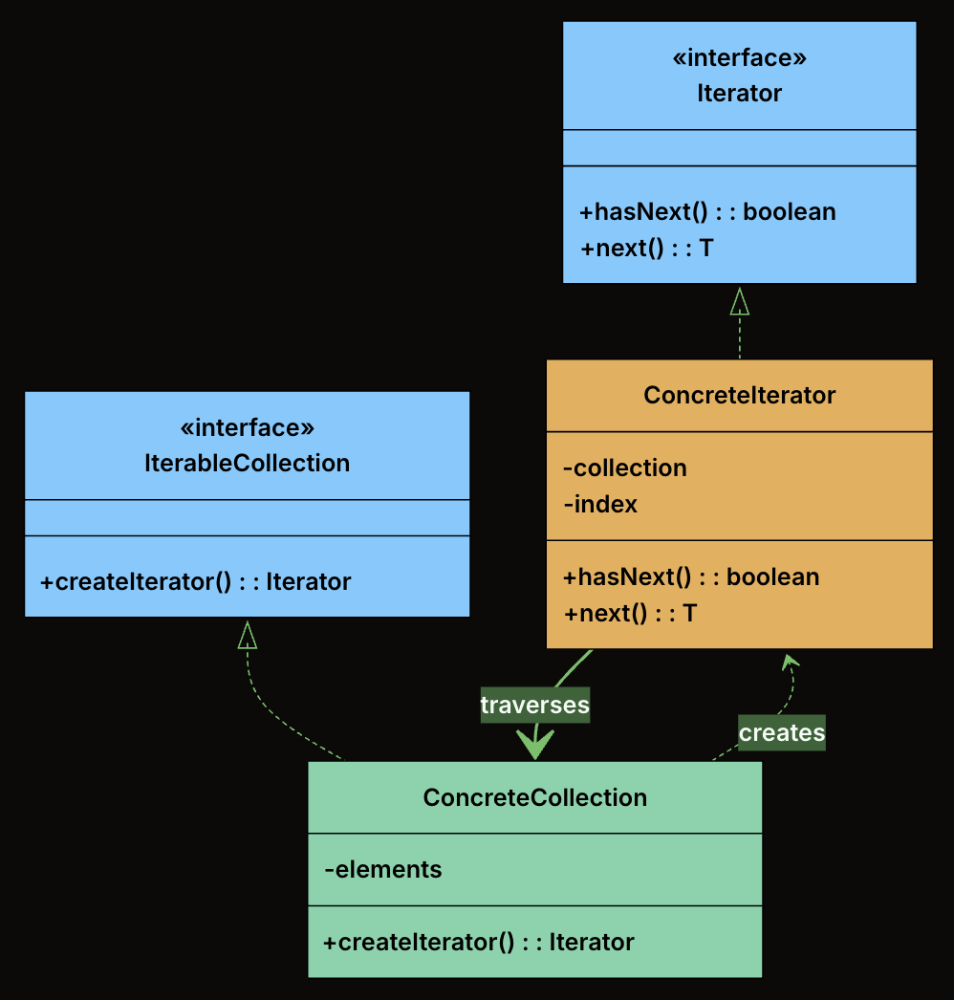
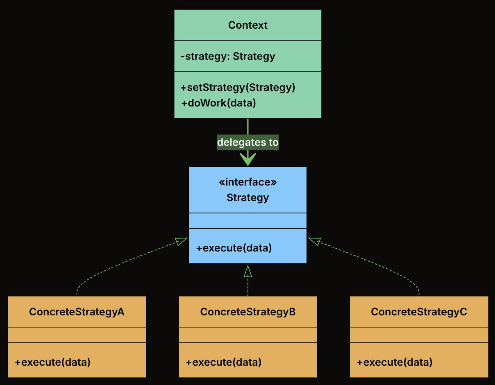
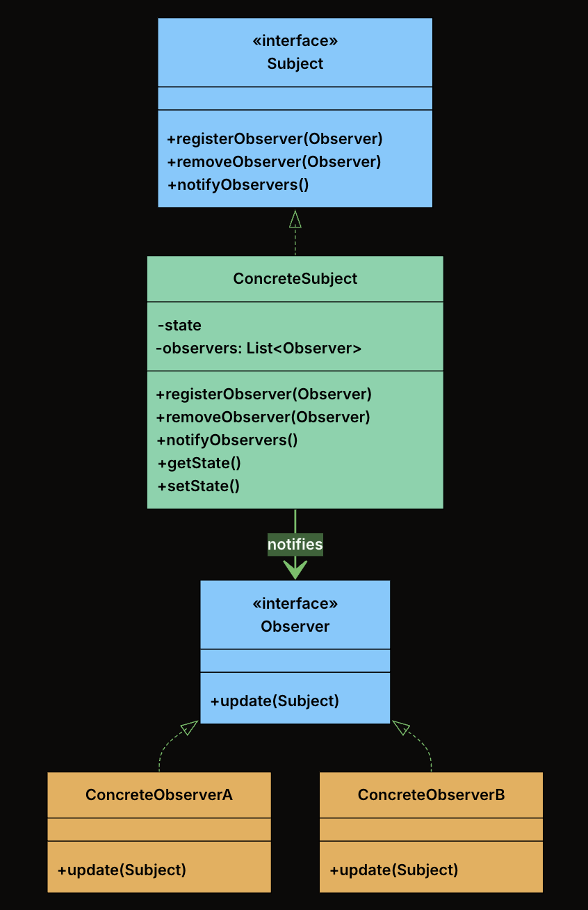

# Behavioral Patterns

---

## Table of Contents

- [Iterator](#iterator)
- [Strategy](#strategy)
- [Observer](#observer)

---

## Iterator

### 📖 Definition

The Iterator Design Pattern is a behavioral pattern that provides a standard way to access elements of a collection sequentially without exposing its internal structure.

At its core, the Iterator pattern is about separating the logic of how you move through a collection from the collection itself. Instead of letting clients directly access internal arrays, lists, or other data structures, the collection provides an iterator object that handles traversal.

It’s particularly useful in situations where:

- You need to traverse a collection (like a list, tree, or graph) in a consistent and flexible way.
- You want to support multiple ways to iterate (e.g., forward, backward, filtering, or skipping elements).
- You want to decouple traversal logic from collection structure, so the client doesn't depend on the internal representation.

### 🧩 Class Diagram



- **Iterator (interface)**: Declares the operations required to traverse a collection. At minimum, this includes hasNext() to check if more elements exist, and next() to retrieve the next element.

- **ConcreteIterator**: Implements the Iterator interface for a specific collection. It maintains the current position within the collection and knows how to move to the next element.

- **IterableCollection (interface)**: Declares a method for creating an iterator. Any class implementing this interface promises it can be iterated.

- **ConcreteCollection**: Implements the IterableCollection interface. It stores elements and returns an appropriate iterator when asked.

### 🛠 Implementation

{{#tabs}}
{{#tab name="Java"}}

1. Define the Iterator Interface

```java
interface Iterator<T> {
    boolean hasNext();
    T next();
}
```

2. Define the IterableCollection Interface

```java
interface IterableCollection<T> {
    Iterator<T> createIterator();
}
```

3. Implement the Concrete Collection

```java
class Playlist implements IterableCollection<String> {
    private final List<String> songs = new ArrayList<>();

    public void addSong(String song) {
        songs.add(song);
    }

    public String getSongAt(int index) {
        return songs.get(index);
    }

    public int getSize() {
        return songs.size();
    }

    @Override
    public Iterator<String> createIterator() {
        return new PlaylistIterator(this);
    }
}
```

4. Implement the Concrete Iterator

```java
class PlaylistIterator implements Iterator<String> {
    private final Playlist playlist;
    private int index = 0;

    public PlaylistIterator(Playlist playlist) {
        this.playlist = playlist;
    }

    @Override
    public boolean hasNext() {
        return index < playlist.getSize();
    }

    @Override
    public String next() {
        return playlist.getSongAt(index++);
    }
}
```

5. Client Code

```java
public class MusicPlayer {
    public static void main(String[] args) {
        Playlist playlist = new Playlist();
        playlist.addSong("Shape of You");
        playlist.addSong("Bohemian Rhapsody");
        playlist.addSong("Blinding Lights");

        Iterator<String> iterator = playlist.createIterator();

        System.out.println("Now Playing:");
        while (iterator.hasNext()) {
            System.out.println(" 🎵 " + iterator.next());
        }
    }
}
```

- Output

```txt
Now Playing:
🎵 Shape of You
🎵 Bohemian Rhapsody
🎵 Blinding Lights
```

{{#endtab}}
{{#tab name="Python"}}

1. Define the Iterator Interface

```python
from abc import ABC, abstractmethod

class Iterator(ABC):
    @abstractmethod
    def has_next(self) -> bool:
        pass

    @abstractmethod
    def next(self):
        pass
```

2. Define the IterableCollection Interface

```python
class IterableCollection(ABC):
    @abstractmethod
    def create_iterator(self):
        pass
```

3. Implement the Concrete Collection

```python
class Playlist(IterableCollection):
    def __init__(self):
        self.songs = []

    def add_song(self, song):
        self.songs.append(song)

    def get_song_at(self, index):
        return self.songs[index]

    def get_size(self):
        return len(self.songs)

    def create_iterator(self):
        return PlaylistIterator(self)
```

4. Implement the Concrete Iterator

```python
class PlaylistIterator(Iterator):
    def __init__(self, playlist):
        self.playlist = playlist
        self.index = 0

    def has_next(self):
        return self.index < self.playlist.get_size()

    def next(self):
        song = self.playlist.get_song_at(self.index)
        self.index += 1
        return song
```

5. Client Code

```python
def music_player_demo():
    playlist = PlaylistIteratorPattern()
    playlist.add_song("Shape of You")
    playlist.add_song("Bohemian Rhapsody")
    playlist.add_song("Blinding Lights")

    iterator = playlist.create_iterator()

    print("Now Playing:")
    while iterator.has_next():
        print(f" 🎵 {iterator.next()}")

if __name__ == "__main__":

    music_player_demo()
```

- Output

```txt
Now Playing:
🎵 Shape of You
🎵 Bohemian Rhapsody
🎵 Blinding Lights
```

{{#endtab}}
{{#tab name="C++"}}

1. Define the Iterator Interface

```cpp
template<typename T>
class Iterator {
public:
    virtual ~Iterator() {}
    virtual bool hasNext() = 0;
    virtual T next() = 0;
};
```

2. Define the IterableCollection Interface

```cpp
template<typename T>
class IterableCollection {
public:
    virtual ~IterableCollection() {}
    virtual Iterator<T>* createIterator() = 0;
};
```

3. Implement the Concrete Collection

```cpp
class Playlist : public IterableCollection<string> {
private:
    vector<string> songs;

public:
    void addSong(const string& song) {
        songs.push_back(song);
    }

    string getSongAt(int index) const {
        return songs[index];
    }

    int getSize() const {
        return songs.size();
    }

    Iterator<string>* createIterator() override {
        return new PlaylistIterator(this);
    }
};
```

4. Implement the Concrete Iterator

```cpp
class PlaylistIterator : public Iterator<string> {
private:
    PlaylistIteratorPattern* playlist;
    int index;

public:
    PlaylistIterator(PlaylistIteratorPattern* pl);

    bool hasNext() override {
      return index < playlist->getSize();
    }

    string next() override {
      string song = playlist->getSongAt(index);
      index++;
      return song;
    }
};
```

5. Client Code

```cpp
void musicPlayerDemo() {
    PlaylistIteratorPattern playlist;
    playlist.addSong("Shape of You");
    playlist.addSong("Bohemian Rhapsody");
    playlist.addSong("Blinding Lights");

    Iterator<string>* iterator = playlist.createIterator();

    cout << "Now Playing:" << endl;
    while (iterator->hasNext()) {
        cout << " 🎵 " << iterator->next() << endl;
    }

    delete iterator;
}

int main() {
    musicPlayerDemo();
    return 0;
}
```

- Output

```txt
Now Playing:
🎵 Shape of You
🎵 Bohemian Rhapsody
🎵 Blinding Lights
```

{{#endtab}}
{{#tab name="C#"}}

1. Define the Iterator Interface

```csharp
interface IIterator<T>
{
    bool HasNext();
    T Next();
}
```

2. Define the IterableCollection Interface

```csharp
interface IIterableCollection<T>
{
    IIterator<T> CreateIterator();
}
```

3. Implement the Concrete Collection

```csharp
class Playlist : IIterableCollection<string>
{
    private List<string> songs = new List<string>();

    public void AddSong(string song)
    {
        songs.Add(song);
    }

    public string GetSongAt(int index)
    {
        return songs[index];
    }

    public int GetSize()
    {
        return songs.Count;
    }

    public IIterator<string> CreateIterator()
    {
        return new PlaylistIterator(this);
    }
}
```

4. Implement the Concrete Iterator

```csharp
class PlaylistIterator : IIterator<string>
{
    private PlaylistIteratorPattern playlist;
    private int index = 0;

    public PlaylistIterator(PlaylistIteratorPattern playlist)
    {
        this.playlist = playlist;
    }

    public bool HasNext()
    {
        return index < playlist.GetSize();
    }

    public string Next()
    {
        string song = playlist.GetSongAt(index);
        index++;
        return song;
    }
}
```

5. Client Code

```csharp
public class Program
{
    public static void Main(string[] args)
    {
        PlaylistIteratorPattern playlist = new PlaylistIteratorPattern();
        playlist.AddSong("Shape of You");
        playlist.AddSong("Bohemian Rhapsody");
        playlist.AddSong("Blinding Lights");

        IIterator<string> iterator = playlist.CreateIterator();

        Console.WriteLine("Now Playing:");
        while (iterator.HasNext())
        {
            Console.WriteLine($" 🎵 {iterator.Next()}");
        }
    }
}
```

- Output

```txt
Now Playing:
🎵 Shape of You
🎵 Bohemian Rhapsody
🎵 Blinding Lights
```

{{#endtab}}
{{#tab name="TypeScript"}}

1. Define the Iterator Interface

```typescript
interface Iterator<T> {
  hasNext(): boolean;
  next(): T;
}
```

2. Define the IterableCollection Interface

```typescript
interface IterableCollection<T> {
  createIterator(): Iterator<T>;
}
```

3. Implement the Concrete Collection

```typescript
class Playlist implements IterableCollection<string> {
  private readonly songs: string[] = [];

  addSong(song: string): void {
    this.songs.push(song);
  }

  getSongAt(index: number): string {
    return this.songs[index];
  }

  getSize(): number {
    return this.songs.length;
  }

  createIterator(): Iterator<string> {
    return new PlaylistIterator(this);
  }
}
```

4. Implement the Concrete Iterator

```typescript
class PlaylistIterator implements Iterator<string> {
  private readonly playlist: Playlist;
  private index: number = 0;

  constructor(playlist: Playlist) {
    this.playlist = playlist;
  }

  hasNext(): boolean {
    return this.index < this.playlist.getSize();
  }

  next(): string {
    return this.playlist.getSongAt(this.index++);
  }
}
```

5. Client Code

```typescript
class MusicPlayer {
  static main(): void {
    const playlist = new Playlist();
    playlist.addSong("Shape of You");
    playlist.addSong("Bohemian Rhapsody");
    playlist.addSong("Blinding Lights");

    const iterator: Iterator<string> = playlist.createIterator();

    console.log("Now Playing:");
    while (iterator.hasNext()) {
      console.log(" 🎵 " + iterator.next());
    }
  }
}
```

- Output

```txt
Now Playing:
🎵 Shape of You
🎵 Bohemian Rhapsody
🎵 Blinding Lights
```

{{#endtab}}
{{#endtabs}}

---

## Strategy

### 📖 Definition

The Strategy Design Pattern is a behavioral pattern that lets you define a family of algorithms, encapsulate each one in its own class, and make them interchangeable at runtime.

This pattern becomes valuable when:

- You have multiple ways to perform the same operation, and the choice might change at runtime
- You want to avoid bloated conditional statements that select between different behaviors
- You need to isolate algorithm-specific data and logic from the code that uses it
- Different clients might need different algorithms for the same task

### 🧩 Class Diagram



- **Strategy Interface**: Declares the interface common to all supported algorithms. The Context uses this interface to call the algorithm defined by a ConcreteStrategy.

- **Concrete Strategies**: Implements the algorithm using the Strategy interface. Each concrete strategy encapsulates a specific algorithm.

- **Context Class**: This is the main class that uses a strategy to perform a task. It holds a reference to a Strategy object and delegates the calculation to it. The context doesn’t know or care which specific strategy is being used. It just knows that it has a strategy that can calculate a shipping cost.

### 🛠 Implementation

{{#tabs}}
{{#tab name="Java"}}

1. Define the Strategy Interface

```java
interface ShippingStrategy {
    double calculateCost(Order order);
}
```

2. Implement Concrete Strategies

- FlatRateShipping

```java
class FlatRateShipping implements ShippingStrategy {
    private double rate;

    public FlatRateShipping(double rate) {
        this.rate = rate;
    }

    @Override
    public double calculateCost(Order order) {
        System.out.println("Calculating with Flat Rate strategy ($" + rate + ")");
        return rate;
    }
}
```

- WeightBasedShipping

```java
class WeightBasedShipping implements ShippingStrategy {
    private final double ratePerKg;

    public WeightBasedShipping(double ratePerKg) {
        this.ratePerKg = ratePerKg;
    }

    @Override
    public double calculateCost(Order order) {
        System.out.println("Calculating with Weight-Based strategy ($" + ratePerKg + "/kg)");
        return order.getTotalWeight() * ratePerKg;
    }
}
```

- DistanceBasedShipping

```java
class DistanceBasedShipping implements ShippingStrategy {
    private double ratePerKm;

    public DistanceBasedShipping(double ratePerKm) {
        this.ratePerKm = ratePerKm;
    }

    @Override
    public double calculateCost(Order order) {
        System.out.println("Calculating with Distance-Based strategy for zone: " + order.getDestinationZone());
        return switch (order.getDestinationZone()) {
            case "ZoneA" -> ratePerKm * 5.0;
            case "ZoneB" -> ratePerKm * 7.0;
            default -> ratePerKm * 10.0;
        };
    }
}
```

- ThirdPartyApiShipping

```java
class ThirdPartyApiShipping implements ShippingStrategy {
    private final double baseFee;
    private final double percentageFee;

    public ThirdPartyApiShipping(double baseFee, double percentageFee) {
        this.baseFee = baseFee;
        this.percentageFee = percentageFee;
    }

    @Override
    public double calculateCost(Order order) {
        System.out.println("Calculating with Third-Party API strategy.");
        // Simulate API call
        return baseFee + (order.getOrderValue() * percentageFee);
    }
}
```

3. Create the Context Class

```java
class ShippingCostService {
    private ShippingStrategy strategy;

    // Constructor to set initial strategy
    public ShippingCostService(ShippingStrategy strategy) {
        this.strategy = strategy;
    }

    // Method to change strategy at runtime
    public void setStrategy(ShippingStrategy strategy) {
        System.out.println("ShippingCostService: Strategy changed to " + strategy.getClass().getSimpleName());
        this.strategy = strategy;
    }

    public double calculateShippingCost(Order order) {
        if (strategy == null) {
            throw new IllegalStateException("Shipping strategy not set.");
        }
        double cost = strategy.calculateCost(order);
        System.out.println("ShippingCostService: Final Calculated Shipping Cost: $" + cost +
                           " (using " + strategy.getClass().getSimpleName() + ")");
        return cost;
    }
}
```

4. Client Code

```java
public class ECommerceAppV2 {
    public static void main(String[] args) {
        Order order1 = new Order();

        // Create different strategy instances
        ShippingStrategy flatRate = new FlatRateShipping(10.0);
        ShippingStrategy weightBased = new WeightBasedShipping(2.5);
        ShippingStrategy distanceBased = new DistanceBasedShipping(5.0);
        ShippingStrategy thirdParty = new ThirdPartyApiShipping(7.5, 0.02);

        // Create context with an initial strategy
        ShippingCostService shippingService = new ShippingCostService(flatRate);

        System.out.println("--- Order 1: Using Flat Rate (initial) ---");
        shippingService.calculateShippingCost(order1);

        System.out.println("\n--- Order 1: Changing to Weight-Based ---");
        shippingService.setStrategy(weightBased);
        shippingService.calculateShippingCost(order1);

        System.out.println("\n--- Order 1: Changing to Distance-Based ---");
        shippingService.setStrategy(distanceBased);
        shippingService.calculateShippingCost(order1);

        System.out.println("\n--- Order 1: Changing to Third-Party API ---");
        shippingService.setStrategy(thirdParty);
        shippingService.calculateShippingCost(order1);

        // Adding a NEW strategy is easy:
        // 1. Create a new class implementing ShippingStrategy (e.g., FreeShippingStrategy)
        // 2. Client can then instantiate and use it:
        //    ShippingStrategy freeShipping = new FreeShippingStrategy();
        //    shippingService.setStrategy(freeShipping);
        //    shippingService.calculateShippingCost(primeMemberOrder);
        // No modification to ShippingCostService is needed!
    }
}
```

{{#endtab}}
{{#tab name="Python"}}

1. Define the Strategy Interface

```python
from abc import ABC, abstractmethod

class ShippingStrategy(ABC):
    @abstractmethod
    def calculate_cost(self, order) -> float:
        pass
```

2. Implement Concrete Strategies

- FlatRateShipping

```python
class FlatRateShipping(ShippingStrategy):
    def __init__(self, rate):
        self.rate = rate

    def calculate_cost(self, order):
        print(f"Calculating with Flat Rate strategy (${self.rate})")
        return self.rate
```

- WeightBasedShipping

```python
class WeightBasedShipping(ShippingStrategy):
    def __init__(self, rate_per_kg):
        self.rate_per_kg = rate_per_kg

    def calculate_cost(self, order):
        print(f"Calculating with Weight-Based strategy (${self.rate_per_kg}/kg)")
        return order.get_total_weight() * self.rate_per_kg
```

- DistanceBasedShipping

```python
class DistanceBasedShipping(ShippingStrategy):
    def __init__(self, rate_per_km):
        self.rate_per_km = rate_per_km

    def calculate_cost(self, order):
        print(f"Calculating with Distance-Based strategy for zone: {order.get_destination_zone()}")
        zone_mapping = {
            "ZoneA": self.rate_per_km * 5.0,
            "ZoneB": self.rate_per_km * 7.0
        }
        return zone_mapping.get(order.get_destination_zone(), self.rate_per_km * 10.0)
```

- ThirdPartyApiShipping

```python
class ThirdPartyApiShipping(ShippingStrategy):
    def __init__(self, base_fee, percentage_fee):
        self.base_fee = base_fee
        self.percentage_fee = percentage_fee

    def calculate_cost(self, order):
        print("Calculating with Third-Party API strategy.")
        # Simulate API call
        return self.base_fee + (order.get_order_value() * self.percentage_fee)
```

3. Create the Context Class

```python
class ShippingCostService:
    def __init__(self, strategy):
        self.strategy = strategy

    def set_strategy(self, strategy):
        print(f"ShippingCostService: Strategy changed to {strategy.__class__.__name__}")
        self.strategy = strategy

    def calculate_shipping_cost(self, order):
        if self.strategy is None:
            raise ValueError("Shipping strategy not set.")

        cost = self.strategy.calculate_cost(order)
        print(f"ShippingCostService: Final Calculated Shipping Cost: ${cost} "
              f"(using {self.strategy.__class__.__name__})")
        return cost
```

4. Client Code

```python
def ecommerce_app_v2():
    order1 = Order()

    # Create different strategy instances
    flat_rate = FlatRateShipping(10.0)
    weight_based = WeightBasedShipping(2.5)
    distance_based = DistanceBasedShipping(5.0)
    third_party = ThirdPartyApiShipping(7.5, 0.02)

    # Create context with an initial strategy
    shipping_service = ShippingCostService(flat_rate)

    print("--- Order 1: Using Flat Rate (initial) ---")
    shipping_service.calculate_shipping_cost(order1)

    print("\n--- Order 1: Changing to Weight-Based ---")
    shipping_service.set_strategy(weight_based)
    shipping_service.calculate_shipping_cost(order1)

    print("\n--- Order 1: Changing to Distance-Based ---")
    shipping_service.set_strategy(distance_based)
    shipping_service.calculate_shipping_cost(order1)

    print("\n--- Order 1: Changing to Third-Party API ---")
    shipping_service.set_strategy(third_party)
    shipping_service.calculate_shipping_cost(order1)

    # Adding a NEW strategy is easy:
    # 1. Create a new class implementing ShippingStrategy (e.g., FreeShippingStrategy)
    # 2. Client can then instantiate and use it:
    #    free_shipping = FreeShippingStrategy()
    #    shipping_service.set_strategy(free_shipping)
    #    shipping_service.calculate_shipping_cost(prime_member_order)
    # No modification to ShippingCostService is needed!

# Example usage
if __name__ == "__main__":
    ecommerce_app_v2()
```

{{#endtab}}
{{#tab name="C++"}}

1. Define the Strategy Interface

```cpp
class ShippingStrategy {
public:
    virtual ~ShippingStrategy() {}
    virtual double calculateCost(const Order& order) = 0;
};
```

2. Implement Concrete Strategies

- FlatRateShipping

```cpp
class FlatRateShipping : public ShippingStrategy {
private:
    double rate;

public:
    FlatRateShipping(double r) : rate(r) {}

    double calculateCost(const Order& order) override {
        cout << "Calculating with Flat Rate strategy ($" << rate << ")" << endl;
        return rate;
    }
};
```

- WeightBasedShipping

```cpp
class WeightBasedShipping : public ShippingStrategy {
private:
    double ratePerKg;

public:
    WeightBasedShipping(double rateKg) : ratePerKg(rateKg) {}

    double calculateCost(const Order& order) override {
        cout << "Calculating with Weight-Based strategy ($" << ratePerKg << "/kg)" << endl;
        return order.getTotalWeight() * ratePerKg;
    }
};
```

- DistanceBasedShipping

```cpp
class DistanceBasedShipping : public ShippingStrategy {
private:
    double ratePerKm;

public:
    DistanceBasedShipping(double rateKm) : ratePerKm(rateKm) {}

    double calculateCost(const Order& order) override {
        cout << "Calculating with Distance-Based strategy for zone: " << order.getDestinationZone() << endl;

        if (order.getDestinationZone() == "ZoneA") {
            return ratePerKm * 5.0;
        } else if (order.getDestinationZone() == "ZoneB") {
            return ratePerKm * 7.0;
        } else {
            return ratePerKm * 10.0;
        }
    }
};
```

- ThirdPartyApiShipping

```cpp
class ThirdPartyApiShipping : public ShippingStrategy {
private:
    double baseFee;
    double percentageFee;

public:
    ThirdPartyApiShipping(double base, double percentage)
        : baseFee(base), percentageFee(percentage) {}

    double calculateCost(const Order& order) override {
        cout << "Calculating with Third-Party API strategy." << endl;
        // Simulate API call
        return baseFee + (order.getOrderValue() * percentageFee);
    }
};
```

3. Create the Context Class

```cpp
class ShippingCostService {
private:
    ShippingStrategy* strategy;

public:
    ShippingCostService(ShippingStrategy* s) : strategy(s) {}

    void setStrategy(ShippingStrategy* s) {
        cout << "ShippingCostService: Strategy changed" << endl;
        strategy = s;
    }

    double calculateShippingCost(const Order& order) {
        if (strategy == nullptr) {
            throw invalid_argument("Shipping strategy not set.");
        }

        double cost = strategy->calculateCost(order);
        cout << "ShippingCostService: Final Calculated Shipping Cost: $" << cost << endl;
        return cost;
    }
};
```

4. Client Code

```cpp
void ecommerceAppV2() {
    Order order1;

    // Create different strategy instances
    FlatRateShipping flatRate(10.0);
    WeightBasedShipping weightBased(2.5);
    DistanceBasedShipping distanceBased(5.0);
    ThirdPartyApiShipping thirdParty(7.5, 0.02);

    // Create context with an initial strategy
    ShippingCostService shippingService(&flatRate);

    cout << "--- Order 1: Using Flat Rate (initial) ---" << endl;
    shippingService.calculateShippingCost(order1);

    cout << "\n--- Order 1: Changing to Weight-Based ---" << endl;
    shippingService.setStrategy(&weightBased);
    shippingService.calculateShippingCost(order1);

    cout << "\n--- Order 1: Changing to Distance-Based ---" << endl;
    shippingService.setStrategy(&distanceBased);
    shippingService.calculateShippingCost(order1);

    cout << "\n--- Order 1: Changing to Third-Party API ---" << endl;
    shippingService.setStrategy(&thirdParty);
    shippingService.calculateShippingCost(order1);

    // Adding a NEW strategy is easy:
    // 1. Create a new class implementing ShippingStrategy (e.g., FreeShippingStrategy)
    // 2. Client can then instantiate and use it:
    //    FreeShippingStrategy freeShipping;
    //    shippingService.setStrategy(&freeShipping);
    //    shippingService.calculateShippingCost(primeMemberOrder);
    // No modification to ShippingCostService is needed!
}

int main() {
    cout << "\n\n=== Strategy Pattern Approach ===" << endl;
    ecommerceAppV2();
    return 0;
}
```

{{#endtab}}
{{#tab name="C#"}}

1. Define the Strategy Interface

```csharp
interface IShippingStrategy
{
    double CalculateCost(Order order);
}
```

2. Implement Concrete Strategies

- FlatRateShipping

```csharp
class FlatRateShipping : IShippingStrategy
{
    private double rate;

    public FlatRateShipping(double rate)
    {
        this.rate = rate;
    }

    public double CalculateCost(Order order)
    {
        Console.WriteLine($"Calculating with Flat Rate strategy (${rate})");
        return rate;
    }
}
```

- WeightBasedShipping

```csharp
class WeightBasedShipping : IShippingStrategy
{
    private double ratePerKg;

    public WeightBasedShipping(double ratePerKg)
    {
        this.ratePerKg = ratePerKg;
    }

    public double CalculateCost(Order order)
    {
        Console.WriteLine($"Calculating with Weight-Based strategy (${ratePerKg}/kg)");
        return order.GetTotalWeight() * ratePerKg;
    }
}
```

- DistanceBasedShipping

```csharp
class DistanceBasedShipping : IShippingStrategy
{
    private double ratePerKm;

    public DistanceBasedShipping(double ratePerKm)
    {
        this.ratePerKm = ratePerKm;
    }

    public double CalculateCost(Order order)
    {
        Console.WriteLine($"Calculating with Distance-Based strategy for zone: {order.GetDestinationZone()}");

        switch (order.GetDestinationZone())
        {
            case "ZoneA":
                return ratePerKm * 5.0;
            case "ZoneB":
                return ratePerKm * 7.0;
            default:
                return ratePerKm * 10.0;
        }
    }
}
```

- ThirdPartyApiShipping

```csharp
class ThirdPartyApiShipping : IShippingStrategy
{
    private double baseFee;
    private double percentageFee;

    public ThirdPartyApiShipping(double baseFee, double percentageFee)
    {
        this.baseFee = baseFee;
        this.percentageFee = percentageFee;
    }

    public double CalculateCost(Order order)
    {
        Console.WriteLine("Calculating with Third-Party API strategy.");
        // Simulate API call
        return baseFee + (order.GetOrderValue() * percentageFee);
    }
}
```

3. Create the Context Class

```csharp
class ShippingCostService
{
    private IShippingStrategy strategy;

    public ShippingCostService(IShippingStrategy strategy)
    {
        this.strategy = strategy;
    }

    public void SetStrategy(IShippingStrategy strategy)
    {
        Console.WriteLine($"ShippingCostService: Strategy changed to {strategy.GetType().Name}");
        this.strategy = strategy;
    }

    public double CalculateShippingCost(Order order)
    {
        if (strategy == null)
        {
            throw new InvalidOperationException("Shipping strategy not set.");
        }

        double cost = strategy.CalculateCost(order);
        Console.WriteLine($"ShippingCostService: Final Calculated Shipping Cost: ${cost} " +
                         $"(using {strategy.GetType().Name})");
        return cost;
    }
}
```

4. Client Code

```csharp
public class Program
{
    public static void ECommerceAppV2()
    {
        Order order1 = new Order();

        // Create different strategy instances
        IShippingStrategy flatRate = new FlatRateShipping(10.0);
        IShippingStrategy weightBased = new WeightBasedShipping(2.5);
        IShippingStrategy distanceBased = new DistanceBasedShipping(5.0);
        IShippingStrategy thirdParty = new ThirdPartyApiShipping(7.5, 0.02);

        // Create context with an initial strategy
        ShippingCostService shippingService = new ShippingCostService(flatRate);

        Console.WriteLine("--- Order 1: Using Flat Rate (initial) ---");
        shippingService.CalculateShippingCost(order1);

        Console.WriteLine("\n--- Order 1: Changing to Weight-Based ---");
        shippingService.SetStrategy(weightBased);
        shippingService.CalculateShippingCost(order1);

        Console.WriteLine("\n--- Order 1: Changing to Distance-Based ---");
        shippingService.SetStrategy(distanceBased);
        shippingService.CalculateShippingCost(order1);

        Console.WriteLine("\n--- Order 1: Changing to Third-Party API ---");
        shippingService.SetStrategy(thirdParty);
        shippingService.CalculateShippingCost(order1);

        // Adding a NEW strategy is easy:
        // 1. Create a new class implementing IShippingStrategy (e.g., FreeShippingStrategy)
        // 2. Client can then instantiate and use it:
        //    IShippingStrategy freeShipping = new FreeShippingStrategy();
        //    shippingService.SetStrategy(freeShipping);
        //    shippingService.CalculateShippingCost(primeMemberOrder);
        // No modification to ShippingCostService is needed!
    }

    public static void Main(string[] args)
    {
        Console.WriteLine("\n\n=== Strategy Pattern Approach ===");
        ECommerceAppV2();
    }
}
```

{{#endtab}}
{{#tab name="TypeScript"}}

1. Define the Strategy Interface

```typescript
interface ShippingStrategy {
  calculateCost(order: Order): number;
}
```

2. Implement Concrete Strategies

- FlatRateShipping

```typescript
class FlatRateShipping implements ShippingStrategy {
  private rate: number;

  constructor(rate: number) {
    this.rate = rate;
  }

  calculateCost(order: Order): number {
    console.log("Calculating with Flat Rate strategy ($" + this.rate + ")");
    return this.rate;
  }
}
```

- WeightBasedShipping

```typescript
class WeightBasedShipping implements ShippingStrategy {
  private readonly ratePerKg: number;

  constructor(ratePerKg: number) {
    this.ratePerKg = ratePerKg;
  }

  calculateCost(order: Order): number {
    console.log(
      "Calculating with Weight-Based strategy ($" + this.ratePerKg + "/kg)",
    );
    return order.getTotalWeight() * this.ratePerKg;
  }
}
```

- DistanceBasedShipping

```typescript
class DistanceBasedShipping implements ShippingStrategy {
  private ratePerKm: number;

  constructor(ratePerKm: number) {
    this.ratePerKm = ratePerKm;
  }

  calculateCost(order: Order): number {
    console.log(
      "Calculating with Distance-Based strategy for zone: " +
        order.getDestinationZone(),
    );
    switch (order.getDestinationZone()) {
      case "ZoneA":
        return this.ratePerKm * 5.0;
      case "ZoneB":
        return this.ratePerKm * 7.0;
      default:
        return this.ratePerKm * 10.0;
    }
  }
}
```

- ThirdPartyApiShipping

```typescript
class ThirdPartyApiShipping implements ShippingStrategy {
  private readonly baseFee: number;
  private readonly percentageFee: number;

  constructor(baseFee: number, percentageFee: number) {
    this.baseFee = baseFee;
    this.percentageFee = percentageFee;
  }

  calculateCost(order: Order): number {
    console.log("Calculating with Third-Party API strategy.");
    // Simulate API call
    return this.baseFee + order.getOrderValue() * this.percentageFee;
  }
}
```

3. Create the Context Class

```typescript
class ShippingCostService {
  private strategy: ShippingStrategy;

  // Constructor to set initial strategy
  constructor(strategy: ShippingStrategy) {
    this.strategy = strategy;
  }

  // Method to change strategy at runtime
  setStrategy(strategy: ShippingStrategy): void {
    console.log(
      "ShippingCostService: Strategy changed to " + strategy.constructor.name,
    );
    this.strategy = strategy;
  }

  calculateShippingCost(order: Order): number {
    if (!this.strategy) {
      throw new Error("Shipping strategy not set.");
    }
    const cost = this.strategy.calculateCost(order);
    console.log(
      "ShippingCostService: Final Calculated Shipping Cost: $" +
        cost +
        " (using " +
        this.strategy.constructor.name +
        ")",
    );
    return cost;
  }
}
```

4. Client Code

```typescript
class ECommerceAppV2 {
  static main(): void {
    const order1 = new Order();

    // Create different strategy instances
    const flatRate: ShippingStrategy = new FlatRateShipping(10.0);
    const weightBased: ShippingStrategy = new WeightBasedShipping(2.5);
    const distanceBased: ShippingStrategy = new DistanceBasedShipping(5.0);
    const thirdParty: ShippingStrategy = new ThirdPartyApiShipping(7.5, 0.02);

    // Create context with an initial strategy
    const shippingService = new ShippingCostService(flatRate);

    console.log("--- Order 1: Using Flat Rate (initial) ---");
    shippingService.calculateShippingCost(order1);

    console.log("\n--- Order 1: Changing to Weight-Based ---");
    shippingService.setStrategy(weightBased);
    shippingService.calculateShippingCost(order1);

    console.log("\n--- Order 1: Changing to Distance-Based ---");
    shippingService.setStrategy(distanceBased);
    shippingService.calculateShippingCost(order1);

    console.log("\n--- Order 1: Changing to Third-Party API ---");
    shippingService.setStrategy(thirdParty);
    shippingService.calculateShippingCost(order1);

    // Adding a NEW strategy is easy:
    // 1. Create a new class implementing ShippingStrategy (e.g., FreeShippingStrategy)
    // 2. Client can then instantiate and use it:
    //    const freeShipping: ShippingStrategy = new FreeShippingStrategy();
    //    shippingService.setStrategy(freeShipping);
    //    shippingService.calculateShippingCost(primeMemberOrder);
    // No modification to ShippingCostService is needed!
  }
}
```

{{#endtab}}
{{#endtabs}}

---

## Observer

### 📖 Definition

The Observer Design Pattern is a behavioral pattern that defines a one-to-many dependency between objects so that when one object (the subject) changes its state, all its dependents (observers) are automatically notified and updated.

This pattern shines in scenarios where:

- You have multiple parts of the system that need to react to a change in one central component.
- You want to decouple the publisher of data from the subscribers who react to it.
- You need a dynamic, event-driven communication model without hardcoding who is listening to whom.

### 🧩 Class Diagram



- **Subject Interface**: Declares the interface for managing observers, registering, removing, and notifying them. Defines `registerObserver()`, `removeObserver()`, and `notifyObservers()` methods. The subject holds a list of observers typed to the Observer interface, not to concrete classes. This means any class that implements the Observer interface can register, and the subject never needs to know what it is.

- **Observer Interface**: Declares the `update()` method that the subject calls when its state changes. All modules that want to listen to fitness data changes will implement this interface.

- **ConcreteSubject**: Implements the Subject interface. Holds the actual state and notifies observers when that state changes. Maintain a list of registered observers and calls `notifyObservers()` whenever its state changes.

- **ConcreteObservers**: Implements the Observer interface. Defines what happens when the subject's state changes. When `update()` is called, each observer pulls relevant data from the subject and performs its own logic (e.g., update UI, log progress, send alerts).

### 🛠 Implementation

{{#tabs}}
{{#tab name="Java"}}

1. Define the Observer Interface

```java
interface FitnessDataObserver {
    void update(FitnessData data);
}
```

2. Define the Subject Interface

```java
interface FitnessDataSubject {
    void registerObserver(FitnessDataObserver observer);
    void removeObserver(FitnessDataObserver observer);
    void notifyObservers();
}
```

3. Implement the ConcreteSubject

```java
public class FitnessData implements FitnessDataSubject {
    private int steps;
    private int activeMinutes;
    private int calories;

    private final List<FitnessDataObserver> observers = new ArrayList<>();

    @Override
    public void registerObserver(FitnessDataObserver observer) {
        observers.add(observer);
    }

    @Override
    public void removeObserver(FitnessDataObserver observer) {
        observers.remove(observer);
    }

    @Override
    public void notifyObservers() {
        for (FitnessDataObserver observer : observers) {
            observer.update(this);
        }
    }

    public void newFitnessDataPushed(int steps, int activeMinutes, int calories) {
        this.steps = steps;
        this.activeMinutes = activeMinutes;
        this.calories = calories;

        System.out.println("\nFitnessData: New data received – Steps: " + steps +
            ", Active Minutes: " + activeMinutes + ", Calories: " + calories);

        notifyObservers();
    }

    public void dailyReset() {
        this.steps = 0;
        this.activeMinutes = 0;
        this.calories = 0;

        System.out.println("\nFitnessData: Daily reset performed.");
        notifyObservers();
    }

    // Getters
    public int getSteps() { return steps; }
    public int getActiveMinutes() { return activeMinutes; }
    public int getCalories() { return calories; }
}
```

4. Implement Concrete Observers

- LiveActivityDisplay

```java
class LiveActivityDisplay implements FitnessDataObserver {
    @Override
    public void update(FitnessData data) {
        System.out.println("Live Display → Steps: " + data.getSteps() +
            " | Active Minutes: " + data.getActiveMinutes() +
            " | Calories: " + data.getCalories());
    }
}
```

- ProgressLogger

```java
class ProgressLogger implements FitnessDataObserver {
    @Override
    public void update(FitnessData data) {
        System.out.println("Logger → Saving to DB: Steps=" + data.getSteps() +
            ", ActiveMinutes=" + data.getActiveMinutes() +
            ", Calories=" + data.getCalories());
        // Simulated DB/file write...
    }
}
```

- GoalNotifier

```java
class GoalNotifier implements FitnessDataObserver {
    private final int stepGoal = 10000;
    private boolean goalReached = false;

    @Override
    public void update(FitnessData data) {
        if (data.getSteps() >= stepGoal && !goalReached) {
            System.out.println("Notifier → 🎉 Goal Reached! You've hit " + stepGoal + " steps!");
            goalReached = true;
        }
    }

    public void reset() {
        goalReached = false;
    }
}
```

5. Client Code

```java
public class FitnessAppObserverDemo {
    public static void main(String[] args) {
        FitnessData fitnessData = new FitnessData();

        LiveActivityDisplay display = new LiveActivityDisplay();
        ProgressLogger logger = new ProgressLogger();
        GoalNotifier notifier = new GoalNotifier();

        // Register observers
        fitnessData.registerObserver(display);
        fitnessData.registerObserver(logger);
        fitnessData.registerObserver(notifier);

        // Simulate updates
        fitnessData.newFitnessDataPushed(500, 5, 20);
        fitnessData.newFitnessDataPushed(9800, 85, 350);
        fitnessData.newFitnessDataPushed(10100, 90, 380);

        // Remove logger and reset notifier
        fitnessData.removeObserver(logger);
        notifier.reset();
        fitnessData.dailyReset();
    }
}
```

{{#endtab}}
{{#tab name="Python"}}

1. Define the Observer Interface

```python
from abc import ABC, abstractmethod

class FitnessDataObserver(ABC):
    @abstractmethod
    def update(self, data):
        pass
```

2. Define the Subject Interface

```python
class FitnessDataSubject(ABC):
    @abstractmethod
    def register_observer(self, observer):
        pass

    @abstractmethod
    def remove_observer(self, observer):
        pass

    @abstractmethod
    def notify_observers(self):
        pass
```

3. Implement the ConcreteSubject

```python
class FitnessData(FitnessDataSubject):
    def __init__(self):
        self.steps = 0
        self.active_minutes = 0
        self.calories = 0
        self.observers = []

    def register_observer(self, observer):
        self.observers.append(observer)

    def remove_observer(self, observer):
        if observer in self.observers:
            self.observers.remove(observer)

    def notify_observers(self):
        for observer in self.observers:
            observer.update(self)

    def new_fitness_data_pushed(self, steps, active_minutes, calories):
        self.steps = steps
        self.active_minutes = active_minutes
        self.calories = calories

        print(f"\nFitnessData: New data received – Steps: {steps}, "
              f"Active Minutes: {active_minutes}, Calories: {calories}")

        self.notify_observers()

    def daily_reset(self):
        self.steps = 0
        self.active_minutes = 0
        self.calories = 0

        print("\nFitnessData: Daily reset performed.")
        self.notify_observers()

    # Getters
    def get_steps(self):
        return self.steps

    def get_active_minutes(self):
        return self.active_minutes

    def get_calories(self):
        return self.calories
```

4. Implement Concrete Observers

- LiveActivityDisplay

```python
class LiveActivityDisplay(FitnessDataObserver):
    def update(self, data):
        print(f"Live Display → Steps: {data.get_steps()} "
              f"| Active Minutes: {data.get_active_minutes()} "
              f"| Calories: {data.get_calories()}")
```

- ProgressLogger

```python
class ProgressLogger(FitnessDataObserver):
    def update(self, data):
        print(f"Logger → Saving to DB: Steps={data.get_steps()}, "
              f"ActiveMinutes={data.get_active_minutes()}, "
              f"Calories={data.get_calories()}")
        # Simulated DB/file write...
```

- GoalNotifier

```python
class GoalNotifier(FitnessDataObserver):
    def __init__(self):
        self.step_goal = 10000
        self.goal_reached = False

    def update(self, data):
        if data.get_steps() >= self.step_goal and not self.goal_reached:
            print(f"Notifier → 🎉 Goal Reached! You've hit {self.step_goal} steps!")
            self.goal_reached = True

    def reset(self):
        self.goal_reached = False
```

5. Client Code

```python
def fitness_app_observer_demo():
    fitness_data = FitnessData()

    display = LiveActivityDisplay()
    logger = ProgressLogger()
    notifier = GoalNotifier()

    # Register observers
    fitness_data.register_observer(display)
    fitness_data.register_observer(logger)
    fitness_data.register_observer(notifier)

    # Simulate updates
    fitness_data.new_fitness_data_pushed(500, 5, 20)
    fitness_data.new_fitness_data_pushed(9800, 85, 350)
    fitness_data.new_fitness_data_pushed(10100, 90, 380)

    # Remove logger and reset notifier
    fitness_data.remove_observer(logger)
    notifier.reset()
    fitness_data.daily_reset()

if __name__ == "__main__":
    print("=== Observer Pattern Approach ===")
    fitness_app_observer_demo()
```

{{#endtab}}
{{#tab name="C++"}}

1. Define the Observer Interface

```cpp
class FitnessDataObserver {
public:
    virtual ~FitnessDataObserver() {}
    virtual void update(FitnessData* data) = 0;
};
```

2. Define the Subject Interface

```cpp
class FitnessDataSubject {
public:
    virtual ~FitnessDataSubject() {}
    virtual void registerObserver(FitnessDataObserver* observer) = 0;
    virtual void removeObserver(FitnessDataObserver* observer) = 0;
    virtual void notifyObservers() = 0;
};
```

3. Implement the ConcreteSubject

```cpp
class FitnessData : public FitnessDataSubject {
private:
    int steps;
    int activeMinutes;
    int calories;
    vector<FitnessDataObserver*> observers;

public:
    FitnessData() : steps(0), activeMinutes(0), calories(0) {}

    void registerObserver(FitnessDataObserver* observer) override {
        observers.push_back(observer);
    }

    void removeObserver(FitnessDataObserver* observer) override {
        observers.erase(remove(observers.begin(), observers.end(), observer), observers.end());
    }

    void notifyObservers() override {
        for (FitnessDataObserver* observer : observers) {
            observer->update(this);
        }
    }

    void newFitnessDataPushed(int newSteps, int newActiveMinutes, int newCalories) {
        steps = newSteps;
        activeMinutes = newActiveMinutes;
        calories = newCalories;

        cout << "\nFitnessData: New data received – Steps: " << steps
             << ", Active Minutes: " << activeMinutes << ", Calories: " << calories << endl;

        notifyObservers();
    }

    void dailyReset() {
        steps = 0;
        activeMinutes = 0;
        calories = 0;

        cout << "\nFitnessData: Daily reset performed." << endl;
        notifyObservers();
    }

    // Getters
    int getSteps() const { return steps; }
    int getActiveMinutes() const { return activeMinutes; }
    int getCalories() const { return calories; }
};
```

4. Implement Concrete Observers

- LiveActivityDisplay

```cpp
class LiveActivityDisplay : public FitnessDataObserver {
public:
    void update(FitnessData* data) override {
        cout << "Live Display → Steps: " << data->getSteps()
             << " | Active Minutes: " << data->getActiveMinutes()
             << " | Calories: " << data->getCalories() << endl;
    }
};
```

- ProgressLogger

```cpp
class ProgressLogger : public FitnessDataObserver {
public:
    void update(FitnessData* data) override {
        cout << "Logger → Saving to DB: Steps=" << data->getSteps()
             << ", ActiveMinutes=" << data->getActiveMinutes()
             << ", Calories=" << data->getCalories() << endl;
        // Simulated DB/file write...
    }
};
```

- GoalNotifier

```cpp
class GoalNotifier : public FitnessDataObserver {
private:
    int stepGoal;
    bool goalReached;

public:
    GoalNotifier() : stepGoal(10000), goalReached(false) {}

    void update(FitnessData* data) override {
        if (data->getSteps() >= stepGoal && !goalReached) {
            cout << "Notifier → 🎉 Goal Reached! You've hit " << stepGoal << " steps!" << endl;
            goalReached = true;
        }
    }

    void reset() {
        goalReached = false;
    }
};
```

5. Client Code

```cpp
int main() {
    cout << "=== Observer Pattern Approach ===" << endl;

    FitnessData fitnessData;

    LiveActivityDisplay display;
    ProgressLogger logger;
    GoalNotifier notifier;

    // Register observers
    fitnessData.registerObserver(&display);
    fitnessData.registerObserver(&logger);
    fitnessData.registerObserver(&notifier);

    // Simulate updates
    fitnessData.newFitnessDataPushed(500, 5, 20);
    fitnessData.newFitnessDataPushed(9800, 85, 350);
    fitnessData.newFitnessDataPushed(10100, 90, 380);

    // Remove logger and reset notifier
    fitnessData.removeObserver(&logger);
    notifier.reset();
    fitnessData.dailyReset();

    return 0;
}
```

{{#endtab}}
{{#tab name="C#"}}

1. Define the Observer Interface

```csharp
interface IFitnessDataObserver
{
    void Update(FitnessData data);
}
```

2. Define the Subject Interface

```csharp
interface IFitnessDataSubject
{
    void RegisterObserver(IFitnessDataObserver observer);
    void RemoveObserver(IFitnessDataObserver observer);
    void NotifyObservers();
}
```

3. Implement the ConcreteSubject

```csharp
class FitnessData : IFitnessDataSubject
{
    private int steps;
    private int activeMinutes;
    private int calories;
    private List<IFitnessDataObserver> observers = new List<IFitnessDataObserver>();

    public void RegisterObserver(IFitnessDataObserver observer)
    {
        observers.Add(observer);
    }

    public void RemoveObserver(IFitnessDataObserver observer)
    {
        observers.Remove(observer);
    }

    public void NotifyObservers()
    {
        foreach (IFitnessDataObserver observer in observers)
        {
            observer.Update(this);
        }
    }

    public void NewFitnessDataPushed(int newSteps, int newActiveMinutes, int newCalories)
    {
        steps = newSteps;
        activeMinutes = newActiveMinutes;
        calories = newCalories;

        Console.WriteLine($"\nFitnessData: New data received – Steps: {steps}, Active Minutes: {activeMinutes}, Calories: {calories}");

        NotifyObservers();
    }

    public void DailyReset()
    {
        steps = 0;
        activeMinutes = 0;
        calories = 0;

        Console.WriteLine("\nFitnessData: Daily reset performed.");
        NotifyObservers();
    }

    // Getters
    public int GetSteps() { return steps; }
    public int GetActiveMinutes() { return activeMinutes; }
    public int GetCalories() { return calories; }
}
```

4. Implement Concrete Observers

- LiveActivityDisplay

```csharp
class LiveActivityDisplay : IFitnessDataObserver
{
    public void Update(FitnessData data)
    {
        Console.WriteLine($"Live Display → Steps: {data.GetSteps()} | Active Minutes: {data.GetActiveMinutes()} | Calories: {data.GetCalories()}");
    }
}
```

- ProgressLogger

```csharp
class ProgressLogger : IFitnessDataObserver
{
    public void Update(FitnessData data)
    {
        Console.WriteLine($"Logger → Saving to DB: Steps={data.GetSteps()}, ActiveMinutes={data.GetActiveMinutes()}, Calories={data.GetCalories()}");
        // Simulated DB/file write...
    }
}
```

- GoalNotifier

```csharp
class GoalNotifier : IFitnessDataObserver
{
    private int stepGoal = 10000;
    private bool goalReached = false;

    public void Update(FitnessData data)
    {
        if (data.GetSteps() >= stepGoal && !goalReached)
        {
            Console.WriteLine($"Notifier → 🎉 Goal Reached! You've hit {stepGoal} steps!");
            goalReached = true;
        }
    }

    public void Reset()
    {
        goalReached = false;
    }
}
```

5. Client Code

```csharp
public class Program
{
    public static void Main(string[] args)
    {
        Console.WriteLine("=== Observer Pattern Approach ===");

        FitnessData fitnessData = new FitnessData();

        LiveActivityDisplay display = new LiveActivityDisplay();
        ProgressLogger logger = new ProgressLogger();
        GoalNotifier notifier = new GoalNotifier();

        // Register observers
        fitnessData.RegisterObserver(display);
        fitnessData.RegisterObserver(logger);
        fitnessData.RegisterObserver(notifier);

        // Simulate updates
        fitnessData.NewFitnessDataPushed(500, 5, 20);
        fitnessData.NewFitnessDataPushed(9800, 85, 350);
        fitnessData.NewFitnessDataPushed(10100, 90, 380);

        // Remove logger and reset notifier
        fitnessData.RemoveObserver(logger);
        notifier.Reset();
        fitnessData.DailyReset();
    }
}
```

{{#endtab}}
{{#tab name="TypeScript"}}

1. Define the Observer Interface

```typescript
interface FitnessDataObserver {
  update(data: FitnessData): void;
}
```

2. Define the Subject Interface

```typescript
interface FitnessDataSubject {
  registerObserver(observer: FitnessDataObserver): void;
  removeObserver(observer: FitnessDataObserver): void;
  notifyObservers(): void;
}
```

3. Implement the ConcreteSubject

```typescript
class FitnessData implements FitnessDataSubject {
  private steps: number;
  private activeMinutes: number;
  private calories: number;

  private readonly observers: FitnessDataObserver[] = [];

  registerObserver(observer: FitnessDataObserver): void {
    this.observers.push(observer);
  }

  removeObserver(observer: FitnessDataObserver): void {
    const index = this.observers.indexOf(observer);
    if (index > -1) {
      this.observers.splice(index, 1);
    }
  }

  notifyObservers(): void {
    for (const observer of this.observers) {
      observer.update(this);
    }
  }

  newFitnessDataPushed(
    steps: number,
    activeMinutes: number,
    calories: number,
  ): void {
    this.steps = steps;
    this.activeMinutes = activeMinutes;
    this.calories = calories;

    console.log(
      "\nFitnessData: New data received – Steps: " +
        steps +
        ", Active Minutes: " +
        activeMinutes +
        ", Calories: " +
        calories,
    );

    this.notifyObservers();
  }

  dailyReset(): void {
    this.steps = 0;
    this.activeMinutes = 0;
    this.calories = 0;

    console.log("\nFitnessData: Daily reset performed.");
    this.notifyObservers();
  }

  // Getters
  getSteps(): number {
    return this.steps;
  }
  getActiveMinutes(): number {
    return this.activeMinutes;
  }
  getCalories(): number {
    return this.calories;
  }
}
```

4. Implement Concrete Observers

- LiveActivityDisplay

```typescript
class LiveActivityDisplay implements FitnessDataObserver {
  update(data: FitnessData): void {
    console.log(
      "Live Display → Steps: " +
        data.getSteps() +
        " | Active Minutes: " +
        data.getActiveMinutes() +
        " | Calories: " +
        data.getCalories(),
    );
  }
}
```

- ProgressLogger

```typescript
class ProgressLogger implements FitnessDataObserver {
  update(data: FitnessData): void {
    console.log(
      "Logger → Saving to DB: Steps=" +
        data.getSteps() +
        ", ActiveMinutes=" +
        data.getActiveMinutes() +
        ", Calories=" +
        data.getCalories(),
    );
    // Simulated DB/file write...
  }
}
```

- GoalNotifier

```typescript
class GoalNotifier implements FitnessDataObserver {
  private readonly stepGoal: number = 10000;
  private goalReached: boolean = false;

  update(data: FitnessData): void {
    if (data.getSteps() >= this.stepGoal && !this.goalReached) {
      console.log(
        "Notifier → 🎉 Goal Reached! You've hit " + this.stepGoal + " steps!",
      );
      this.goalReached = true;
    }
  }

  reset(): void {
    this.goalReached = false;
  }
}
```

5. Client Code

```typescript
const fitnessData = new FitnessData();

const display = new LiveActivityDisplay();
const logger = new ProgressLogger();
const notifier = new GoalNotifier();

// Register observers
fitnessData.registerObserver(display);
fitnessData.registerObserver(logger);
fitnessData.registerObserver(notifier);

// Simulate updates
fitnessData.newFitnessDataPushed(500, 5, 20);
fitnessData.newFitnessDataPushed(9800, 85, 350);
fitnessData.newFitnessDataPushed(10100, 90, 380);

// Remove logger and reset notifier
fitnessData.removeObserver(logger);
notifier.reset();
fitnessData.dailyReset();
```

{{#endtab}}
{{#endtabs}}
