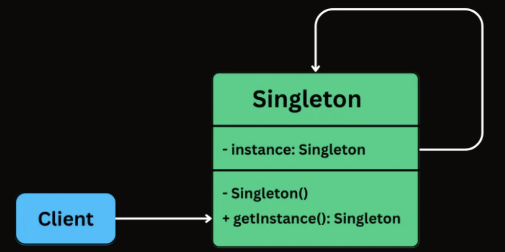
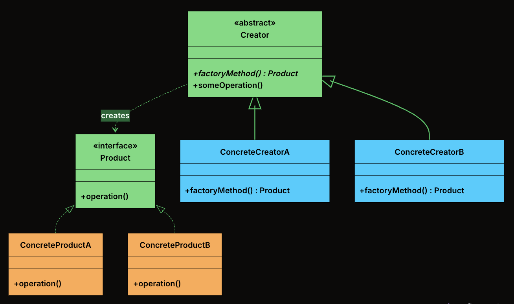
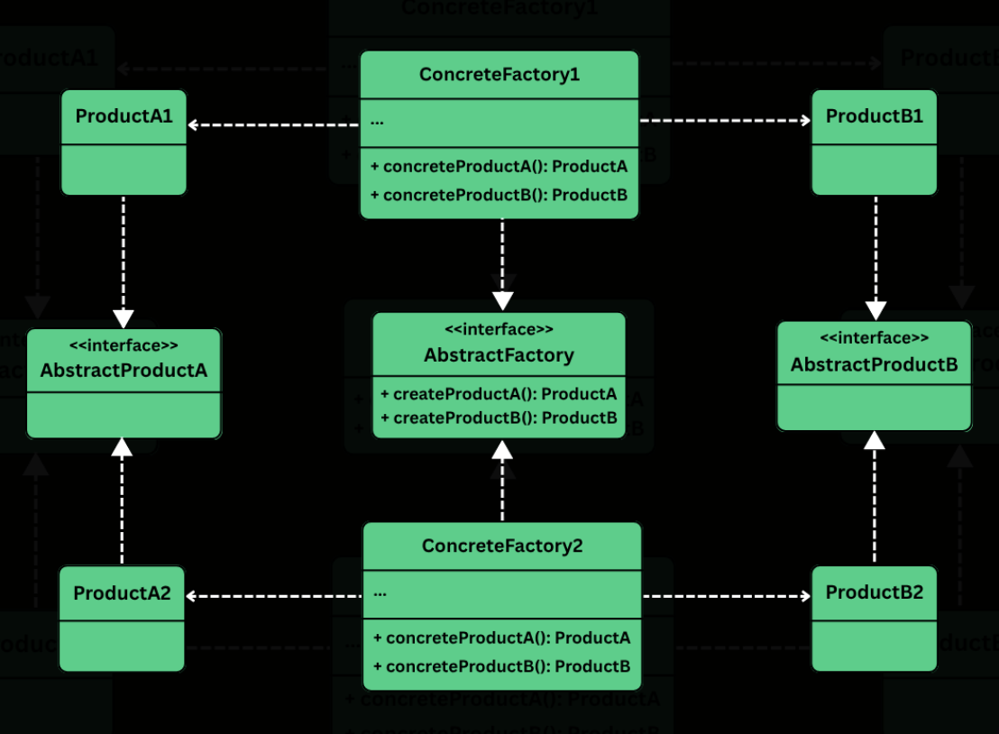
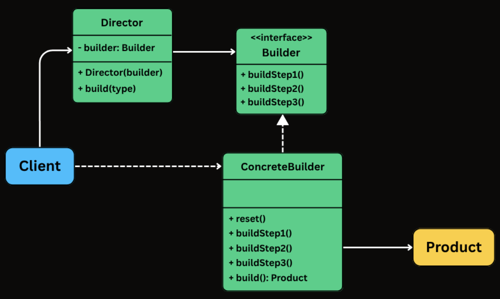

# Creational Patterns

---

## Table of Contents

- [Singleton](#singleton)
- [Factory Method](#factory-method)
- [Abstract Factory](#abstract-factory)
- [Builder](#builder)

---

## Singleton

### 📖 Definition

Singleton Pattern is a creational design pattern that guarantees a class has only one instance and provides a global point of access to it.

Two requirements define the pattern:

1. **Single instance**: No matter how many times any part of the code requests it, the same object is returned.
2. **Global access**: Any component can reach the instance without needing it passed through constructors or method parameters.

Singleton is useful in scenarios like:

- Managing Shared Resources (database connections, thread pools, caches, configuration settings)
- Coordinating System-Wide Actions (logging, print spoolers, file managers)
- Managing State (user session, application state)

### 🧩 Class Diagram

To implement the singleton pattern, we must prevent external objects from creating instances of the singleton class. Only the singleton class should be permitted to create its own objects.

Additionally, we need to provide a method for external objects to access the singleton object.



- An `instance` field stores the one and only Singleton object.
- The constructor is private or otherwise restricted, so other code cannot create new instances directly.
- A `getInstance()` (or similar) class-level method returns the shared instance and is accessible from anywhere.

### 🛠 Implementation

{{#tabs}}
{{#tab name="Java"}}

```java
class Singleton {
    // Holds the single shared instance (initially not created)
    private static Singleton instance;

    // Private constructor prevents creating objects from outside the class
    private Singleton() {}

    // Global access point to get the Singleton instance
    public static Singleton getInstance() {

        // Create the instance only when first requested (initialization)
        if (instance == null) {
            instance = new Singleton();
        }

        // Return the shared instance
        return instance;
    }
}
```

{{#endtab}}
{{#tab name="Python"}}

```python
class Singleton:
    # Holds the single shared instance (initially not created)
    _instance = None

    # Constructor prevents direct creation if instance already exists
    def __init__(self):
        if Singleton._instance is not None:
            raise Exception("Use get_instance() instead.")

    # Global access point to get the Singleton instance
    @staticmethod
    def get_instance():

        # Create the instance only when first requested (lazy initialization)
        if Singleton._instance is None:
            Singleton._instance = Singleton()

        # Return the shared instance
        return Singleton._instance
```

{{#endtab}}
{{#tab name="C++"}}

```cpp
class Singleton {
private:
    // Holds the single shared instance (initially not created)
    static Singleton* instance;

    // Private constructor prevents creating objects from outside the class
    Singleton() {}

public:

    // Global access point to get the Singleton instance
    static Singleton* getInstance() {

        // Create the instance only when first requested (initialization)
        if (instance == nullptr) {
            instance = new Singleton();
        }

        // Return the shared instance
        return instance;
    }
};
```

{{#endtab}}
{{#tab name="C#"}}

```csharp
class Singleton
{
    // Holds the single shared instance (initially not created)
    private static Singleton instance;

    // Private constructor prevents creating objects from outside the class
    private Singleton() { }

    // Global access point to get the Singleton instance
    public static Singleton GetInstance()
    {
        // Create the instance only when first requested (initialization)
        if (instance == null)
        {
            instance = new Singleton();
        }

        // Return the shared instance
        return instance;
    }
}
```

{{#endtab}}
{{#tab name="TypeScript"}}

```typescript
class Singleton {
  // Holds the single shared instance (initially not created)
  private static instance: Singleton;

  // Private constructor prevents creating objects from outside the class
  private constructor() {}

  // Global access point to get the Singleton instance
  public static getInstance(): Singleton {
    // Create the instance only when first requested (initialization)
    if (Singleton.instance == null) {
      Singleton.instance = new Singleton();
    }

    // Return the shared instance
    return Singleton.instance;
  }
}
```

{{#endtab}}
{{#endtabs}}

---

## Factory Method

### 📖 Definition

The Factory Method Design Pattern is a creational pattern that provides an interface for creating objects in a superclass, but allows subclasses to alter the type of objects that will be created.

It’s particularly useful in situations where:

- The exact type of object to be created isn't known until runtime.
- Object creation logic is complex, repetitive, or needs encapsulation.
- You want to follow the Open/Closed Principle, open for extension, closed for modification.

### 🧩 Class Diagram



- **Product**: The interface or abstract class that defines the contract for all objects the factory method creates. Every concrete product implements this interface, which means the rest of the system can work with any product without knowing its concrete type.

- **ConcreteProduct**: The actual classes that implement the Product interface. Each one provides its own behavior.

- **Creator**: An abstract class (or an interface) that declares the factory method, which returns an object of type Product.

- **ConcreteCreator**: Subclasses of Creator that override the factory method to return a specific ConcreteProduct. Each creator is paired with exactly one product type.

### 🛠 Implementation

{{#tabs}}
{{#tab name="Java"}}

1. Define the Product Interface

```java
interface Notification {
    public void send(String message);
}
```

2. Define Concrete Products

```java
class EmailNotification implements Notification {
    @Override
    public void send(String message) {
        System.out.println("Sending email: " + message);
    }
}

class SMSNotification implements Notification {
    @Override
    public void send(String message) {
        System.out.println("Sending SMS: " + message);
    }
}

class PushNotification implements Notification {
    @Override
    public void send(String message) {
        System.out.println("Sending push notification: " + message);
    }
}

class SlackNotification implements Notification {
    @Override
    public void send(String message) {
        System.out.println("Sending Slack message: " + message);
    }
}
```

3. Define Abstract Creator

```java
abstract class NotificationCreator {
    // Factory Method - subclasses decide what to create
    public abstract Notification createNotification();

    // Shared logic that uses the factory method
    public void send(String message) {
        Notification notification = createNotification();
        notification.send(message);
    }
}
```

4. Define Concrete Creators

```java
class EmailNotificationCreator extends NotificationCreator {
    @Override
    public Notification createNotification() {
        return new EmailNotification();
    }
}

class SMSNotificationCreator extends NotificationCreator {
    @Override
    public Notification createNotification() {
        return new SMSNotification();
    }
}

class PushNotificationCreator extends NotificationCreator {
    @Override
    public Notification createNotification() {
        return new PushNotification();
    }
}

class SlackNotificationCreator extends NotificationCreator {
    @Override
    public Notification createNotification() {
        return new SlackNotification();
    }
}
```

5, Client Code

```java
public class FactoryMethodDemo {
    public static void main(String[] args) {
        NotificationCreator creator;

        // Send Email
        creator = new EmailNotificationCreator();
        creator.send("Welcome to our platform!");

        // Send SMS
        creator = new SMSNotificationCreator();
        creator.send("Your OTP is 123456");

        // Send Push Notification
        creator = new PushNotificationCreator();
        creator.send("You have a new follower!");

        // Send Slack Message
        creator = new SlackNotificationCreator();
        creator.send("Standup in 10 minutes!");
    }
}
```

{{#endtab}}
{{#tab name="Python"}}

1. Define the Product Interface

```python
from abc import ABC, abstractmethod

class Notification(ABC):
    @abstractmethod
    def send(self, message: str) -> None:
        pass
```

2. Define Concrete Products

```python
class EmailNotification(Notification):
    def send(self, message: str) -> None:
        print(f"Sending email: {message}")

class SMSNotification(Notification):
    def send(self, message: str) -> None:
        print(f"Sending SMS: {message}")

class PushNotification(Notification):
    def send(self, message: str) -> None:
        print(f"Sending push notification: {message}")

class SlackNotification(Notification):
    def send(self, message: str) -> None:
        print(f"Sending Slack message: {message}")
```

3. Define Abstract Creator

```python
class NotificationCreator(ABC):
    # Factory Method - subclasses decide what to create
    @abstractmethod
    def create_notification(self) -> Notification:
        pass

    # Shared logic that uses the factory method
    def send(self, message: str) -> None:
        notification = self.create_notification()
        notification.send(message)
```

4. Define Concrete Creators

```python
class EmailNotificationCreator(NotificationCreator):
    def create_notification(self) -> Notification:
        return EmailNotification()

class SMSNotificationCreator(NotificationCreator):
    def create_notification(self) -> Notification:
        return SMSNotification()

class PushNotificationCreator(NotificationCreator):
    def create_notification(self) -> Notification:
        return PushNotification()

class SlackNotificationCreator(NotificationCreator):
    def create_notification(self) -> Notification:
        return SlackNotification()
```

5. Client Code

```python
def main():
    # Send Email
    creator = EmailNotificationCreator()
    creator.send("Welcome to our platform!")

    # Send SMS
    creator = SMSNotificationCreator()
    creator.send("Your OTP is 123456")

    # Send Push Notification
    creator = PushNotificationCreator()
    creator.send("You have a new follower!")

    # Send Slack Message
    creator = SlackNotificationCreator()
    creator.send("Standup in 10 minutes!")

if __name__ == "__main__":
    main()
```

{{#endtab}}
{{#tab name="C++"}}

1. Define the Product Interface

```cpp
class Notification {
public:
    virtual void send(const string& message) = 0;
    virtual ~Notification() {}
};
```

2. Define Concrete Products

```cpp
class EmailNotification : public Notification {
public:
    void send(const string& message) override {
        cout << "Sending email: " << message << endl;
    }
};

class SMSNotification : public Notification {
public:
    void send(const string& message) override {
        cout << "Sending SMS: " << message << endl;
    }
};

class PushNotification : public Notification {
public:
    void send(const string& message) override {
        cout << "Sending push notification: " << message << endl;
    }
};

class SlackNotification : public Notification {
public:
    void send(const string& message) override {
        cout << "Sending Slack message: " << message << endl;
    }
};
```

3. Define Abstract Creator

```cpp
class NotificationCreator {
public:
    // Factory Method - subclasses decide what to create
    virtual unique_ptr<Notification> createNotification() = 0;

    // Shared logic that uses the factory method
    void send(const string& message) {
        auto notification = createNotification();
        notification->send(message);
    }

    virtual ~NotificationCreator() = default;
};
```

4. Define Concrete Creators

```cpp
class EmailNotificationCreator : public NotificationCreator {
public:
    unique_ptr<Notification> createNotification() override {
        return make_unique<EmailNotification>();
    }
};

class SMSNotificationCreator : public NotificationCreator {
public:
    unique_ptr<Notification> createNotification() override {
        return make_unique<SMSNotification>();
    }
};

class PushNotificationCreator : public NotificationCreator {
public:
    unique_ptr<Notification> createNotification() override {
        return make_unique<PushNotification>();
    }
};

class SlackNotificationCreator : public NotificationCreator {
public:
    unique_ptr<Notification> createNotification() override {
        return make_unique<SlackNotification>();
    }
};
```

5. Client Code

```cpp
int main() {
    // Send Email
    unique_ptr<NotificationCreator> creator = make_unique<EmailNotificationCreator>();
    creator->send("Welcome to our platform!");

    // Send SMS
    creator = make_unique<SMSNotificationCreator>();
    creator->send("Your OTP is 123456");

    // Send Push Notification
    creator = make_unique<PushNotificationCreator>();
    creator->send("You have a new follower!");

    // Send Slack Message
    creator = make_unique<SlackNotificationCreator>();
    creator->send("Standup in 10 minutes!");

    return 0;
}
```

{{#endtab}}
{{#tab name="C#"}}

1. Define the Product Interface

```csharp
interface INotification
{
    void Send(string message);
}
```

2. Define Concrete Products

```csharp
class EmailNotification : INotification
{
    public void Send(string message)
    {
        Console.WriteLine("Sending email: " + message);
    }
}

class SmsNotification : INotification
{
    public void Send(string message)
    {
        Console.WriteLine("Sending SMS: " + message);
    }
}

class PushNotification : INotification
{
    public void Send(string message)
    {
        Console.WriteLine("Sending push notification: " + message);
    }
}

class SlackNotification : INotification
{
    public void Send(string message)
    {
        Console.WriteLine("Sending Slack message: " + message);
    }
}
```

3. Define Abstract Creator

```csharp
abstract class NotificationCreator
{
    // Factory Method - subclasses decide what to create
    public abstract INotification CreateNotification();

    // Shared logic that uses the factory method
    public void Send(string message)
    {
        INotification notification = CreateNotification();
        notification.Send(message);
    }
}
```

4. Define Concrete Creators

```csharp
class EmailNotificationCreator : NotificationCreator
{
    public override INotification CreateNotification()
    {
        return new EmailNotification();
    }
}

class SmsNotificationCreator : NotificationCreator
{
    public override INotification CreateNotification()
    {
        return new SmsNotification();
    }
}

class PushNotificationCreator : NotificationCreator
{
    public override INotification CreateNotification()
    {
        return new PushNotification();
    }
}

class SlackNotificationCreator : NotificationCreator
{
    public override INotification CreateNotification()
    {
        return new SlackNotification();
    }
}
```

5. Client Code

```csharp
class Program
{
    static void Main()
    {
        NotificationCreator creator;

        // Send Email
        creator = new EmailNotificationCreator();
        creator.Send("Welcome to our platform!");

        // Send SMS
        creator = new SmsNotificationCreator();
        creator.Send("Your OTP is 123456");

        // Send Push Notification
        creator = new PushNotificationCreator();
        creator.Send("You have a new follower!");

        // Send Slack Message
        creator = new SlackNotificationCreator();
        creator.Send("Standup in 10 minutes!");
    }
}
```

{{#endtab}}
{{#tab name="TypeScript"}}

1. Define the Product Interface

```typescript
interface Notification {
  send(message: string): void;
}
```

2. Define Concrete Products

```typescript
class EmailNotification implements Notification {
  send(message: string): void {
    console.log(`Sending email: ${message}`);
  }
}

class SMSNotification implements Notification {
  send(message: string): void {
    console.log(`Sending SMS: ${message}`);
  }
}

class PushNotification implements Notification {
  send(message: string): void {
    console.log(`Sending push notification: ${message}`);
  }
}

class SlackNotification implements Notification {
  send(message: string): void {
    console.log(`Sending Slack message: ${message}`);
  }
}
```

3. Define Abstract Creator

```typescript
abstract class NotificationCreator {
  // Factory Method - subclasses decide what to create
  abstract createNotification(): Notification;

  // Shared logic that uses the factory method
  send(message: string): void {
    const notification = this.createNotification();
    notification.send(message);
  }
}
```

4. Define Concrete Creators

```typescript
class EmailNotificationCreator extends NotificationCreator {
  createNotification(): Notification {
    return new EmailNotification();
  }
}

class SMSNotificationCreator extends NotificationCreator {
  createNotification(): Notification {
    return new SMSNotification();
  }
}

class PushNotificationCreator extends NotificationCreator {
  createNotification(): Notification {
    return new PushNotification();
  }
}

class SlackNotificationCreator extends NotificationCreator {
  createNotification(): Notification {
    return new SlackNotification();
  }
}
```

5. Client Code

```typescript
function main(): void {
  let creator: NotificationCreator;

  // Send Email
  creator = new EmailNotificationCreator();
  creator.send("Welcome to our platform!");

  // Send SMS
  creator = new SMSNotificationCreator();
  creator.send("Your OTP is 123456");

  // Send Push Notification
  creator = new PushNotificationCreator();
  creator.send("You have a new follower!");

  // Send Slack Message
  creator = new SlackNotificationCreator();
  creator.send("Standup in 10 minutes!");
}

main();
```

{{#endtab}}
{{#endtabs}}

---

## Abstract Factory

### 📖 Definition

The Abstract Factory Design Pattern is a creational pattern that provides an interface for creating families of related or dependent objects without specifying their concrete classes.

It’s particularly useful in situations where:

- You need to create objects that must be used together and are part of a consistent family (e.g., GUI elements like buttons, checkboxes, and menus).
- Your system must support multiple configurations, environments, or product variants (e.g., light vs. dark themes, Windows vs. macOS look-and-feel).
- You want to enforce consistency across related objects, ensuring that they are all created from the same factory.

### 🧩 Class Diagram



- **Abstract Factory**
  - Defines a common interface for creating a family of related products.
  - Typically includes factory methods like createButton(), createCheckbox(), createTextField(), etc.
  - Clients rely on this interface to create objects without knowing their concrete types.

- **Concrete Factory**
  - Implement the abstract factory interface.
  - Create concrete product variants that belong to a specific family or platform.
  - Each factory ensures that all components it produces are compatible (i.e., belong to the same platform/theme).

- **Abstract Product**
  - Define the interfaces or abstract classes for a set of related components.
  - All product variants for a given type (e.g., WindowsButton, MacOSButton) will implement these interfaces.

- **Concrete Product**
  - Implement the abstract product interfaces.
  - Contain platform-specific logic and appearance for the components.

- **Client**
  - Uses the abstract factory and abstract product interfaces.
  - Is completely unaware of the concrete classes it is using — it only interacts with the factory and product interfaces.
  - Can switch entire product families (e.g., from Windows to macOS) by changing the factory without touching UI logic.

### 🛠 Implementation

{{#tabs}}
{{#tab name="Java"}}

1. Define Abstract Product Interfaces

- Button

```java
interface Button {
    void paint();
    void onClick();
}
```

- Checkbox

```java
interface Checkbox {
    void paint();
    void onSelect();
}
```

2. Create Concrete Products

- Windows Products

```java
class WindowsButton implements Button {
    @Override
    public void paint() {
        System.out.println("Painting a Windows-style button.");
    }

    @Override
    public void onClick() {
        System.out.println("Windows button clicked.");
    }
}

class WindowsCheckbox implements Checkbox {
    @Override
    public void paint() {
        System.out.println("Painting a Windows-style checkbox.");
    }

    @Override
    public void onSelect() {
        System.out.println("Windows checkbox selected.");
    }
}
```

- MacOS Products

```java
class MacOSButton implements Button {
    @Override
    public void paint() {
        System.out.println("Painting a macOS-style button.");
    }

    @Override
    public void onClick() {
        System.out.println("macOS button clicked.");
    }
}

class MacOSCheckbox implements Checkbox {
    @Override
    public void paint() {
        System.out.println("Painting a macOS-style checkbox.");
    }

    @Override
    public void onSelect() {
        System.out.println("macOS checkbox selected.");
    }
}
```

3. Define the Abstract Factory

```java
interface GUIFactory {
    Button createButton();
    Checkbox createCheckbox();
}
```

4. Implement Concrete Factories

- WindowsFactory

```java
class WindowsFactory implements GUIFactory {
    @Override
    public Button createButton() {
        return new WindowsButton();
    }

    @Override
    public Checkbox createCheckbox() {
        return new WindowsCheckbox();
    }
}
```

- MacOSFactory

```java
class MacOSFactory implements GUIFactory {
    @Override
    public Button createButton() {
        return new MacOSButton();
    }

    @Override
    public Checkbox createCheckbox() {
        return new MacOSCheckbox();
    }
}
```

5. Client Code

```java
class Application {
    private final Button button;
    private final Checkbox checkbox;

    public Application(GUIFactory factory) {
        this.button = factory.createButton();
        this.checkbox = factory.createCheckbox();
    }

    public void renderUI() {
        button.paint();
        checkbox.paint();
    }
}
```

6. Wire Everything Together

```java
public class AppLauncher {
    public static void main(String[] args) {
        // Simulate platform detection
        String os = System.getProperty("os.name");
        GUIFactory factory;

        if (os.contains("Windows")) {
            factory = new WindowsFactory();
        } else {
            factory = new MacOSFactory();
        }

        Application app = new Application(factory);
        app.renderUI();
    }
}
```

- Output (on MacOS)

```txt
Painting a macOS-style button.
Painting a macOS-style checkbox.
```

- Output (on Windows)

```txt
Painting a Windows-style button.
Painting a Windows-style checkbox.
```

{{#endtab}}
{{#tab name="Python"}}

1. Define Abstract Product Interfaces

- Button

```python
from abc import ABC, abstractmethod

class Button(ABC):
    @abstractmethod
    def paint(self):
        pass

    @abstractmethod
    def on_click(self):
        pass
```

- Checkbox

```python
class Checkbox(ABC):
    @abstractmethod
    def paint(self):
        pass

    @abstractmethod
    def on_select(self):
        pass
```

2. Create Concrete Products

- Windows Products

```python
class WindowsButton(Button):
    def paint(self):
        print("Painting a Windows-style button.")

    def on_click(self):
        print("Windows button clicked.")


class WindowsCheckbox(Checkbox):
    def paint(self):
        print("Painting a Windows-style checkbox.")

    def on_select(self):
        print("Windows checkbox selected.")
```

- MacOS Products

```python
class MacOSButton(Button):
    def paint(self):
        print("Painting a macOS-style button.")

    def on_click(self):
        print("macOS button clicked.")


class MacOSCheckbox(Checkbox):
    def paint(self):
        print("Painting a macOS-style checkbox.")

    def on_select(self):
        print("macOS checkbox selected.")
```

3. Define the Abstract Factory

```python
class GUIFactory(ABC):
    @abstractmethod
    def create_button(self):
        pass

    @abstractmethod
    def create_checkbox(self):
        pass
```

4. Implement Concrete Factories

- WindowsFactory

```python
class WindowsFactory(GUIFactory):
    def create_button(self):
        return WindowsButton()

    def create_checkbox(self):
        return WindowsCheckbox()
```

- MacOSFactory

```python
class MacOSFactory(GUIFactory):
    def create_button(self):
        return MacOSButton()

    def create_checkbox(self):
        return MacOSCheckbox()
```

5. Client Code

```python
class Application:
    def __init__(self, factory):
        self.button = factory.create_button()
        self.checkbox = factory.create_checkbox()

    def render_ui(self):
        self.button.paint()
        self.checkbox.paint()
```

6. Wire Everything Together

```python
import platform

class AppLauncher:
    @staticmethod
    def main():
        # Simulate platform detection
        os = platform.system()

        if "Windows" in os:
            factory = WindowsFactory()
        else:
            factory = MacOSFactory()

        app = Application(factory)
        app.render_ui()

if __name__ == "__main__":
    AppLauncher.main()
```

- Output (on MacOS)

```txt
Painting a macOS-style button.
Painting a macOS-style checkbox.
```

- Output (on Windows)

```txt
Painting a Windows-style button.
Painting a Windows-style checkbox.
```

{{#endtab}}
{{#tab name="C++"}}

1. Define Abstract Product Interfaces

- Button

```cpp
class Button {
public:
    virtual void paint() = 0;
    virtual void onClick() = 0;
    virtual ~Button() = default;
};
```

- Checkbox

```cpp
class Checkbox {
public:
    virtual void paint() = 0;
    virtual void onSelect() = 0;
    virtual ~Checkbox() {}
};
```

2. Create Concrete Products

- Windows Products

```cpp
class WindowsButton : public Button {
public:
    void paint() override {
        cout << "Painting a Windows-style button." << endl;
    }

    void onClick() override {
        cout << "Windows button clicked." << endl;
    }
};

class WindowsCheckbox : public Checkbox {
public:
    void paint() override {
        cout << "Painting a Windows-style checkbox." << endl;
    }

    void onSelect() override {
        cout << "Windows checkbox selected." << endl;
    }
};
```

- MacOS Products

```cpp
class MacOSButton : public Button {
public:
    void paint() override {
        cout << "Painting a macOS-style button." << endl;
    }

    void onClick() override {
        cout << "macOS button clicked." << endl;
    }
};

class MacOSCheckbox : public Checkbox {
public:
    void paint() override {
        cout << "Painting a macOS-style checkbox." << endl;
    }

    void onSelect() override {
        cout << "macOS checkbox selected." << endl;
    }
};
```

3. Define the Abstract Factory

```cpp
class GUIFactory {
public:
    virtual Button* createButton() = 0;
    virtual Checkbox* createCheckbox() = 0;
    virtual ~GUIFactory() {}
};
```

4. Implement Concrete Factories

- WindowsFactory

```cpp
class WindowsFactory : public GUIFactory {
public:
    Button* createButton() override {
        return new WindowsButton();
    }
    Checkbox* createCheckbox() override {
        return new WindowsCheckbox();
    }
};
```

- MacOSFactory

```cpp
class MacOSFactory : public GUIFactory {
public:
    Button* createButton() override {
        return new MacOSButton();
    }
    Checkbox* createCheckbox() override {
        return new MacOSCheckbox();
    }
};
```

5. Client Code

```cpp
class Application {
private:
    Button* button;
    Checkbox* checkbox;

public:
    Application(GUIFactory* factory) {
        button = factory->createButton();
        checkbox = factory->createCheckbox();
    }

    ~Application() {
        delete button;
        delete checkbox;
    }

    void renderUI() {
        button->paint();
        checkbox->paint();
    }
};
```

6. Wire Everything Together

```cpp
int main() {
    string os;
    cout << "Enter OS (Windows/Mac): ";
    getline(cin, os);

    GUIFactory* factory = nullptr;

    // Simulated platform detection
    transform(os.begin(), os.end(), os.begin(), ::tolower);
    if (os.find("windows") != string::npos) {
        factory = new WindowsFactory();
    } else {
        factory = new MacOSFactory();
    }

    Application app(factory);
    app.renderUI();

    delete factory;

    return 0;
}
```

- Output (on MacOS)

```txt
Painting a macOS-style button.
Painting a macOS-style checkbox.
```

- Output (on Windows)

```txt
Painting a Windows-style button.
Painting a Windows-style checkbox.
```

{{#endtab}}
{{#tab name="C#"}}

1. Define Abstract Product Interfaces

- Button

```csharp
interface IButton
{
    void Paint();
    void OnClick();
}
```

- Checkbox

```csharp
interface ICheckbox
{
    void Paint();
    void OnSelect();
}
```

2. Create Concrete Products

- Windows Products

```csharp
class WindowsButton : IButton
{
    public void Paint()
    {
        Console.WriteLine("Painting a Windows-style button.");
    }

    public void OnClick()
    {
        Console.WriteLine("Windows button clicked.");
    }
}

class WindowsCheckbox : ICheckbox
{
    public void Paint()
    {
        Console.WriteLine("Painting a Windows-style checkbox.");
    }

    public void OnSelect()
    {
        Console.WriteLine("Windows checkbox selected.");
    }
}
```

- MacOS Products

```csharp
class MacOSButton : IButton
{
    public void Paint()
    {
        Console.WriteLine("Painting a macOS-style button.");
    }

    public void OnClick()
    {
        Console.WriteLine("macOS button clicked.");
    }
}

class MacOSCheckbox : ICheckbox
{
    public void Paint()
    {
        Console.WriteLine("Painting a macOS-style checkbox.");
    }

    public void OnSelect()
    {
        Console.WriteLine("macOS checkbox selected.");
    }
}
```

3. Define the Abstract Factory

```csharp
interface IGUIFactory
{
    IButton CreateButton();
    ICheckbox CreateCheckbox();
}
```

4. Implement Concrete Factories

- WindowsFactory

```csharp
class WindowsFactory : IGUIFactory
{
    public IButton CreateButton()
    {
        return new WindowsButton();
    }

    public ICheckbox CreateCheckbox()
    {
        return new WindowsCheckbox();
    }
}
```

- MacOSFactory

```csharp
class MacOSFactory : IGUIFactory
{
    public IButton CreateButton()
    {
        return new MacOSButton();
    }

    public ICheckbox CreateCheckbox()
    {
        return new MacOSCheckbox();
    }
}
```

5. Client Code

```csharp
class Application
{
    private readonly IButton _button;
    private readonly ICheckbox _checkbox;

    public Application(IGUIFactory factory)
    {
        _button = factory.CreateButton();
        _checkbox = factory.CreateCheckbox();
    }

    public void RenderUI()
    {
        _button.Paint();
        _checkbox.Paint();
    }
}
```

6. Wire Everything Together

```csharp
public class AppLauncher
{
    public static void Main()
    {
        Console.Write("Enter OS (Windows/Mac): ");
        string os = Console.ReadLine()?.ToLower() ?? "";

        IGUIFactory factory;

        if (os.Contains("windows"))
        {
            factory = new WindowsFactory();
        }
        else
        {
            factory = new MacOSFactory();
        }

        Application app = new Application(factory);
        app.RenderUI();
    }
}
```

- Output (on MacOS)

```txt
Painting a macOS-style button.
Painting a macOS-style checkbox.
```

- Output (on Windows)

```txt
Painting a Windows-style button.
Painting a Windows-style checkbox.
```

{{#endtab}}
{{#tab name="TypeScript"}}

1. Define Abstract Product Interfaces

- Button

```typescript
interface Button {
  paint(): void;
  onClick(): void;
}
```

- Checkbox

```typescript
interface Checkbox {
  paint(): void;
  onSelect(): void;
}
```

2. Create Concrete Products

- Windows Products

```typescript
class WindowsButton implements Button {
  paint(): void {
    console.log("Painting a Windows-style button.");
  }

  onClick(): void {
    console.log("Windows button clicked.");
  }
}

class WindowsCheckbox implements Checkbox {
  paint(): void {
    console.log("Painting a Windows-style checkbox.");
  }

  onSelect(): void {
    console.log("Windows checkbox selected.");
  }
}
```

- MacOS Products

```typescript
class MacOSButton implements Button {
  paint(): void {
    console.log("Painting a macOS-style button.");
  }

  onClick(): void {
    console.log("macOS button clicked.");
  }
}

class MacOSCheckbox implements Checkbox {
  paint(): void {
    console.log("Painting a macOS-style checkbox.");
  }

  onSelect(): void {
    console.log("macOS checkbox selected.");
  }
}
```

3. Define the Abstract Factory

```typescript
interface GUIFactory {
  createButton(): Button;
  createCheckbox(): Checkbox;
}
```

4. Implement Concrete Factories

- WindowsFactory

```typescript
class WindowsFactory implements GUIFactory {
  createButton(): Button {
    return new WindowsButton();
  }

  createCheckbox(): Checkbox {
    return new WindowsCheckbox();
  }
}
```

- MacOSFactory

```typescript
class MacOSFactory implements GUIFactory {
  createButton(): Button {
    return new MacOSButton();
  }

  createCheckbox(): Checkbox {
    return new MacOSCheckbox();
  }
}
```

5. Client Code

```typescript
class Application {
  private readonly button: Button;
  private readonly checkbox: Checkbox;

  constructor(factory: GUIFactory) {
    this.button = factory.createButton();
    this.checkbox = factory.createCheckbox();
  }

  renderUI(): void {
    this.button.paint();
    this.checkbox.paint();
  }
}
```

6. Wire Everything Together

```typescript
class AppLauncher {
  static main(): void {
    // Simulate platform detection
    const os = process.platform;
    let factory: GUIFactory;

    if (os === "win32") {
      factory = new WindowsFactory();
    } else {
      factory = new MacOSFactory();
    }

    const app = new Application(factory);
    app.renderUI();
  }
}

AppLauncher.main();
```

- Output (on MacOS)

```txt
Painting a macOS-style button.
Painting a macOS-style checkbox.
```

- Output (on Windows)

```txt
Painting a Windows-style button.
Painting a Windows-style checkbox.
```

{{#endtab}}
{{#endtabs}}

---

## Builder

### 📖 Definition

The Builder Design Pattern is a creational pattern that lets you construct complex objects step-by-step, separating the construction logic from the final representation.

Two ideas define the pattern:

1. **Step-by-step construction**: Instead of passing everything to a constructor at once, you set each field through individual method calls. You only call the methods for the fields you need.
2. **Fluent interface**: Each setter method returns the builder itself, allowing you to chain calls into a single readable expression that ends with `build()`.

### 🧩 Class Diagram

The Builder pattern involves four participants. In many real-world implementations, the Director is optional and is often skipped when using fluent builders.



- **Builder**
  - Exposes methods to configure the product step by step.
  - Typically returns the builder itself from each method to enable fluent chaining.
  - Often implemented as a static nested class inside the product class.

- **ConcreteBuilder**
  - Implements the builder API (either via an interface or directly through fluent methods).
  - Stores intermediate state for the object being constructed.
  - Implements build() to validate inputs and produce the final product instance.

- **Product**
  - The complex object being constructed.
  - Often immutable and created only through the builder.
  - Commonly has a private constructor that copies state from the builder.

- **Director (Optional)**
  - Coordinates the construction process by calling builder steps in a specific sequence.
  - Useful when you want to encapsulate standard configurations or reusable construction sequences.
  - Often omitted in fluent builder style, where the client effectively plays this role by chaining bilder calls.

### 🛠 Implementation

{{#tabs}}
{{#tab name="Java"}}

1. Create the Product and Builder

```java
class HttpRequest {
    // Required
    private final String url;

    // Optional
    private final String method;
    private final Map<String, String> headers;
    private final Map<String, String> queryParams;
    private final String body;
    private final int timeout;

    // Private constructor - only the Builder can call this
    private HttpRequest(Builder builder) {
        this.url = builder.url;
        this.method = builder.method;
        this.headers = Collections.unmodifiableMap(new HashMap<>(builder.headers));
        this.queryParams = Collections.unmodifiableMap(new HashMap<>(builder.queryParams));
        this.body = builder.body;
        this.timeout = builder.timeout;
    }

    public String getUrl() { return url; }
    public String getMethod() { return method; }
    public Map<String, String> getHeaders() { return headers; }
    public Map<String, String> getQueryParams() { return queryParams; }
    public String getBody() { return body; }
    public int getTimeout() { return timeout; }

    @Override
    public String toString() {
        return "HttpRequest{url='" + url + "', method='" + method +
               "', headers=" + headers + ", queryParams=" + queryParams +
               ", body='" + body + "', timeout=" + timeout + "}";
    }

    // Static nested Builder class
    public static class Builder {
        private final String url; // required
        private String method = "GET";
        private Map<String, String> headers = new HashMap<>();
        private Map<String, String> queryParams = new HashMap<>();
        private String body;
        private int timeout = 30000;

        public Builder(String url) {
            this.url = url;
        }

        public Builder method(String method) {
            this.method = method;
            return this;
        }

        public Builder addHeader(String key, String value) {
            this.headers.put(key, value);
            return this;
        }

        public Builder addQueryParam(String key, String value) {
            this.queryParams.put(key, value);
            return this;
        }

        public Builder body(String body) {
            this.body = body;
            return this;
        }

        public Builder timeout(int timeout) {
            this.timeout = timeout;
            return this;
        }

        public HttpRequest build() {
            return new HttpRequest(this);
        }
    }
}
```

2. Using the Builder from Client Code

```java
public class Main {
    public static void main(String[] args) {
        // Simple GET request - just the URL
        HttpRequest get = new HttpRequest.Builder("https://api.example.com/users")
                .build();

        // POST with body and custom timeout
        HttpRequest post = new HttpRequest.Builder("https://api.example.com/users")
                .method("POST")
                .addHeader("Content-Type", "application/json")
                .body("{\"name\":\"Alice\",\"email\":\"alice@example.com\"}")
                .timeout(5000)
                .build();

        // Authenticated PUT with query parameters
        HttpRequest put = new HttpRequest.Builder("https://api.example.com/config")
                .method("PUT")
                .addHeader("Authorization", "Bearer token123")
                .addHeader("Content-Type", "application/json")
                .addQueryParam("env", "production")
                .addQueryParam("version", "2")
                .body("{\"feature_flag\":true}")
                .timeout(10000)
                .build();
    }
}
```

{{#endtab}}
{{#tab name="Python"}}

1. Create the Product and Builder

```python
class HttpRequest:
    def __init__(self, builder):
        self.url = builder._url
        self.method = builder._method
        self.headers = dict(builder._headers)  # defensive copy
        self.query_params = dict(builder._query_params)
        self.body = builder._body
        self.timeout = builder._timeout

    def __str__(self):
        return (f"HttpRequest(url='{self.url}', method='{self.method}', "
                f"headers={self.headers}, query_params={self.query_params}, "
                f"body='{self.body}', timeout={self.timeout})")

    class Builder:
        def __init__(self, url):
            self._url = url  # required
            self._method = "GET"
            self._headers = {}
            self._query_params = {}
            self._body = None
            self._timeout = 30000

        def method(self, method):
            self._method = method
            return self

        def add_header(self, key, value):
            self._headers[key] = value
            return self

        def add_query_param(self, key, value):
            self._query_params[key] = value
            return self

        def body(self, body):
            self._body = body
            return self

        def timeout(self, timeout):
            self._timeout = timeout
            return self

        def build(self):
            return HttpRequest(self)
```

2. Using the Builder from Client Code

```python
if __name__ == "__main__":
    # Simple GET request
    get = HttpRequest.Builder("https://api.example.com/users") \
        .build()

    # POST with body and custom timeout
    post = HttpRequest.Builder("https://api.example.com/users") \
        .method("POST") \
        .add_header("Content-Type", "application/json") \
        .body('{"name":"Alice","email":"alice@example.com"}') \
        .timeout(5000) \
        .build()

    # Authenticated PUT with query parameters
    put = HttpRequest.Builder("https://api.example.com/config") \
        .method("PUT") \
        .add_header("Authorization", "Bearer token123") \
        .add_header("Content-Type", "application/json") \
        .add_query_param("env", "production") \
        .add_query_param("version", "2") \
        .body('{"feature_flag":true}') \
        .timeout(10000) \
        .build()
```

{{#endtab}}
{{#tab name="C++"}}

1. Create the Product and Builder

```cpp
class HttpRequest {
private:
    string url;
    string method;
    map<string, string> headers;
    map<string, string> queryParams;
    string body;
    int timeout;

    // Private constructor
    HttpRequest(const string& url, const string& method,
                const map<string, string>& headers,
                const map<string, string>& queryParams,
                const string& body, int timeout)
        : url(url), method(method), headers(headers),
          queryParams(queryParams), body(body), timeout(timeout) {}

public:
    string getUrl() const {
        return url;
    }
    string getMethod() const {
        return method;
    }

    void print() const {
        cout << "HttpRequest{url='" << url << "', method='" << method
             << "', headers=" << headers.size()
             << ", queryParams=" << queryParams.size()
             << ", body='" << body << "', timeout=" << timeout << "}" << endl;
    }

    class Builder {
    private:
        string url;
        string method = "GET";
        map<string, string> headers;
        map<string, string> queryParams;
        string body;
        int timeout = 30000;

    public:
        explicit Builder(const string& url) : url(url) {}

        Builder& setMethod(const string& m) {
            method = m;
            return *this;
        }

        Builder& addHeader(const string& key, const string& value) {
            headers[key] = value;
            return *this;
        }

        Builder& addQueryParam(const string& key, const string& value) {
            queryParams[key] = value;
            return *this;
        }

        Builder& setBody(const string& b) {
            body = b;
            return *this;
        }

        Builder& setTimeout(int t) {
            timeout = t;
            return *this;
        }

        HttpRequest build() const {
            return HttpRequest(url, method, headers, queryParams, body, timeout);
        }
    };
};
```

2. Using the Builder from Client Code

```cpp
int main() {
    // Simple GET request
    HttpRequest get = HttpRequest::Builder("https://api.example.com/users")
        .build();

    // POST with body and custom timeout
    HttpRequest post = HttpRequest::Builder("https://api.example.com/users")
        .setMethod("POST")
        .addHeader("Content-Type", "application/json")
        .setBody("{\"name\":\"Alice\",\"email\":\"alice@example.com\"}")
        .setTimeout(5000)
        .build();

    // Authenticated PUT with query parameters
    HttpRequest put = HttpRequest::Builder("https://api.example.com/config")
        .setMethod("PUT")
        .addHeader("Authorization", "Bearer token123")
        .addHeader("Content-Type", "application/json")
        .addQueryParam("env", "production")
        .addQueryParam("version", "2")
        .setBody("{\"feature_flag\":true}")
        .setTimeout(10000)
        .build();

    return 0;
}
```

{{#endtab}}
{{#tab name="C#"}}

1. Create the Product and Builder

```csharp
class HttpRequest
{
    public string Url { get; }
    public string Method { get; }
    public IReadOnlyDictionary<string, string> Headers { get; }
    public IReadOnlyDictionary<string, string> QueryParams { get; }
    public string Body { get; }
    public int Timeout { get; }

    // Private constructor
    private HttpRequest(Builder builder)
    {
        Url = builder.Url;
        Method = builder.Method;
        Headers = new Dictionary<string, string>(builder.Headers);
        QueryParams = new Dictionary<string, string>(builder.QueryParams);
        Body = builder.Body;
        Timeout = builder.Timeout;
    }

    public override string ToString()
    {
        return $"HttpRequest{{Url='{Url}', Method='{Method}', " +
               $"Headers={Headers.Count}, QueryParams={QueryParams.Count}, " +
               $"Body='{Body}', Timeout={Timeout}}}";
    }

    public class Builder
    {
        public string Url { get; }
        public string Method { get; private set; } = "GET";
        public Dictionary<string, string> Headers { get; } = new();
        public Dictionary<string, string> QueryParams { get; } = new();
        public string Body { get; private set; }
        public int Timeout { get; private set; } = 30000;

        public Builder(string url) {
            Url = url;
        }

        public Builder SetMethod(string method)
        {
            Method = method;
            return this;
        }

        public Builder AddHeader(string key, string value)
        {
            Headers[key] = value;
            return this;
        }

        public Builder AddQueryParam(string key, string value)
        {
            QueryParams[key] = value;
            return this;
        }

        public Builder SetBody(string body)
        {
            Body = body;
            return this;
        }

        public Builder SetTimeout(int timeout)
        {
            Timeout = timeout;
            return this;
        }

        public HttpRequest Build()
        {
            return new HttpRequest(this);
        }
    }
}
```

2. Using the Builder from Client Code

```csharp
class Program
{
    static void Main()
    {
        // Simple GET request
        var get = new HttpRequest.Builder("https://api.example.com/users")
            .Build();

        // POST with body and custom timeout
        var post = new HttpRequest.Builder("https://api.example.com/users")
            .SetMethod("POST")
            .AddHeader("Content-Type", "application/json")
            .SetBody("{\"name\":\"Alice\",\"email\":\"alice@example.com\"}")
            .SetTimeout(5000)
            .Build();

        // Authenticated PUT with query parameters
        var put = new HttpRequest.Builder("https://api.example.com/config")
            .SetMethod("PUT")
            .AddHeader("Authorization", "Bearer token123")
            .AddHeader("Content-Type", "application/json")
            .AddQueryParam("env", "production")
            .AddQueryParam("version", "2")
            .SetBody("{\"feature_flag\":true}")
            .SetTimeout(10000)
            .Build();
    }
}
```

{{#endtab}}
{{#tab name="TypeScript"}}

1. Create the Product and Builder

```typescript
class HttpRequest {
  private readonly url: string;
  private readonly method: string;
  private readonly headers: ReadonlyMap<string, string>;
  private readonly queryParams: ReadonlyMap<string, string>;
  private readonly body: string | null;
  private readonly timeout: number;

  // Private constructor
  private constructor(builder: HttpRequestBuilder) {
    this.url = builder.getUrl();
    this.method = builder.getMethod();
    this.headers = new Map(builder.getHeaders());
    this.queryParams = new Map(builder.getQueryParams());
    this.body = builder.getBody();
    this.timeout = builder.getTimeout();
  }

  toString(): string {
    return (
      `HttpRequest{url='${this.url}', method='${this.method}', ` +
      `headers=${this.headers.size}, queryParams=${this.queryParams.size}, ` +
      `body='${this.body}', timeout=${this.timeout}}`
    );
  }

  static Builder = class HttpRequestBuilder {
    private url: string;
    private method: string = "GET";
    private headers: Map<string, string> = new Map();
    private queryParams: Map<string, string> = new Map();
    private body: string | null = null;
    private timeout: number = 30000;

    constructor(url: string) {
      this.url = url;
    }

    getUrl(): string {
      return this.url;
    }
    getMethod(): string {
      return this.method;
    }
    getHeaders(): Map<string, string> {
      return this.headers;
    }
    getQueryParams(): Map<string, string> {
      return this.queryParams;
    }
    getBody(): string | null {
      return this.body;
    }
    getTimeout(): number {
      return this.timeout;
    }

    setMethod(method: string): this {
      this.method = method;
      return this;
    }

    addHeader(key: string, value: string): this {
      this.headers.set(key, value);
      return this;
    }

    addQueryParam(key: string, value: string): this {
      this.queryParams.set(key, value);
      return this;
    }

    setBody(body: string): this {
      this.body = body;
      return this;
    }

    setTimeout(timeout: number): this {
      this.timeout = timeout;
      return this;
    }

    build(): HttpRequest {
      return new HttpRequest(this);
    }
  };
}
```

2. Using the Builder from Client Code

```typescript
// Simple GET request
const get = new HttpRequest.Builder("https://api.example.com/users").build();

// POST with body and custom timeout
const post = new HttpRequest.Builder("https://api.example.com/users")
  .setMethod("POST")
  .addHeader("Content-Type", "application/json")
  .setBody('{"name":"Alice","email":"alice@example.com"}')
  .setTimeout(5000)
  .build();

// Authenticated PUT with query parameters
const put = new HttpRequest.Builder("https://api.example.com/config")
  .setMethod("PUT")
  .addHeader("Authorization", "Bearer token123")
  .addHeader("Content-Type", "application/json")
  .addQueryParam("env", "production")
  .addQueryParam("version", "2")
  .setBody('{"feature_flag":true}')
  .setTimeout(10000)
  .build();
```

{{#endtab}}
{{#endtabs}}
