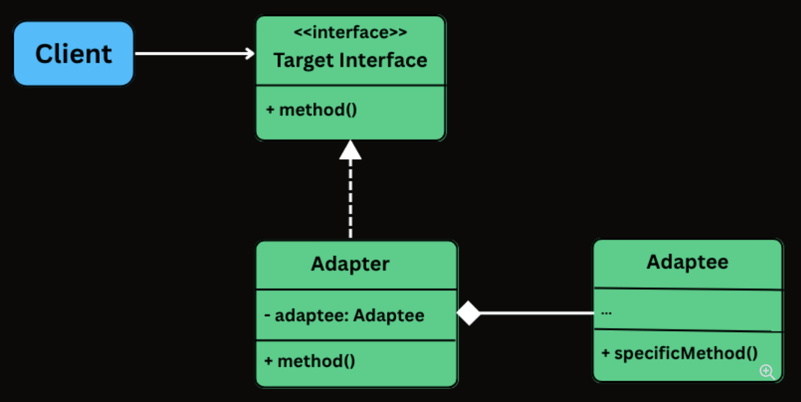
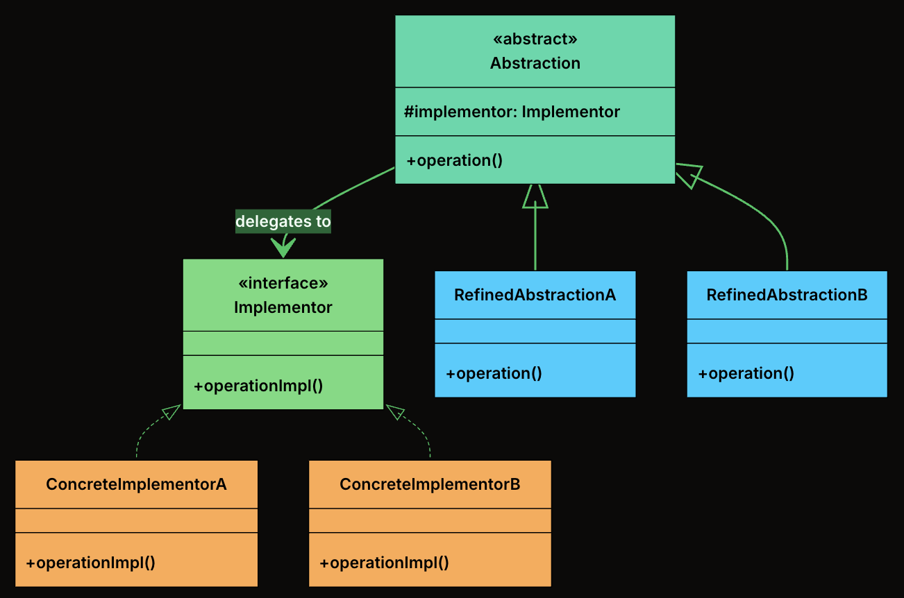

# Structural Patterns

---

## Table of Contents

- [Adapter](#adapter)
- [Bridge](#bridge)
- [Decorator](#decorator)
- [Composite](#composite)
- [Facade](#facade)

## Adapter

### 📖 Definition

The Adapter Design Pattern is a structural design pattern that allows incompatible interfaces to work together by converting the interface of one class into another that the client expects.

It’s particularly useful in situations where:

- You’re integrating with a legacy system or a third-party library that doesn’t match your current interface.
- You want to reuse existing functionality without modifying its source code.
- You need to bridge the gap between new and old code, or between systems built with different interface designs.

### 🧩 Class Diagram



- **Target Interface**: The interface that the client code depends on. Every method call from the client goes through this interface.

- **Adaptee**: The existing class with a useful implementation but an incompatible interface.

- **Adapter**: The translator. It implements the Target interface and holds a reference to the Adaptee, delegating calls with the necessary translation.

- **Client**: The code that uses the Target interface. It is completely unaware of the Adaptee or the Adapter's internal workings.

### 🛠 Implementation

{{#tabs}}
{{#tab name="Java"}}

1. Define the Target Interface

```java
interface PaymentProcessor {
    void processPayment(double amount, String currency);
    boolean isPaymentSuccessful();
    String getTransactionId();
}
```

2. Create the Adaptee Class

```java
class LegacyGateway {
    private long transactionReference;
    private boolean paymentSuccessful;

    public void executeTransaction(double totalAmount, String currency) {
        System.out.println("LegacyGateway: Executing " + currency + " " + totalAmount);
        transactionReference = System.nanoTime();
        paymentSuccessful = true;
        System.out.println("LegacyGateway: Done. Ref: " + transactionReference);
    }

    public boolean checkStatus(long ref) {
        System.out.println("LegacyGateway: Checking status for ref: " + ref);
        return paymentSuccessful;
    }

    public long getReferenceNumber() {
        return transactionReference;
    }
}
```

3. Implement the Adapter Class

```java
class LegacyGatewayAdapter implements PaymentProcessor {
    private final LegacyGateway legacyGateway;
    private long currentRef;

    public LegacyGatewayAdapter(LegacyGateway legacyGateway) {
        this.legacyGateway = legacyGateway;
    }

    @Override
    public void processPayment(double amount, String currency) {
        System.out.println("Adapter: Translating processPayment() for " + amount + " " + currency);
        legacyGateway.executeTransaction(amount, currency);
        currentRef = legacyGateway.getReferenceNumber(); // Store for later use
    }

    @Override
    public boolean isPaymentSuccessful() {
        return legacyGateway.checkStatus(currentRef);
    }

    @Override
    public String getTransactionId() {
        return "LEGACY_TXN_" + currentRef;
    }
}
```

4. Client Code

```java
public class ECommerceAppV2 {
    public static void main(String[] args) {
        // Modern processor
        PaymentProcessor processor = new InHousePaymentProcessor();
        CheckoutService modernCheckout = new CheckoutService(processor);
        System.out.println("--- Using Modern Processor ---");
        modernCheckout.checkout(199.99, "USD");

        // Legacy gateway through adapter
        System.out.println("\n--- Using Legacy Gateway via Adapter ---");
        LegacyGateway legacy = new LegacyGateway();
        processor = new LegacyGatewayAdapter(legacy);
        CheckoutService legacyCheckout = new CheckoutService(processor);
        legacyCheckout.checkout(75.50, "USD");
    }
}
```

{{#endtab}}
{{#tab name="Python"}}

1. Define the Target Interface

```python
from abc import ABC, abstractmethod

class PaymentProcessor(ABC):
    @abstractmethod
    def process_payment(self, amount: float, currency: str):
        pass

    @abstractmethod
    def is_payment_successful(self) -> bool:
        pass

    @abstractmethod
    def get_transaction_id(self) -> str:
        pass
```

2. Create the Adaptee Class

```python
class LegacyGateway:
    def __init__(self):
        self._transaction_reference = None
        self._payment_successful = False

    def execute_transaction(self, total_amount: float, currency: str):
        print(f"LegacyGateway: Executing {currency} {total_amount}")
        self._transaction_reference = time.time_ns()
        self._payment_successful = True
        print(f"LegacyGateway: Done. Ref: {self._transaction_reference}")

    def check_status(self, ref: int) -> bool:
        print(f"LegacyGateway: Checking status for ref: {ref}")
        return self._payment_successful

    def get_reference_number(self) -> int:
        return self._transaction_reference
```

3. Implement the Adapter Class

```python
class LegacyGatewayAdapter(PaymentProcessor):
   def __init__(self, legacy_gateway):
       self.legacy_gateway = legacy_gateway
       self.current_ref = None

   def process_payment(self, amount, currency):
       print(f"Adapter: Translating processPayment() for {amount} {currency}")
       self.legacy_gateway.execute_transaction(amount, currency)
       self.current_ref = self.legacy_gateway.get_reference_number()

   def is_payment_successful(self):
       return self.legacy_gateway.check_status(self.current_ref)

   def get_transaction_id(self):
       return f"LEGACY_TXN_{self.current_ref}"
```

4. Client Code

```python
class ECommerceAppV2:
   @staticmethod
   def main():
       # Modern processor
       processor = InHousePaymentProcessor()
       modern_checkout = CheckoutService(processor)
       print("--- Using Modern Processor ---")
       modern_checkout.checkout(199.99, "USD")

       # Legacy gateway through adapter
       print("\n--- Using Legacy Gateway via Adapter ---")
       legacy = LegacyGateway()
       processor = LegacyGatewayAdapter(legacy)
       legacy_checkout = CheckoutService(processor)
       legacy_checkout.checkout(75.50, "USD")

if __name__ == "__main__":
   ECommerceAppV2.main()
```

{{#endtab}}
{{#tab name="C++"}}

1. Define the Target Interface

```cpp
class PaymentProcessor {
public:
   virtual void processPayment(double amount, string currency) = 0;
   virtual bool isPaymentSuccessful() = 0;
   virtual string getTransactionId() = 0;
   virtual ~PaymentProcessor() {}
};
```

2. Create the Adaptee Class

```cpp
class LegacyGateway {
private:
    long transactionReference = 0;
    bool paymentSuccessful = false;

public:
    void executeTransaction(double totalAmount, string currency) {
        cout << "LegacyGateway: Executing " << currency << " " << totalAmount << endl;
        transactionReference = chrono::duration_cast<chrono::nanoseconds>(
            chrono::system_clock::now().time_since_epoch()).count();
        paymentSuccessful = true;
        cout << "LegacyGateway: Done. Ref: " << transactionReference << endl;
    }

    bool checkStatus(long ref) {
        cout << "LegacyGateway: Checking status for ref: " << ref << endl;
        return paymentSuccessful;
    }

    long getReferenceNumber() {
        return transactionReference;
    }
};
```

3. Implement the Adapter Class

```cpp
class LegacyGatewayAdapter : public PaymentProcessor {
private:
   LegacyGateway* legacyGateway;
   long currentRef;

public:
   LegacyGatewayAdapter(LegacyGateway* legacyGateway) : legacyGateway(legacyGateway), currentRef(0) {}

   void processPayment(double amount, string currency) override {
       cout << "Adapter: Translating processPayment() for " << amount << " " << currency << endl;
       legacyGateway->executeTransaction(amount, currency);
       currentRef = legacyGateway->getReferenceNumber();
   }

   bool isPaymentSuccessful() override {
       return legacyGateway->checkStatus(currentRef);
   }

   string getTransactionId() override {
       return "LEGACY_TXN_" + to_string(currentRef);
   }
};
```

4. Client Code

```cpp
class ECommerceAppV2 {
public:
   static void main() {
       // Modern processor
       InHousePaymentProcessor processor;
       CheckoutService modernCheckout(&processor);
       cout << "--- Using Modern Processor ---" << endl;
       modernCheckout.checkout(199.99, "USD");

       // Legacy gateway through adapter
       cout << "\n--- Using Legacy Gateway via Adapter ---" << endl;
       LegacyGateway legacy;
       LegacyGatewayAdapter adapter(&legacy);
       CheckoutService legacyCheckout(&adapter);
       legacyCheckout.checkout(75.50, "USD");
   }
};

int main() {
   ECommerceAppV2::main();
   return 0;
}
```

{{#endtab}}
{{#tab name="C#"}}

1. Define the Target Interface

```csharp
interface IPaymentProcessor
{
   void ProcessPayment(double amount, string currency);
   bool IsPaymentSuccessful();
   string GetTransactionId();
}
```

2. Create the Adaptee Class

```csharp
class LegacyGateway
{
    private long transactionReference;
    private bool paymentSuccessful;

    public void ExecuteTransaction(double totalAmount, string currency)
    {
        Console.WriteLine($"LegacyGateway: Executing {currency} {totalAmount}");
        transactionReference = DateTimeOffset.Now.Ticks;
        paymentSuccessful = true;
        Console.WriteLine($"LegacyGateway: Done. Ref: {transactionReference}");
    }

    public bool CheckStatus(long reference)
    {
        Console.WriteLine($"LegacyGateway: Checking status for ref: {reference}");
        return paymentSuccessful;
    }

    public long GetReferenceNumber() => transactionReference;
}
```

3. Implement the Adapter Class

```csharp
class LegacyGatewayAdapter : IPaymentProcessor
{
   private LegacyGateway legacyGateway;
   private long currentRef;

   public LegacyGatewayAdapter(LegacyGateway legacyGateway)
   {
       this.legacyGateway = legacyGateway;
   }

   public void ProcessPayment(double amount, string currency)
   {
       Console.WriteLine($"Adapter: Translating processPayment() for {amount} {currency}");
       legacyGateway.ExecuteTransaction(amount, currency);
       currentRef = legacyGateway.GetReferenceNumber();
   }

   public bool IsPaymentSuccessful()
   {
       return legacyGateway.CheckStatus(currentRef);
   }

   public string GetTransactionId()
   {
       return "LEGACY_TXN_" + currentRef;
   }
}
```

4. Client Code

```csharp
public class ECommerceAppV2
{
   public static void Main(string[] args)
   {
       // Modern processor
       IPaymentProcessor processor = new InHousePaymentProcessor();
       CheckoutService modernCheckout = new CheckoutService(processor);
       Console.WriteLine("--- Using Modern Processor ---");
       modernCheckout.Checkout(199.99, "USD");

       // Legacy gateway through adapter
       Console.WriteLine("\n--- Using Legacy Gateway via Adapter ---");
       LegacyGateway legacy = new LegacyGateway();
       processor = new LegacyGatewayAdapter(legacy);
       CheckoutService legacyCheckout = new CheckoutService(processor);
       legacyCheckout.Checkout(75.50, "USD");
   }
}
```

{{#endtab}}
{{#tab name="TypeScript"}}

1. Define the Target Interface

```typescript
interface PaymentProcessor {
  processPayment(amount: number, currency: string): void;
  isPaymentSuccessful(): boolean;
  getTransactionId(): string;
}
```

2. Create the Adaptee Class

```typescript
class LegacyGateway {
  private transactionReference: number = 0;
  private paymentSuccessful: boolean = false;

  executeTransaction(totalAmount: number, currency: string): void {
    console.log(`LegacyGateway: Executing ${currency} ${totalAmount}`);
    this.transactionReference =
      Date.now() * 1000000 + Math.floor(Math.random() * 1000000);
    this.paymentSuccessful = true;
    console.log(`LegacyGateway: Done. Ref: ${this.transactionReference}`);
  }

  checkStatus(ref: number): boolean {
    console.log(`LegacyGateway: Checking status for ref: ${ref}`);
    return this.paymentSuccessful;
  }

  getReferenceNumber(): number {
    return this.transactionReference;
  }
}
```

3. Implement the Adapter Class

```typescript
class LegacyGatewayAdapter implements PaymentProcessor {
  private readonly legacyGateway: LegacyGateway;
  private currentRef: number;

  constructor(legacyGateway: LegacyGateway) {
    this.legacyGateway = legacyGateway;
  }

  processPayment(amount: number, currency: string): void {
    console.log(
      "Adapter: Translating processPayment() for " + amount + " " + currency,
    );
    this.legacyGateway.executeTransaction(amount, currency);
    this.currentRef = this.legacyGateway.getReferenceNumber(); // Store for later use
  }

  isPaymentSuccessful(): boolean {
    return this.legacyGateway.checkStatus(this.currentRef);
  }

  getTransactionId(): string {
    return "LEGACY_TXN_" + this.currentRef;
  }
}
```

4. Client Code

```typescript
class ECommerceAppV2 {
  static main(): void {
    // Modern processor
    let processor: PaymentProcessor = new InHousePaymentProcessor();
    const modernCheckout = new CheckoutService(processor);
    console.log("--- Using Modern Processor ---");
    modernCheckout.checkout(199.99, "USD");

    // Legacy gateway through adapter
    console.log("\n--- Using Legacy Gateway via Adapter ---");
    const legacy = new LegacyGateway();
    processor = new LegacyGatewayAdapter(legacy);
    const legacyCheckout = new CheckoutService(processor);
    legacyCheckout.checkout(75.5, "USD");
  }
}
```

{{#endtab}}
{{#endtabs}}

---

## Bridge

### 📖 Definition

The Bridge Design Pattern is a structural pattern that lets you decouple an abstraction from its implementation, allowing the two to vary independently.

It’s particularly useful in situations where:

- You have classes that can be extended in multiple orthogonal dimensions (e.g., shape vs. rendering technology, UI control vs. platform).
- You want to avoid a deep inheritance hierarchy that multiplies combinations of features.
- You need to combine multiple variations of behavior or implementation at runtime.

### 🧩 Class Diagram



- **Abstraction**: The high-level interface that clients interact with. It defines operations in terms that make sense to the domain (e.g., "draw a shape") and delegates the low-level work to an implementor.

- **RefinedAbstraction**: A concrete subclass of Abstraction that adds domain-specific state or behavior. It still delegates to the implementor for low-level operations.

- **Implementor**: The interface that defines the low-level operations that concrete implementations must provide. This is the "other side" of the bridge.

- **ConcreteImplementors**: A concrete class that implements the Implementor interface with a specific technology or strategy.

### 🛠 Implementation

{{#tabs}}
{{#tab name="Java"}}

1. Define Implementator Interface

```java
interface Renderer {
    void renderCircle(float radius);
    void renderRectangle(float width, float height);
}
```

2. Create Concrete Implementations of the Renderer

- VectorRenderer

```java
class VectorRenderer implements Renderer {
    @Override
    public void renderCircle(float radius) {
        System.out.println("Drawing a circle of radius " + radius + " using VECTOR rendering.");
    }

    @Override
    public void renderRectangle(float width, float height) {
        System.out.println("Drawing a rectangle " + width + "x" + height + " using VECTOR rendering.");
    }
}
```

- RasterRenderer

```java
class RasterRenderer implements Renderer {
    @Override
    public void renderCircle(float radius) {
        System.out.println("Drawing pixels for a circle of radius " + radius + " (RASTER).");
    }

    @Override
    public void renderRectangle(float width, float height) {
        System.out.println("Drawing pixels for a rectangle " + width + "x" + height + " (RASTER).");
    }
}
```

3. Define the Abstraction

```java
abstract class Shape {
    protected Renderer renderer;

    public Shape(Renderer renderer) {
        this.renderer = renderer;
    }

    public abstract void draw();
}
```

4. Create Concrete Shapes

- Circle

```java
class Circle extends Shape {
    private final float radius;

    public Circle(Renderer renderer, float radius) {
        super(renderer);
        this.radius = radius;
    }

    @Override
    public void draw() {
        renderer.renderCircle(radius);
    }
}
```

- Rectangle

```java
class Rectangle extends Shape {
    private final float width;
    private final float height;

    public Rectangle(Renderer renderer, float width, float height) {
        super(renderer);
        this.width = width;
        this.height = height;
    }

    @Override
    public void draw() {
        renderer.renderRectangle(width, height);
    }
}
```

5. Client Code

```java
public class BridgeDemo {
    public static void main(String[] args) {
        Renderer vector = new VectorRenderer();
        Renderer raster = new RasterRenderer();

        Shape circle1 = new Circle(vector, 5);
        Shape circle2 = new Circle(raster, 5);

        Shape rectangle1 = new Rectangle(vector, 10, 4);
        Shape rectangle2 = new Rectangle(raster, 10, 4);

        circle1.draw();     // Vector
        circle2.draw();     // Raster
        rectangle1.draw();  // Vector
        rectangle2.draw();  // Raster
    }
}
```

{{#endtab}}
{{#tab name="Python"}}

1. Define Implementator Interface

```python
from abc import ABC, abstractmethod

class Renderer(ABC):
    @abstractmethod
    def render_circle(self, radius: float):
        pass

    @abstractmethod
    def render_rectangle(self, width: float, height: float):
        pass
```

2. Create Concrete Implementations of the Renderer

- VectorRenderer

```python
class VectorRenderer(Renderer):
    def render_circle(self, radius):
        print(f"Drawing a circle of radius {radius} using VECTOR rendering.")

    def render_rectangle(self, width, height):
        print(f"Drawing a rectangle {width}x{height} using VECTOR rendering.")
```

- RasterRenderer

```python
class RasterRenderer(Renderer):
    def render_circle(self, radius):
        print(f"Drawing pixels for a circle of radius {radius} (RASTER).")

    def render_rectangle(self, width, height):
        print(f"Drawing pixels for a rectangle {width}x{height} (RASTER).")
```

3. Define the Abstraction

```python
class Shape(ABC):
    def __init__(self, renderer):
        self.renderer = renderer

    @abstractmethod
    def draw(self):
        pass
```

4. Create Concrete Shapes

- Circle

```python
class Circle(Shape):
    def __init__(self, renderer, radius):
        super().__init__(renderer)
        self.radius = radius

    def draw(self):
        self.renderer.render_circle(self.radius)
```

- Rectangle

```python
class Rectangle(Shape):
    def __init__(self, renderer, width, height):
        super().__init__(renderer)
        self.width = width
        self.height = height

    def draw(self):
        self.renderer.render_rectangle(self.width, self.height)
```

5. Client Code

```python
def bridge_demo():
    vector = VectorRenderer()
    raster = RasterRenderer()

    circle1 = Circle(vector, 5)
    circle2 = Circle(raster, 5)

    rectangle1 = Rectangle(vector, 10, 4)
    rectangle2 = Rectangle(raster, 10, 4)

    circle1.draw()     # Vector
    circle2.draw()     # Raster
    rectangle1.draw()  # Vector
    rectangle2.draw()  # Raster

# Example usage
if __name__ == "__main__":
    bridge_demo()
```

{{#endtab}}
{{#tab name="C++"}}

1. Define Implementator Interface

```cpp
class Renderer {
public:
    virtual ~Renderer() {}
    virtual void renderCircle(float radius) = 0;
    virtual void renderRectangle(float width, float height) = 0;
};
```

2. Create Concrete Implementations of the Renderer

- VectorRenderer

```cpp
class VectorRenderer : public Renderer {
public:
    void renderCircle(float radius) override {
        cout << "Drawing a circle of radius " << radius << " using VECTOR rendering." << endl;
    }

    void renderRectangle(float width, float height) override {
        cout << "Drawing a rectangle " << width << "x" << height << " using VECTOR rendering." << endl;
    }
};
```

- RasterRenderer

```cpp
class RasterRenderer : public Renderer {
public:
    void renderCircle(float radius) override {
        cout << "Drawing pixels for a circle of radius " << radius << " (RASTER)." << endl;
    }

    void renderRectangle(float width, float height) override {
        cout << "Drawing pixels for a rectangle " << width << "x" << height << " (RASTER)." << endl;
    }
};
```

3. Define the Abstraction

```cpp
class Shape {
protected:
    Renderer* renderer;

public:
    Shape(Renderer* renderer) : renderer(renderer) {}
    virtual ~Shape() {}
    virtual void draw() = 0;
};
```

4. Create Concrete Shapes

- Circle

```cpp
class Circle : public Shape {
private:
    float radius;

public:
    Circle(Renderer* renderer, float radius) : Shape(renderer), radius(radius) {}

    void draw() override {
        renderer->renderCircle(radius);
    }
};
```

- Rectangle

```cpp
class Rectangle : public Shape {
private:
    float width;
    float height;

public:
    Rectangle(Renderer* renderer, float width, float height)
        : Shape(renderer), width(width), height(height) {}

    void draw() override {
        renderer->renderRectangle(width, height);
    }
};
```

5. Client Code

```cpp
int main() {
    VectorRenderer vector;
    RasterRenderer raster;

    Circle circle1(&vector, 5);
    Circle circle2(&raster, 5);

    Rectangle rectangle1(&vector, 10, 4);
    Rectangle rectangle2(&raster, 10, 4);

    circle1.draw();     // Vector
    circle2.draw();     // Raster
    rectangle1.draw();  // Vector
    rectangle2.draw();  // Raster

    return 0;
}
```

{{#endtab}}
{{#tab name="C#"}}

1. Define Implementator Interface

```csharp
interface IRenderer
{
    void RenderCircle(float radius);
    void RenderRectangle(float width, float height);
}
```

2. Create Concrete Implementations of the Renderer

- VectorRenderer

```csharp
class VectorRenderer : IRenderer
{
    public void RenderCircle(float radius)
    {
        Console.WriteLine($"Drawing a circle of radius {radius} using VECTOR rendering.");
    }

    public void RenderRectangle(float width, float height)
    {
        Console.WriteLine($"Drawing a rectangle {width}x{height} using VECTOR rendering.");
    }
}
```

- RasterRenderer

```csharp
class RasterRenderer : IRenderer
{
    public void RenderCircle(float radius)
    {
        Console.WriteLine($"Drawing pixels for a circle of radius {radius} (RASTER).");
    }

    public void RenderRectangle(float width, float height)
    {
        Console.WriteLine($"Drawing pixels for a rectangle {width}x{height} (RASTER).");
    }
}
```

3. Define the Abstraction

```csharp
abstract class Shape
{
    protected IRenderer renderer;

    public Shape(IRenderer renderer)
    {
        this.renderer = renderer;
    }

    public abstract void Draw();
}
```

4. Create Concrete Shapes

- Circle

```csharp
class Circle : Shape
{
    private readonly float radius;

    public Circle(IRenderer renderer, float radius) : base(renderer)
    {
        this.radius = radius;
    }

    public override void Draw()
    {
        renderer.RenderCircle(radius);
    }
}
```

- Rectangle

```csharp
class Rectangle : Shape
{
    private readonly float width;
    private readonly float height;

    public Rectangle(IRenderer renderer, float width, float height) : base(renderer)
    {
        this.width = width;
        this.height = height;
    }

    public override void Draw()
    {
        renderer.RenderRectangle(width, height);
    }
}
```

5. Client Code

```csharp
public class BridgeDemo
{
    public static void Main(string[] args)
    {
        IRenderer vector = new VectorRenderer();
        IRenderer raster = new RasterRenderer();

        ShapeBridge circle1 = new Circle(vector, 5);
        ShapeBridge circle2 = new Circle(raster, 5);

        ShapeBridge rectangle1 = new Rectangle(vector, 10, 4);
        ShapeBridge rectangle2 = new Rectangle(raster, 10, 4);

        circle1.Draw();     // Vector
        circle2.Draw();     // Raster
        rectangle1.Draw();  // Vector
        rectangle2.Draw();  // Raster
    }
}
```

{{#endtab}}
{{#tab name="TypeScript"}}

1. Define Implementator Interface

```typescript
interface Renderer {
  renderCircle(radius: number): void;
  renderRectangle(width: number, height: number): void;
}
```

2. Create Concrete Implementations of the Renderer

- VectorRenderer

```typescript
class VectorRenderer implements Renderer {
  renderCircle(radius: number): void {
    console.log(
      "Drawing a circle of radius " + radius + " using VECTOR rendering.",
    );
  }

  renderRectangle(width: number, height: number): void {
    console.log(
      "Drawing a rectangle " +
        width +
        "x" +
        height +
        " using VECTOR rendering.",
    );
  }
}
```

- RasterRenderer

```typescript
class RasterRenderer implements Renderer {
  renderCircle(radius: number): void {
    console.log(
      "Drawing pixels for a circle of radius " + radius + " (RASTER).",
    );
  }

  renderRectangle(width: number, height: number): void {
    console.log(
      "Drawing pixels for a rectangle " + width + "x" + height + " (RASTER).",
    );
  }
}
```

3. Define the Abstraction

```typescript
abstract class Shape {
  protected renderer: Renderer;

  constructor(renderer: Renderer) {
    this.renderer = renderer;
  }

  public abstract draw(): void;
}
```

4. Create Concrete Shapes

- Circle

```typescript
class Circle extends Shape {
  private readonly radius: number;

  constructor(renderer: Renderer, radius: number) {
    super(renderer);
    this.radius = radius;
  }

  draw(): void {
    this.renderer.renderCircle(this.radius);
  }
}
```

- Rectangle

```typescript
class Rectangle extends Shape {
  private readonly width: number;
  private readonly height: number;

  constructor(renderer: Renderer, width: number, height: number) {
    super(renderer);
    this.width = width;
    this.height = height;
  }

  draw(): void {
    this.renderer.renderRectangle(this.width, this.height);
  }
}
```

5. Client Code

```typescript
class BridgeDemo {
  static main(): void {
    const vector: Renderer = new VectorRenderer();
    const raster: Renderer = new RasterRenderer();

    const circle1: Shape = new Circle(vector, 5);
    const circle2: Shape = new Circle(raster, 5);

    const rectangle1: Shape = new Rectangle(vector, 10, 4);
    const rectangle2: Shape = new Rectangle(raster, 10, 4);

    circle1.draw(); // Vector
    circle2.draw(); // Raster
    rectangle1.draw(); // Vector
    rectangle2.draw(); // Raster
  }
}
```

{{#endtab}}
{{#endtabs}}

---

## Decorator

### 🛠 Implementation

{{#tabs}}
{{#tab name="Java"}}

{{#endtab}}
{{#tab name="Python"}}

{{#endtab}}
{{#tab name="C++"}}

{{#endtab}}
{{#tab name="C#"}}

{{#endtab}}
{{#tab name="TypeScript"}}

{{#endtab}}
{{#endtabs}}

---

## Composite

### 🛠 Implementation

{{#tabs}}
{{#tab name="Java"}}

{{#endtab}}
{{#tab name="Python"}}

{{#endtab}}
{{#tab name="C++"}}

{{#endtab}}
{{#tab name="C#"}}

{{#endtab}}
{{#tab name="TypeScript"}}

{{#endtab}}
{{#endtabs}}

---

## Facade

### 🛠 Implementation

{{#tabs}}
{{#tab name="Java"}}

{{#endtab}}
{{#tab name="Python"}}

{{#endtab}}
{{#tab name="C++"}}

{{#endtab}}
{{#tab name="C#"}}

{{#endtab}}
{{#tab name="TypeScript"}}

{{#endtab}}
{{#endtabs}}
