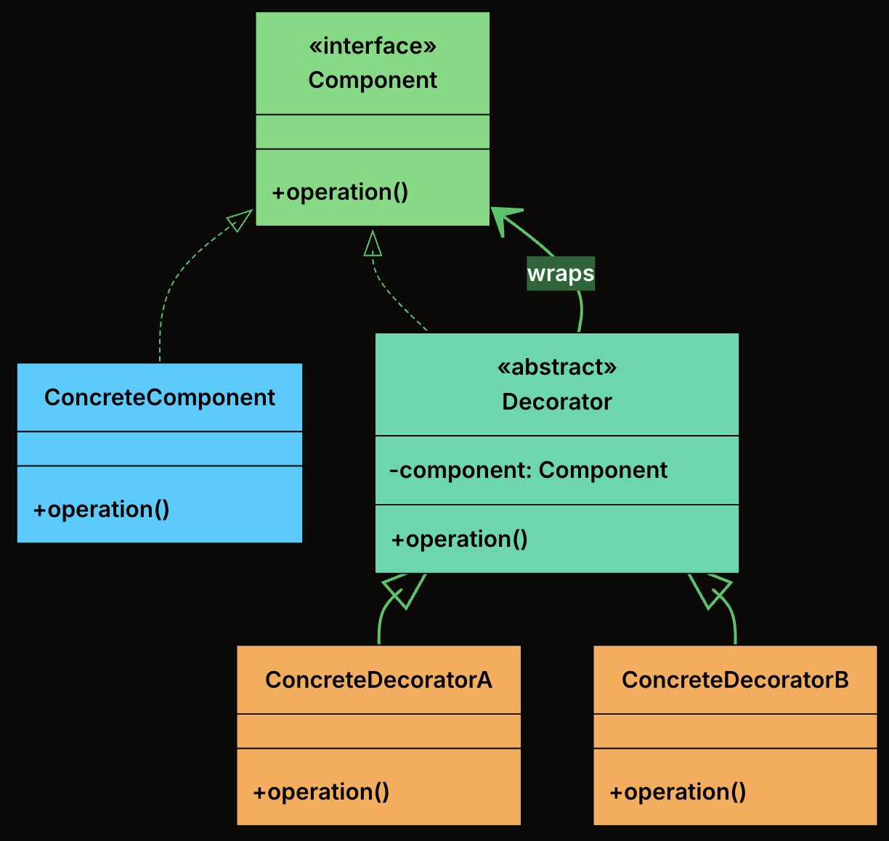
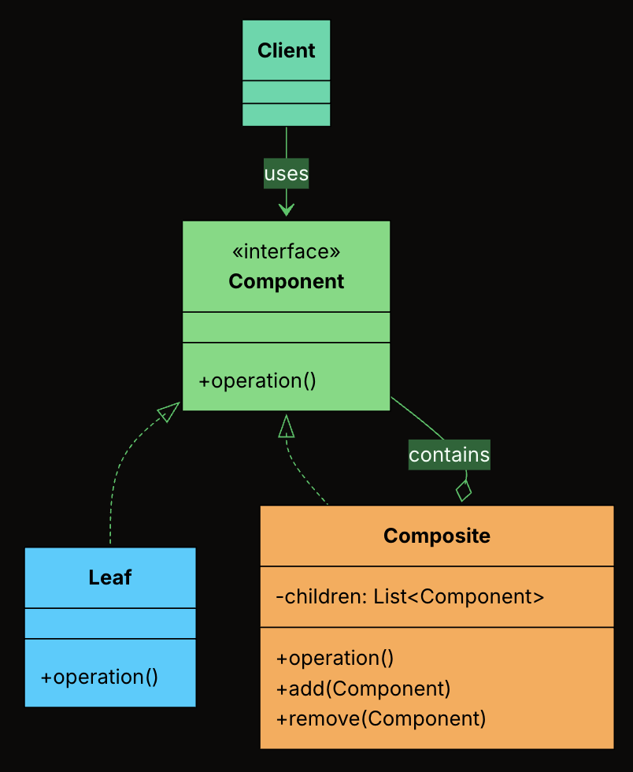
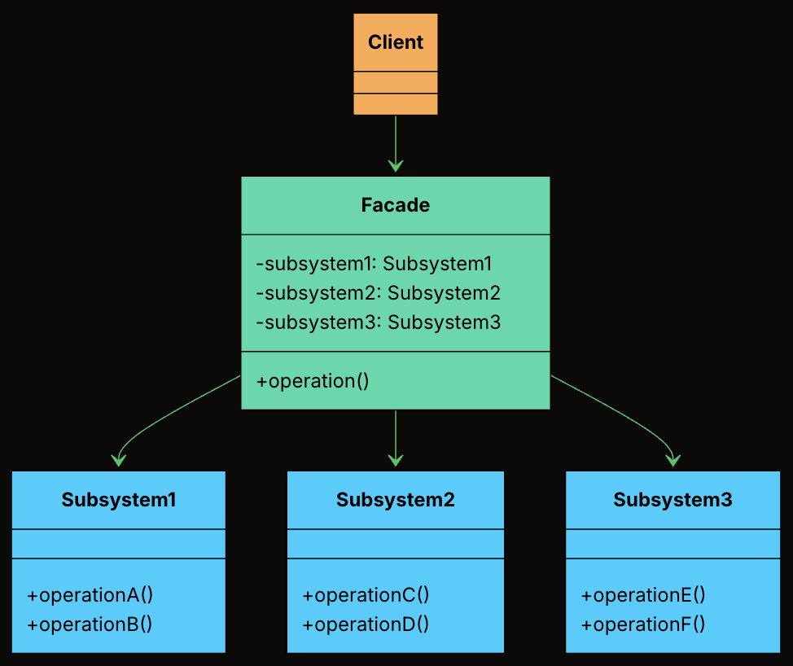

# Structural Patterns

---

## Table of Contents

- [Adapter](#adapter)
- [Bridge](#bridge)
- [Decorator](#decorator)
- [Composite](#composite)
- [Facade](#facade)

## Adapter

### 📖 Definition

The Adapter Design Pattern is a structural design pattern that allows incompatible interfaces to work together by converting the interface of one class into another that the client expects.

It’s particularly useful in situations where:

- You’re integrating with a legacy system or a third-party library that doesn’t match your current interface.
- You want to reuse existing functionality without modifying its source code.
- You need to bridge the gap between new and old code, or between systems built with different interface designs.

### 🧩 Class Diagram


- **Target Interface**: The interface that the client code depends on. Every method call from the client goes through this interface.

- **Adaptee**: The existing class with a useful implementation but an incompatible interface.

- **Adapter**: The translator. It implements the Target interface and holds a reference to the Adaptee, delegating calls with the necessary translation.

- **Client**: The code that uses the Target interface. It is completely unaware of the Adaptee or the Adapter's internal workings.

### 🛠 Implementation

{{#tabs}}
{{#tab name="Java"}}

1. Define the Target Interface

```java
interface PaymentProcessor {
    void processPayment(double amount, String currency);
    boolean isPaymentSuccessful();
    String getTransactionId();
}
```

2. Create the Adaptee Class

```java
class LegacyGateway {
    private long transactionReference;
    private boolean paymentSuccessful;

    public void executeTransaction(double totalAmount, String currency) {
        System.out.println("LegacyGateway: Executing " + currency + " " + totalAmount);
        transactionReference = System.nanoTime();
        paymentSuccessful = true;
        System.out.println("LegacyGateway: Done. Ref: " + transactionReference);
    }

    public boolean checkStatus(long ref) {
        System.out.println("LegacyGateway: Checking status for ref: " + ref);
        return paymentSuccessful;
    }

    public long getReferenceNumber() {
        return transactionReference;
    }
}
```

3. Implement the Adapter Class

```java
class LegacyGatewayAdapter implements PaymentProcessor {
    private final LegacyGateway legacyGateway;
    private long currentRef;

    public LegacyGatewayAdapter(LegacyGateway legacyGateway) {
        this.legacyGateway = legacyGateway;
    }

    @Override
    public void processPayment(double amount, String currency) {
        System.out.println("Adapter: Translating processPayment() for " + amount + " " + currency);
        legacyGateway.executeTransaction(amount, currency);
        currentRef = legacyGateway.getReferenceNumber(); // Store for later use
    }

    @Override
    public boolean isPaymentSuccessful() {
        return legacyGateway.checkStatus(currentRef);
    }

    @Override
    public String getTransactionId() {
        return "LEGACY_TXN_" + currentRef;
    }
}
```

4. Client Code

```java
public class ECommerceAppV2 {
    public static void main(String[] args) {
        // Modern processor
        PaymentProcessor processor = new InHousePaymentProcessor();
        CheckoutService modernCheckout = new CheckoutService(processor);
        System.out.println("--- Using Modern Processor ---");
        modernCheckout.checkout(199.99, "USD");

        // Legacy gateway through adapter
        System.out.println("\n--- Using Legacy Gateway via Adapter ---");
        LegacyGateway legacy = new LegacyGateway();
        processor = new LegacyGatewayAdapter(legacy);
        CheckoutService legacyCheckout = new CheckoutService(processor);
        legacyCheckout.checkout(75.50, "USD");
    }
}
```

{{#endtab}}
{{#tab name="Python"}}

1. Define the Target Interface

```python
from abc import ABC, abstractmethod

class PaymentProcessor(ABC):
    @abstractmethod
    def process_payment(self, amount: float, currency: str):
        pass

    @abstractmethod
    def is_payment_successful(self) -> bool:
        pass

    @abstractmethod
    def get_transaction_id(self) -> str:
        pass
```

2. Create the Adaptee Class

```python
class LegacyGateway:
    def __init__(self):
        self._transaction_reference = None
        self._payment_successful = False

    def execute_transaction(self, total_amount: float, currency: str):
        print(f"LegacyGateway: Executing {currency} {total_amount}")
        self._transaction_reference = time.time_ns()
        self._payment_successful = True
        print(f"LegacyGateway: Done. Ref: {self._transaction_reference}")

    def check_status(self, ref: int) -> bool:
        print(f"LegacyGateway: Checking status for ref: {ref}")
        return self._payment_successful

    def get_reference_number(self) -> int:
        return self._transaction_reference
```

3. Implement the Adapter Class

```python
class LegacyGatewayAdapter(PaymentProcessor):
   def __init__(self, legacy_gateway):
       self.legacy_gateway = legacy_gateway
       self.current_ref = None

   def process_payment(self, amount, currency):
       print(f"Adapter: Translating processPayment() for {amount} {currency}")
       self.legacy_gateway.execute_transaction(amount, currency)
       self.current_ref = self.legacy_gateway.get_reference_number()

   def is_payment_successful(self):
       return self.legacy_gateway.check_status(self.current_ref)

   def get_transaction_id(self):
       return f"LEGACY_TXN_{self.current_ref}"
```

4. Client Code

```python
class ECommerceAppV2:
   @staticmethod
   def main():
       # Modern processor
       processor = InHousePaymentProcessor()
       modern_checkout = CheckoutService(processor)
       print("--- Using Modern Processor ---")
       modern_checkout.checkout(199.99, "USD")

       # Legacy gateway through adapter
       print("\n--- Using Legacy Gateway via Adapter ---")
       legacy = LegacyGateway()
       processor = LegacyGatewayAdapter(legacy)
       legacy_checkout = CheckoutService(processor)
       legacy_checkout.checkout(75.50, "USD")

if __name__ == "__main__":
   ECommerceAppV2.main()
```

{{#endtab}}
{{#tab name="C++"}}

1. Define the Target Interface

```cpp
class PaymentProcessor {
public:
   virtual void processPayment(double amount, string currency) = 0;
   virtual bool isPaymentSuccessful() = 0;
   virtual string getTransactionId() = 0;
   virtual ~PaymentProcessor() {}
};
```

2. Create the Adaptee Class

```cpp
class LegacyGateway {
private:
    long transactionReference = 0;
    bool paymentSuccessful = false;

public:
    void executeTransaction(double totalAmount, string currency) {
        cout << "LegacyGateway: Executing " << currency << " " << totalAmount << endl;
        transactionReference = chrono::duration_cast<chrono::nanoseconds>(
            chrono::system_clock::now().time_since_epoch()).count();
        paymentSuccessful = true;
        cout << "LegacyGateway: Done. Ref: " << transactionReference << endl;
    }

    bool checkStatus(long ref) {
        cout << "LegacyGateway: Checking status for ref: " << ref << endl;
        return paymentSuccessful;
    }

    long getReferenceNumber() {
        return transactionReference;
    }
};
```

3. Implement the Adapter Class

```cpp
class LegacyGatewayAdapter : public PaymentProcessor {
private:
   LegacyGateway* legacyGateway;
   long currentRef;

public:
   LegacyGatewayAdapter(LegacyGateway* legacyGateway) : legacyGateway(legacyGateway), currentRef(0) {}

   void processPayment(double amount, string currency) override {
       cout << "Adapter: Translating processPayment() for " << amount << " " << currency << endl;
       legacyGateway->executeTransaction(amount, currency);
       currentRef = legacyGateway->getReferenceNumber();
   }

   bool isPaymentSuccessful() override {
       return legacyGateway->checkStatus(currentRef);
   }

   string getTransactionId() override {
       return "LEGACY_TXN_" + to_string(currentRef);
   }
};
```

4. Client Code

```cpp
class ECommerceAppV2 {
public:
   static void main() {
       // Modern processor
       InHousePaymentProcessor processor;
       CheckoutService modernCheckout(&processor);
       cout << "--- Using Modern Processor ---" << endl;
       modernCheckout.checkout(199.99, "USD");

       // Legacy gateway through adapter
       cout << "\n--- Using Legacy Gateway via Adapter ---" << endl;
       LegacyGateway legacy;
       LegacyGatewayAdapter adapter(&legacy);
       CheckoutService legacyCheckout(&adapter);
       legacyCheckout.checkout(75.50, "USD");
   }
};

int main() {
   ECommerceAppV2::main();
   return 0;
}
```

{{#endtab}}
{{#tab name="C#"}}

1. Define the Target Interface

```csharp
interface IPaymentProcessor
{
   void ProcessPayment(double amount, string currency);
   bool IsPaymentSuccessful();
   string GetTransactionId();
}
```

2. Create the Adaptee Class

```csharp
class LegacyGateway
{
    private long transactionReference;
    private bool paymentSuccessful;

    public void ExecuteTransaction(double totalAmount, string currency)
    {
        Console.WriteLine($"LegacyGateway: Executing {currency} {totalAmount}");
        transactionReference = DateTimeOffset.Now.Ticks;
        paymentSuccessful = true;
        Console.WriteLine($"LegacyGateway: Done. Ref: {transactionReference}");
    }

    public bool CheckStatus(long reference)
    {
        Console.WriteLine($"LegacyGateway: Checking status for ref: {reference}");
        return paymentSuccessful;
    }

    public long GetReferenceNumber() => transactionReference;
}
```

3. Implement the Adapter Class

```csharp
class LegacyGatewayAdapter : IPaymentProcessor
{
   private LegacyGateway legacyGateway;
   private long currentRef;

   public LegacyGatewayAdapter(LegacyGateway legacyGateway)
   {
       this.legacyGateway = legacyGateway;
   }

   public void ProcessPayment(double amount, string currency)
   {
       Console.WriteLine($"Adapter: Translating processPayment() for {amount} {currency}");
       legacyGateway.ExecuteTransaction(amount, currency);
       currentRef = legacyGateway.GetReferenceNumber();
   }

   public bool IsPaymentSuccessful()
   {
       return legacyGateway.CheckStatus(currentRef);
   }

   public string GetTransactionId()
   {
       return "LEGACY_TXN_" + currentRef;
   }
}
```

4. Client Code

```csharp
public class ECommerceAppV2
{
   public static void Main(string[] args)
   {
       // Modern processor
       IPaymentProcessor processor = new InHousePaymentProcessor();
       CheckoutService modernCheckout = new CheckoutService(processor);
       Console.WriteLine("--- Using Modern Processor ---");
       modernCheckout.Checkout(199.99, "USD");

       // Legacy gateway through adapter
       Console.WriteLine("\n--- Using Legacy Gateway via Adapter ---");
       LegacyGateway legacy = new LegacyGateway();
       processor = new LegacyGatewayAdapter(legacy);
       CheckoutService legacyCheckout = new CheckoutService(processor);
       legacyCheckout.Checkout(75.50, "USD");
   }
}
```

{{#endtab}}
{{#tab name="TypeScript"}}

1. Define the Target Interface

```typescript
interface PaymentProcessor {
  processPayment(amount: number, currency: string): void;
  isPaymentSuccessful(): boolean;
  getTransactionId(): string;
}
```

2. Create the Adaptee Class

```typescript
class LegacyGateway {
  private transactionReference: number = 0;
  private paymentSuccessful: boolean = false;

  executeTransaction(totalAmount: number, currency: string): void {
    console.log(`LegacyGateway: Executing ${currency} ${totalAmount}`);
    this.transactionReference =
      Date.now() * 1000000 + Math.floor(Math.random() * 1000000);
    this.paymentSuccessful = true;
    console.log(`LegacyGateway: Done. Ref: ${this.transactionReference}`);
  }

  checkStatus(ref: number): boolean {
    console.log(`LegacyGateway: Checking status for ref: ${ref}`);
    return this.paymentSuccessful;
  }

  getReferenceNumber(): number {
    return this.transactionReference;
  }
}
```

3. Implement the Adapter Class

```typescript
class LegacyGatewayAdapter implements PaymentProcessor {
  private readonly legacyGateway: LegacyGateway;
  private currentRef: number;

  constructor(legacyGateway: LegacyGateway) {
    this.legacyGateway = legacyGateway;
  }

  processPayment(amount: number, currency: string): void {
    console.log(
      "Adapter: Translating processPayment() for " + amount + " " + currency,
    );
    this.legacyGateway.executeTransaction(amount, currency);
    this.currentRef = this.legacyGateway.getReferenceNumber(); // Store for later use
  }

  isPaymentSuccessful(): boolean {
    return this.legacyGateway.checkStatus(this.currentRef);
  }

  getTransactionId(): string {
    return "LEGACY_TXN_" + this.currentRef;
  }
}
```

4. Client Code

```typescript
class ECommerceAppV2 {
  static main(): void {
    // Modern processor
    let processor: PaymentProcessor = new InHousePaymentProcessor();
    const modernCheckout = new CheckoutService(processor);
    console.log("--- Using Modern Processor ---");
    modernCheckout.checkout(199.99, "USD");

    // Legacy gateway through adapter
    console.log("\n--- Using Legacy Gateway via Adapter ---");
    const legacy = new LegacyGateway();
    processor = new LegacyGatewayAdapter(legacy);
    const legacyCheckout = new CheckoutService(processor);
    legacyCheckout.checkout(75.5, "USD");
  }
}
```

{{#endtab}}
{{#endtabs}}

---

## Bridge

### 📖 Definition

The Bridge Design Pattern is a structural pattern that lets you decouple an abstraction from its implementation, allowing the two to vary independently.

It’s particularly useful in situations where:

- You have classes that can be extended in multiple orthogonal dimensions (e.g., shape vs. rendering technology, UI control vs. platform).
- You want to avoid a deep inheritance hierarchy that multiplies combinations of features.
- You need to combine multiple variations of behavior or implementation at runtime.

### 🧩 Class Diagram


- **Abstraction**: The high-level interface that clients interact with. It defines operations in terms that make sense to the domain (e.g., "draw a shape") and delegates the low-level work to an implementor.

- **RefinedAbstraction**: A concrete subclass of Abstraction that adds domain-specific state or behavior. It still delegates to the implementor for low-level operations.

- **Implementor**: The interface that defines the low-level operations that concrete implementations must provide. This is the "other side" of the bridge.

- **ConcreteImplementors**: A concrete class that implements the Implementor interface with a specific technology or strategy.

### 🛠 Implementation

{{#tabs}}
{{#tab name="Java"}}

1. Define Implementator Interface

```java
interface Renderer {
    void renderCircle(float radius);
    void renderRectangle(float width, float height);
}
```

2. Create Concrete Implementations of the Renderer

- VectorRenderer

```java
class VectorRenderer implements Renderer {
    @Override
    public void renderCircle(float radius) {
        System.out.println("Drawing a circle of radius " + radius + " using VECTOR rendering.");
    }

    @Override
    public void renderRectangle(float width, float height) {
        System.out.println("Drawing a rectangle " + width + "x" + height + " using VECTOR rendering.");
    }
}
```

- RasterRenderer

```java
class RasterRenderer implements Renderer {
    @Override
    public void renderCircle(float radius) {
        System.out.println("Drawing pixels for a circle of radius " + radius + " (RASTER).");
    }

    @Override
    public void renderRectangle(float width, float height) {
        System.out.println("Drawing pixels for a rectangle " + width + "x" + height + " (RASTER).");
    }
}
```

3. Define the Abstraction

```java
abstract class Shape {
    protected Renderer renderer;

    public Shape(Renderer renderer) {
        this.renderer = renderer;
    }

    public abstract void draw();
}
```

4. Create Concrete Shapes

- Circle

```java
class Circle extends Shape {
    private final float radius;

    public Circle(Renderer renderer, float radius) {
        super(renderer);
        this.radius = radius;
    }

    @Override
    public void draw() {
        renderer.renderCircle(radius);
    }
}
```

- Rectangle

```java
class Rectangle extends Shape {
    private final float width;
    private final float height;

    public Rectangle(Renderer renderer, float width, float height) {
        super(renderer);
        this.width = width;
        this.height = height;
    }

    @Override
    public void draw() {
        renderer.renderRectangle(width, height);
    }
}
```

5. Client Code

```java
public class BridgeDemo {
    public static void main(String[] args) {
        Renderer vector = new VectorRenderer();
        Renderer raster = new RasterRenderer();

        Shape circle1 = new Circle(vector, 5);
        Shape circle2 = new Circle(raster, 5);

        Shape rectangle1 = new Rectangle(vector, 10, 4);
        Shape rectangle2 = new Rectangle(raster, 10, 4);

        circle1.draw();     // Vector
        circle2.draw();     // Raster
        rectangle1.draw();  // Vector
        rectangle2.draw();  // Raster
    }
}
```

{{#endtab}}
{{#tab name="Python"}}

1. Define Implementator Interface

```python
from abc import ABC, abstractmethod

class Renderer(ABC):
    @abstractmethod
    def render_circle(self, radius: float):
        pass

    @abstractmethod
    def render_rectangle(self, width: float, height: float):
        pass
```

2. Create Concrete Implementations of the Renderer

- VectorRenderer

```python
class VectorRenderer(Renderer):
    def render_circle(self, radius):
        print(f"Drawing a circle of radius {radius} using VECTOR rendering.")

    def render_rectangle(self, width, height):
        print(f"Drawing a rectangle {width}x{height} using VECTOR rendering.")
```

- RasterRenderer

```python
class RasterRenderer(Renderer):
    def render_circle(self, radius):
        print(f"Drawing pixels for a circle of radius {radius} (RASTER).")

    def render_rectangle(self, width, height):
        print(f"Drawing pixels for a rectangle {width}x{height} (RASTER).")
```

3. Define the Abstraction

```python
class Shape(ABC):
    def __init__(self, renderer):
        self.renderer = renderer

    @abstractmethod
    def draw(self):
        pass
```

4. Create Concrete Shapes

- Circle

```python
class Circle(Shape):
    def __init__(self, renderer, radius):
        super().__init__(renderer)
        self.radius = radius

    def draw(self):
        self.renderer.render_circle(self.radius)
```

- Rectangle

```python
class Rectangle(Shape):
    def __init__(self, renderer, width, height):
        super().__init__(renderer)
        self.width = width
        self.height = height

    def draw(self):
        self.renderer.render_rectangle(self.width, self.height)
```

5. Client Code

```python
def bridge_demo():
    vector = VectorRenderer()
    raster = RasterRenderer()

    circle1 = Circle(vector, 5)
    circle2 = Circle(raster, 5)

    rectangle1 = Rectangle(vector, 10, 4)
    rectangle2 = Rectangle(raster, 10, 4)

    circle1.draw()     # Vector
    circle2.draw()     # Raster
    rectangle1.draw()  # Vector
    rectangle2.draw()  # Raster

# Example usage
if __name__ == "__main__":
    bridge_demo()
```

{{#endtab}}
{{#tab name="C++"}}

1. Define Implementator Interface

```cpp
class Renderer {
public:
    virtual ~Renderer() {}
    virtual void renderCircle(float radius) = 0;
    virtual void renderRectangle(float width, float height) = 0;
};
```

2. Create Concrete Implementations of the Renderer

- VectorRenderer

```cpp
class VectorRenderer : public Renderer {
public:
    void renderCircle(float radius) override {
        cout << "Drawing a circle of radius " << radius << " using VECTOR rendering." << endl;
    }

    void renderRectangle(float width, float height) override {
        cout << "Drawing a rectangle " << width << "x" << height << " using VECTOR rendering." << endl;
    }
};
```

- RasterRenderer

```cpp
class RasterRenderer : public Renderer {
public:
    void renderCircle(float radius) override {
        cout << "Drawing pixels for a circle of radius " << radius << " (RASTER)." << endl;
    }

    void renderRectangle(float width, float height) override {
        cout << "Drawing pixels for a rectangle " << width << "x" << height << " (RASTER)." << endl;
    }
};
```

3. Define the Abstraction

```cpp
class Shape {
protected:
    Renderer* renderer;

public:
    Shape(Renderer* renderer) : renderer(renderer) {}
    virtual ~Shape() {}
    virtual void draw() = 0;
};
```

4. Create Concrete Shapes

- Circle

```cpp
class Circle : public Shape {
private:
    float radius;

public:
    Circle(Renderer* renderer, float radius) : Shape(renderer), radius(radius) {}

    void draw() override {
        renderer->renderCircle(radius);
    }
};
```

- Rectangle

```cpp
class Rectangle : public Shape {
private:
    float width;
    float height;

public:
    Rectangle(Renderer* renderer, float width, float height)
        : Shape(renderer), width(width), height(height) {}

    void draw() override {
        renderer->renderRectangle(width, height);
    }
};
```

5. Client Code

```cpp
int main() {
    VectorRenderer vector;
    RasterRenderer raster;

    Circle circle1(&vector, 5);
    Circle circle2(&raster, 5);

    Rectangle rectangle1(&vector, 10, 4);
    Rectangle rectangle2(&raster, 10, 4);

    circle1.draw();     // Vector
    circle2.draw();     // Raster
    rectangle1.draw();  // Vector
    rectangle2.draw();  // Raster

    return 0;
}
```

{{#endtab}}
{{#tab name="C#"}}

1. Define Implementator Interface

```csharp
interface IRenderer
{
    void RenderCircle(float radius);
    void RenderRectangle(float width, float height);
}
```

2. Create Concrete Implementations of the Renderer

- VectorRenderer

```csharp
class VectorRenderer : IRenderer
{
    public void RenderCircle(float radius)
    {
        Console.WriteLine($"Drawing a circle of radius {radius} using VECTOR rendering.");
    }

    public void RenderRectangle(float width, float height)
    {
        Console.WriteLine($"Drawing a rectangle {width}x{height} using VECTOR rendering.");
    }
}
```

- RasterRenderer

```csharp
class RasterRenderer : IRenderer
{
    public void RenderCircle(float radius)
    {
        Console.WriteLine($"Drawing pixels for a circle of radius {radius} (RASTER).");
    }

    public void RenderRectangle(float width, float height)
    {
        Console.WriteLine($"Drawing pixels for a rectangle {width}x{height} (RASTER).");
    }
}
```

3. Define the Abstraction

```csharp
abstract class Shape
{
    protected IRenderer renderer;

    public Shape(IRenderer renderer)
    {
        this.renderer = renderer;
    }

    public abstract void Draw();
}
```

4. Create Concrete Shapes

- Circle

```csharp
class Circle : Shape
{
    private readonly float radius;

    public Circle(IRenderer renderer, float radius) : base(renderer)
    {
        this.radius = radius;
    }

    public override void Draw()
    {
        renderer.RenderCircle(radius);
    }
}
```

- Rectangle

```csharp
class Rectangle : Shape
{
    private readonly float width;
    private readonly float height;

    public Rectangle(IRenderer renderer, float width, float height) : base(renderer)
    {
        this.width = width;
        this.height = height;
    }

    public override void Draw()
    {
        renderer.RenderRectangle(width, height);
    }
}
```

5. Client Code

```csharp
public class BridgeDemo
{
    public static void Main(string[] args)
    {
        IRenderer vector = new VectorRenderer();
        IRenderer raster = new RasterRenderer();

        ShapeBridge circle1 = new Circle(vector, 5);
        ShapeBridge circle2 = new Circle(raster, 5);

        ShapeBridge rectangle1 = new Rectangle(vector, 10, 4);
        ShapeBridge rectangle2 = new Rectangle(raster, 10, 4);

        circle1.Draw();     // Vector
        circle2.Draw();     // Raster
        rectangle1.Draw();  // Vector
        rectangle2.Draw();  // Raster
    }
}
```

{{#endtab}}
{{#tab name="TypeScript"}}

1. Define Implementator Interface

```typescript
interface Renderer {
  renderCircle(radius: number): void;
  renderRectangle(width: number, height: number): void;
}
```

2. Create Concrete Implementations of the Renderer

- VectorRenderer

```typescript
class VectorRenderer implements Renderer {
  renderCircle(radius: number): void {
    console.log(
      "Drawing a circle of radius " + radius + " using VECTOR rendering.",
    );
  }

  renderRectangle(width: number, height: number): void {
    console.log(
      "Drawing a rectangle " +
        width +
        "x" +
        height +
        " using VECTOR rendering.",
    );
  }
}
```

- RasterRenderer

```typescript
class RasterRenderer implements Renderer {
  renderCircle(radius: number): void {
    console.log(
      "Drawing pixels for a circle of radius " + radius + " (RASTER).",
    );
  }

  renderRectangle(width: number, height: number): void {
    console.log(
      "Drawing pixels for a rectangle " + width + "x" + height + " (RASTER).",
    );
  }
}
```

3. Define the Abstraction

```typescript
abstract class Shape {
  protected renderer: Renderer;

  constructor(renderer: Renderer) {
    this.renderer = renderer;
  }

  public abstract draw(): void;
}
```

4. Create Concrete Shapes

- Circle

```typescript
class Circle extends Shape {
  private readonly radius: number;

  constructor(renderer: Renderer, radius: number) {
    super(renderer);
    this.radius = radius;
  }

  draw(): void {
    this.renderer.renderCircle(this.radius);
  }
}
```

- Rectangle

```typescript
class Rectangle extends Shape {
  private readonly width: number;
  private readonly height: number;

  constructor(renderer: Renderer, width: number, height: number) {
    super(renderer);
    this.width = width;
    this.height = height;
  }

  draw(): void {
    this.renderer.renderRectangle(this.width, this.height);
  }
}
```

5. Client Code

```typescript
class BridgeDemo {
  static main(): void {
    const vector: Renderer = new VectorRenderer();
    const raster: Renderer = new RasterRenderer();

    const circle1: Shape = new Circle(vector, 5);
    const circle2: Shape = new Circle(raster, 5);

    const rectangle1: Shape = new Rectangle(vector, 10, 4);
    const rectangle2: Shape = new Rectangle(raster, 10, 4);

    circle1.draw(); // Vector
    circle2.draw(); // Raster
    rectangle1.draw(); // Vector
    rectangle2.draw(); // Raster
  }
}
```

{{#endtab}}
{{#endtabs}}

---

## Decorator

### 📖 Definition

The Decorator Design Pattern is a structural pattern that lets you dynamically add new behavior or responsibilities to objects without modifying their underlying code.

It’s particularly useful in situations where:

- You want to extend the functionality of a class without subclassing it.
- You need to compose behaviors at runtime, in various combinations.
- You want to avoid bloated classes filled with if-else logic for optional features.

### 🧩 Class Diagram



- **Component**: Declares the common interface that both the core object and all decorators implement.

- **ConcreteComponent**: The base object that can be wrapped with decorators. It provides the default behavior.

- **Decorator**: An abstract class that implements the Component interface and holds a reference to another Component. It forwards calls to the wrapped object.

- **ConcreteDecorator**: Extend the base decorator to add new functionality before/after calling the wrapped component’s method.

### 🛠 Implementation

{{#tabs}}
{{#tab name="Java"}}

1. Define the Component Interface

```java
interface TextView {
    void render();
}
```

2. Implement the Concrete Component

```java
class PlainTextView implements TextView {
    private final String text;

    public PlainTextView(String text) {
        this.text = text;
    }

    @Override
    public void render() {
        System.out.print(text);
    }
}
```

3. Create the Abstract Decorator

```java
abstract class TextDecorator implements TextView {
    protected final TextView inner;

    public TextDecorator(TextView inner) {
        this.inner = inner;
    }
}
```

4. Implement Concrete Decorators

- Bold Decorator

```java
class BoldDecorator extends TextDecorator {
    public BoldDecorator(TextView inner) {
        super(inner);
    }

    @Override
    public void render() {
        System.out.print("<b>");
        inner.render();
        System.out.print("</b>");
    }
}
```

- Italic Decorator

```java
class ItalicDecorator extends TextDecorator {
    public ItalicDecorator(TextView inner) {
        super(inner);
    }

    @Override
    public void render() {
        System.out.print("<i>");
        inner.render();
        System.out.print("</i>");
    }
}
```

- Underline Decorator

```java
class UnderlineDecorator extends TextDecorator {
    public UnderlineDecorator(TextView inner) {
        super(inner);
    }

    @Override
    public void render() {
        System.out.print("<u>");
        inner.render();
        System.out.print("</u>");
    }
}
```

5. Client Code

```java
public class TextRendererApp {
    public static void main(String[] args) {
        TextView text = new PlainTextView("Hello, World!");

        // Plain text
        System.out.print("Plain:                   ");
        text.render();
        System.out.println();

        // Single decorator: Bold
        System.out.print("Bold:                    ");
        TextView boldText = new BoldDecorator(text);
        boldText.render();
        System.out.println();

        // Two decorators: Italic + Underline
        System.out.print("Italic + Underline:      ");
        TextView italicUnderline = new UnderlineDecorator(new ItalicDecorator(text));
        italicUnderline.render();
        System.out.println();

        // Three decorators: Bold + Italic + Underline
        System.out.print("Bold + Italic + Underline: ");
        TextView allStyles = new UnderlineDecorator(
            new ItalicDecorator(new BoldDecorator(text)));
        allStyles.render();
        System.out.println();
    }
}
```

- Output

```txt
Plain:                   Hello, World!
Bold:                    <b>Hello, World!</b>
Italic + Underline:      <u><i>Hello, World!</i></u>
Bold + Italic + Underline: <u><i><b>Hello, World!</b></i></u>
```

{{#endtab}}
{{#tab name="Python"}}

1. Define the Component Interface

```python
from abc import ABC, abstractmethod

class TextView(ABC):
    @abstractmethod
    def render(self):
        pass
```

2. Implement the Concrete Component

```python
class PlainTextView(TextView):
   def __init__(self, text):
       self.text = text

   def render(self):
       print(self.text, end="")
```

3. Create the Abstract Decorator

```python
class TextDecorator(TextView):
   def __init__(self, inner):
       self.inner = inner
```

4. Implement Concrete Decorators

- Bold Decorator

```python
class BoldDecorator(TextDecorator):
   def __init__(self, inner):
       super().__init__(inner)

   def render(self):
       print("<b>", end="")
       self.inner.render()
       print("</b>", end="")
```

- Italic Decorator

```java
class ItalicDecorator(TextDecorator):
   def __init__(self, inner):
       super().__init__(inner)

   def render(self):
       print("<i>", end="")
       self.inner.render()
       print("</i>", end="")
```

- Underline Decorator

```python
class UnderlineDecorator(TextDecorator):
   def __init__(self, inner):
       super().__init__(inner)

   def render(self):
       print("<u>", end="")
       self.inner.render()
       print("</u>", end="")
```

5. Client Code

```python
def main():
    text = PlainTextView("Hello, World!")

    # Plain text
    print("Plain:                   ", end="")
    text.render()
    print()

    # Single decorator: Bold
    print("Bold:                    ", end="")
    bold_text = BoldDecorator(text)
    bold_text.render()
    print()

    # Two decorators: Italic + Underline
    print("Italic + Underline:      ", end="")
    italic_underline = UnderlineDecorator(ItalicDecorator(text))
    italic_underline.render()
    print()

    # Three decorators: Bold + Italic + Underline
    print("Bold + Italic + Underline: ", end="")
    all_styles = UnderlineDecorator(ItalicDecorator(BoldDecorator(text)))
    all_styles.render()
    print()


if __name__ == "__main__":
    main()
```

- Output

```txt
Plain:                   Hello, World!
Bold:                    <b>Hello, World!</b>
Italic + Underline:      <u><i>Hello, World!</i></u>
Bold + Italic + Underline: <u><i><b>Hello, World!</b></i></u>
```

{{#endtab}}
{{#tab name="C++"}}

1. Define the Component Interface

```cpp
class TextView {
public:
   virtual void render() = 0;
   virtual ~TextView() {}
};
```

2. Implement the Concrete Component

```cpp
class PlainTextView : public TextView {
private:
   string text;

public:
   PlainTextView(string text) : text(text) {}

   void render() override {
       cout << text;
   }
};
```

3. Create the Abstract Decorator

```cpp
class TextDecorator : public TextView {
protected:
   TextView* inner;

public:
   TextDecorator(TextView* inner) : inner(inner) {}
};
```

4. Implement Concrete Decorators

- Bold Decorator

```cpp
class BoldDecorator : public TextDecorator {
public:
   BoldDecorator(TextView* inner) : TextDecorator(inner) {}

   void render() override {
       cout << "<b>";
       inner->render();
       cout << "</b>";
   }
};
```

- Italic Decorator

```cpp
class ItalicDecorator : public TextDecorator {
public:
   ItalicDecorator(TextView* inner) : TextDecorator(inner) {}

   void render() override {
       cout << "<i>";
       inner->render();
       cout << "</i>";
   }
};
```

- Underline Decorator

```cpp
class UnderlineDecorator : public TextDecorator {
public:
   UnderlineDecorator(TextView* inner) : TextDecorator(inner) {}

   void render() override {
       cout << "<u>";
       inner->render();
       cout << "</u>";
   }
};
```

5. Client Code

```cpp
int main() {
    PlainTextView text("Hello, World!");

    // Plain text
    cout << "Plain:                   ";
    text.render();
    cout << endl;

    // Single decorator: Bold
    cout << "Bold:                    ";
    BoldDecorator boldText(&text);
    boldText.render();
    cout << endl;

    // Two decorators: Italic + Underline
    cout << "Italic + Underline:      ";
    ItalicDecorator italic(&text);
    UnderlineDecorator italicUnderline(&italic);
    italicUnderline.render();
    cout << endl;

    // Three decorators: Bold + Italic + Underline
    cout << "Bold + Italic + Underline: ";
    BoldDecorator bold(&text);
    ItalicDecorator italicBold(&bold);
    UnderlineDecorator allStyles(&italicBold);
    allStyles.render();
    cout << endl;

    return 0;
}
```

- Output

```txt
Plain:                   Hello, World!
Bold:                    <b>Hello, World!</b>
Italic + Underline:      <u><i>Hello, World!</i></u>
Bold + Italic + Underline: <u><i><b>Hello, World!</b></i></u>
```

{{#endtab}}
{{#tab name="C#"}}

1. Define the Component Interface

```csharp
interface ITextView
{
   void Render();
}
```

2. Implement the Concrete Component

```csharp
class PlainTextView : ITextView
{
   private readonly string text;

   public PlainTextView(string text)
   {
       this.text = text;
   }

   public void Render()
   {
       Console.Write(text);
   }
}
```

3. Create the Abstract Decorator

```csharp
abstract class TextDecorator : ITextView
{
   protected readonly ITextView inner;

   public TextDecorator(ITextView inner)
   {
       this.inner = inner;
   }

   public abstract void Render();
}
```

4. Implement Concrete Decorators

- Bold Decorator

```csharp
class BoldDecorator : TextDecorator
{
   public BoldDecorator(ITextView inner) : base(inner)
   {
   }

   public override void Render()
   {
       Console.Write("<b>");
       inner.Render();
       Console.Write("</b>");
   }
}
```

- Italic Decorator

```csharp
class ItalicDecorator : TextDecorator
{
   public ItalicDecorator(ITextView inner) : base(inner)
   {
   }

   public override void Render()
   {
       Console.Write("<i>");
       inner.Render();
       Console.Write("</i>");
   }
}
```

- Underline Decorator

```csharp
class UnderlineDecorator : TextDecorator
{
   public UnderlineDecorator(ITextView inner) : base(inner)
   {
   }

   public override void Render()
   {
       Console.Write("<u>");
       inner.Render();
       Console.Write("</u>");
   }
}
```

5. Client Code

```csharp
public class TextRendererApp
{
    public static void Main()
    {
        ITextView text = new PlainTextView("Hello, World!");

        // Plain text
        Console.Write("Plain:                   ");
        text.Render();
        Console.WriteLine();

        // Single decorator: Bold
        Console.Write("Bold:                    ");
        ITextView boldText = new BoldDecorator(text);
        boldText.Render();
        Console.WriteLine();

        // Two decorators: Italic + Underline
        Console.Write("Italic + Underline:      ");
        ITextView italicUnderline = new UnderlineDecorator(new ItalicDecorator(text));
        italicUnderline.Render();
        Console.WriteLine();

        // Three decorators: Bold + Italic + Underline
        Console.Write("Bold + Italic + Underline: ");
        ITextView allStyles = new UnderlineDecorator(
            new ItalicDecorator(new BoldDecorator(text)));
        allStyles.Render();
        Console.WriteLine();
    }
}
```

- Output

```txt
Plain:                   Hello, World!
Bold:                    <b>Hello, World!</b>
Italic + Underline:      <u><i>Hello, World!</i></u>
Bold + Italic + Underline: <u><i><b>Hello, World!</b></i></u>
```

{{#endtab}}
{{#tab name="TypeScript"}}

1. Define the Component Interface

```typescript
interface TextView {
  render(): void;
}
```

2. Implement the Concrete Component

```typescript
class PlainTextView implements TextView {
  private readonly text: string;

  constructor(text: string) {
    this.text = text;
  }

  render(): void {
    process.stdout.write(this.text);
  }
}
```

3. Create the Abstract Decorator

```typescript
abstract class TextDecorator implements TextView {
  protected readonly inner: TextView;

  constructor(inner: TextView) {
    this.inner = inner;
  }

  abstract render(): void;
}
```

4. Implement Concrete Decorators

- Bold Decorator

```typescript
class BoldDecorator extends TextDecorator {
  constructor(inner: TextView) {
    super(inner);
  }

  render(): void {
    process.stdout.write("<b>");
    this.inner.render();
    process.stdout.write("</b>");
  }
}
```

- Italic Decorator

```typescript
class ItalicDecorator extends TextDecorator {
  constructor(inner: TextView) {
    super(inner);
  }

  render(): void {
    process.stdout.write("<i>");
    this.inner.render();
    process.stdout.write("</i>");
  }
}
```

- Underline Decorator

```typescript
class UnderlineDecorator extends TextDecorator {
  constructor(inner: TextView) {
    super(inner);
  }

  render(): void {
    process.stdout.write("<u>");
    this.inner.render();
    process.stdout.write("</u>");
  }
}
```

5. Client Code

```typescript
const text: TextView = new PlainTextView("Hello, World!");

// Plain text
process.stdout.write("Plain:                   ");
text.render();
console.log();

// Single decorator: Bold
process.stdout.write("Bold:                    ");
const boldText: TextView = new BoldDecorator(text);
boldText.render();
console.log();

// Two decorators: Italic + Underline
process.stdout.write("Italic + Underline:      ");
const italicUnderline: TextView = new UnderlineDecorator(
  new ItalicDecorator(text),
);
italicUnderline.render();
console.log();

// Three decorators: Bold + Italic + Underline
process.stdout.write("Bold + Italic + Underline: ");
const allStyles: TextView = new UnderlineDecorator(
  new ItalicDecorator(new BoldDecorator(text)),
);
allStyles.render();
console.log();
```

- Output

```txt
Plain:                   Hello, World!
Bold:                    <b>Hello, World!</b>
Italic + Underline:      <u><i>Hello, World!</i></u>
Bold + Italic + Underline: <u><i><b>Hello, World!</b></i></u>
```

{{#endtab}}
{{#endtabs}}

---

## Composite

### 📖 Definition

The Composite Design Pattern is a structural pattern that lets you treat individual objects and compositions of objects uniformly.

It allows you to build tree-like structures (e.g., file systems, UI hierarchies, organizational charts) where clients can work with both single elements and groups of elements using the same interface.

It’s particularly useful in situations where:

- You need to represent part-whole hierarchies.
- You want to perform operations on both leaf nodes and composite nodes in a consistent way.
- You want to avoid writing special-case logic to distinguish between "single" and "grouped" objects.

### 🧩 Class Diagram



- **Component Interface**: The shared interface that declares operations common to both leaves and composites.

- **Leaf**: An end object in the tree that has no children. It implements the Component interface directly.

- **Composite**: A container that holds child Components and implements the Component interface by delegating to its children.

- **Client**: Works with the tree through the Component interface, without knowing whether it holds a leaf or a composite.

### 🛠 Implementation

{{#tabs}}
{{#tab name="Java"}}

1. Define the Component Interface

```java
interface FileSystemItem {
    int getSize();
    void printStructure(String indent);
    void delete();
}
```

2. Create the Leaf Class

```java
class File implements FileSystemItem {
    private final String name;
    private final int size;

    public File(String name, int size) {
        this.name = name;
        this.size = size;
    }

    @Override
    public int getSize() {
        return size;
    }

    @Override
    public void printStructure(String indent) {
        System.out.println(indent + "- " + name + " (" + size + " KB)");
    }

    @Override
    public void delete() {
        System.out.println("Deleting file: " + name);
    }
}
```

3. Create the Composite Class

```java
class Folder implements FileSystemItem {
    private final String name;
    private final List<FileSystemItem> children = new ArrayList<>();

    public Folder(String name) {
        this.name = name;
    }

    public void addItem(FileSystemItem item) {
        children.add(item);
    }

    public void removeItem(FileSystemItem item) {
        children.remove(item);
    }

    @Override
    public int getSize() {
        int total = 0;
        for (FileSystemItem item : children) {
            total += item.getSize();
        }
        return total;
    }

    @Override
    public void printStructure(String indent) {
        System.out.println(indent + "+ " + name + "/");
        for (FileSystemItem item : children) {
            item.printStructure(indent + "  ");
        }
    }

    @Override
    public void delete() {
        for (FileSystemItem item : children) {
            item.delete();
        }
        System.out.println("Deleting folder: " + name);
    }
}
```

4. Client Code

```java
public class FileExplorerApp {
    public static void main(String[] args) {
        FileSystemItem file1 = new File("readme.txt", 5);
        FileSystemItem file2 = new File("photo.jpg", 1500);
        FileSystemItem file3 = new File("data.csv", 300);

        Folder documents = new Folder("Documents");
        documents.addItem(file1);
        documents.addItem(file3);

        Folder pictures = new Folder("Pictures");
        pictures.addItem(file2);

        Folder home = new Folder("Home");
        home.addItem(documents);
        home.addItem(pictures);

        System.out.println("---- File Structure ----");
        home.printStructure("");

        System.out.println("\nTotal Size: " + home.getSize() + " KB");

        System.out.println("\n---- Deleting All ----");
        home.delete();
    }
}
```

- Output

```txt
---- File Structure ----
+ Home/
  + Documents/
    - readme.txt (5 KB)
    - data.csv (300 KB)
  + Pictures/
    - photo.jpg (1500 KB)

Total Size: 1805 KB

---- Deleting All ----
Deleting file: readme.txt
Deleting file: data.csv
Deleting folder: Documents
Deleting file: photo.jpg
Deleting folder: Pictures
Deleting folder: Home
```

{{#endtab}}
{{#tab name="Python"}}

1. Define the Component Interface

```python
from abc import ABC, abstractmethod

class FileSystemItem(ABC):
    @abstractmethod
    def get_size(self) -> int:
        pass

    @abstractmethod
    def print_structure(self, indent: str):
        pass

    @abstractmethod
    def delete(self):
        pass
```

2. Create the Leaf Class

```python
class File(FileSystemItem):
    def __init__(self, name: str, size: int):
        self.name = name
        self.size = size

    def get_size(self) -> int:
        return self.size

    def print_structure(self, indent: str):
        print(f"{indent}- {self.name} ({self.size} KB)")

    def delete(self):
        print(f"Deleting file: {self.name}")
```

3. Create the Composite Class

```python
class Folder(FileSystemItem):
    def __init__(self, name: str):
        self.name = name
        self.children: list[FileSystemItem] = []

    def add_item(self, item: FileSystemItem):
        self.children.append(item)

    def remove_item(self, item: FileSystemItem):
        self.children.remove(item)

    def get_size(self) -> int:
        total = 0
        for item in self.children:
            total += item.get_size()
        return total

    def print_structure(self, indent: str):
        print(f"{indent}+ {self.name}/")
        for item in self.children:
            item.print_structure(indent + "  ")

    def delete(self):
        for item in self.children:
            item.delete()
        print(f"Deleting folder: {self.name}")
```

4. Client Code

```python
if __name__ == "__main__":
    file1 = File("readme.txt", 5)
    file2 = File("photo.jpg", 1500)
    file3 = File("data.csv", 300)

    documents = Folder("Documents")
    documents.add_item(file1)
    documents.add_item(file3)

    pictures = Folder("Pictures")
    pictures.add_item(file2)

    home = Folder("Home")
    home.add_item(documents)
    home.add_item(pictures)

    print("---- File Structure ----")
    home.print_structure("")

    print(f"\nTotal Size: {home.get_size()} KB")

    print("\n---- Deleting All ----")
    home.delete()
```

- Output

```txt
---- File Structure ----
+ Home/
  + Documents/
    - readme.txt (5 KB)
    - data.csv (300 KB)
  + Pictures/
    - photo.jpg (1500 KB)

Total Size: 1805 KB

---- Deleting All ----
Deleting file: readme.txt
Deleting file: data.csv
Deleting folder: Documents
Deleting file: photo.jpg
Deleting folder: Pictures
Deleting folder: Home
```

{{#endtab}}
{{#tab name="C++"}}

1. Define the Component Interface

```cpp
class FileSystemItem {
public:
    virtual int getSize() = 0;
    virtual void printStructure(string indent) = 0;
    virtual void deleteItem() = 0;
    virtual ~FileSystemItem() {}
};
```

2. Create the Leaf Class

```cpp
class File : public FileSystemItem {
private:
    string name;
    int size;

public:
    File(string name, int size) : name(name), size(size) {}

    int getSize() override {
        return size;
    }

    void printStructure(string indent) override {
        cout << indent << "- " << name << " (" << size << " KB)" << endl;
    }

    void deleteItem() override {
        cout << "Deleting file: " << name << endl;
    }
};
```

3. Create the Composite Class

```cpp
class Folder : public FileSystemItem {
private:
    string name;
    vector<FileSystemItem*> children;

public:
    Folder(string name) : name(name) {}

    void addItem(FileSystemItem* item) {
        children.push_back(item);
    }

    void removeItem(FileSystemItem* item) {
        children.erase(
            remove(children.begin(), children.end(), item),
            children.end()
        );
    }

    int getSize() override {
        int total = 0;
        for (FileSystemItem* item : children) {
            total += item->getSize();
        }
        return total;
    }

    void printStructure(string indent) override {
        cout << indent << "+ " << name << "/" << endl;
        for (FileSystemItem* item : children) {
            item->printStructure(indent + "  ");
        }
    }

    void deleteItem() override {
        for (FileSystemItem* item : children) {
            item->deleteItem();
        }
        cout << "Deleting folder: " << name << endl;
    }
};
```

4. Client Code

```cpp
int main() {
    FileSystemItem* file1 = new File("readme.txt", 5);
    FileSystemItem* file2 = new File("photo.jpg", 1500);
    FileSystemItem* file3 = new File("data.csv", 300);

    Folder* documents = new Folder("Documents");
    documents->addItem(file1);
    documents->addItem(file3);

    Folder* pictures = new Folder("Pictures");
    pictures->addItem(file2);

    Folder* home = new Folder("Home");
    home->addItem(documents);
    home->addItem(pictures);

    cout << "---- File Structure ----" << endl;
    home->printStructure("");

    cout << "\nTotal Size: " << home->getSize() << " KB" << endl;

    cout << "\n---- Deleting All ----" << endl;
    home->deleteItem();

    delete file1;
    delete file2;
    delete file3;
    delete documents;
    delete pictures;
    delete home;

    return 0;
}
```

- Output

```txt
---- File Structure ----
+ Home/
  + Documents/
    - readme.txt (5 KB)
    - data.csv (300 KB)
  + Pictures/
    - photo.jpg (1500 KB)

Total Size: 1805 KB

---- Deleting All ----
Deleting file: readme.txt
Deleting file: data.csv
Deleting folder: Documents
Deleting file: photo.jpg
Deleting folder: Pictures
Deleting folder: Home
```

{{#endtab}}
{{#tab name="C#"}}

1. Define the Component Interface

```csharp
interface IFileSystemItem
{
    int GetSize();
    void PrintStructure(string indent);
    void Delete();
}
```

2. Create the Leaf Class

```csharp
class File : IFileSystemItem
{
    private readonly string name;
    private readonly int size;

    public File(string name, int size)
    {
        this.name = name;
        this.size = size;
    }

    public int GetSize() {
        return size;
    }

    public void PrintStructure(string indent)
    {
        Console.WriteLine(indent + "- " + name + " (" + size + " KB)");
    }

    public void Delete()
    {
        Console.WriteLine("Deleting file: " + name);
    }
}
```

3. Create the Composite Class

```csharp
class Folder : IFileSystemItem
{
    private readonly string name;
    private readonly List<IFileSystemItem> children = new List<IFileSystemItem>();

    public Folder(string name) {
        this.name = name;
    }

    public void AddItem(IFileSystemItem item) {
        children.Add(item);
    }

    public void RemoveItem(IFileSystemItem item) {
        children.Remove(item);
    }

    public int GetSize()
    {
        int total = 0;
        foreach (IFileSystemItem item in children)
        {
            total += item.GetSize();
        }
        return total;
    }

    public void PrintStructure(string indent)
    {
        Console.WriteLine(indent + "+ " + name + "/");
        foreach (IFileSystemItem item in children)
        {
            item.PrintStructure(indent + "  ");
        }
    }

    public void Delete()
    {
        foreach (IFileSystemItem item in children)
        {
            item.Delete();
        }
        Console.WriteLine("Deleting folder: " + name);
    }
}
```

4. Client Code

```csharp
public class Program
{
    public static void Main()
    {
        IFileSystemItem file1 = new File("readme.txt", 5);
        IFileSystemItem file2 = new File("photo.jpg", 1500);
        IFileSystemItem file3 = new File("data.csv", 300);

        Folder documents = new Folder("Documents");
        documents.AddItem(file1);
        documents.AddItem(file3);

        Folder pictures = new Folder("Pictures");
        pictures.AddItem(file2);

        Folder home = new Folder("Home");
        home.AddItem(documents);
        home.AddItem(pictures);

        Console.WriteLine("---- File Structure ----");
        home.PrintStructure("");

        Console.WriteLine("\nTotal Size: " + home.GetSize() + " KB");

        Console.WriteLine("\n---- Deleting All ----");
        home.Delete();
    }
}
```

- Output

```txt
---- File Structure ----
+ Home/
  + Documents/
    - readme.txt (5 KB)
    - data.csv (300 KB)
  + Pictures/
    - photo.jpg (1500 KB)

Total Size: 1805 KB

---- Deleting All ----
Deleting file: readme.txt
Deleting file: data.csv
Deleting folder: Documents
Deleting file: photo.jpg
Deleting folder: Pictures
Deleting folder: Home
```

{{#endtab}}
{{#tab name="TypeScript"}}

1. Define the Component Interface

```typescript
interface FileSystemItem {
  getSize(): number;
  printStructure(indent: string): void;
  delete(): void;
}
```

2. Create the Leaf Class

```typescript
class FileNode implements FileSystemItem {
  private readonly name: string;
  private readonly size: number;

  constructor(name: string, size: number) {
    this.name = name;
    this.size = size;
  }

  getSize(): number {
    return this.size;
  }

  printStructure(indent: string): void {
    console.log(indent + "- " + this.name + " (" + this.size + " KB)");
  }

  delete(): void {
    console.log("Deleting file: " + this.name);
  }
}
```

3. Create the Composite Class

```typescript
class FolderNode implements FileSystemItem {
  private readonly name: string;
  private readonly children: FileSystemItem[] = [];

  constructor(name: string) {
    this.name = name;
  }

  addItem(item: FileSystemItem): void {
    this.children.push(item);
  }

  removeItem(item: FileSystemItem): void {
    const index = this.children.indexOf(item);
    if (index !== -1) {
      this.children.splice(index, 1);
    }
  }

  getSize(): number {
    let total = 0;
    for (const item of this.children) {
      total += item.getSize();
    }
    return total;
  }

  printStructure(indent: string): void {
    console.log(indent + "+ " + this.name + "/");
    for (const item of this.children) {
      item.printStructure(indent + "  ");
    }
  }

  delete(): void {
    for (const item of this.children) {
      item.delete();
    }
    console.log("Deleting folder: " + this.name);
  }
}
```

4. Client Code

```typescript
const file1: FileSystemItem = new FileNode("readme.txt", 5);
const file2: FileSystemItem = new FileNode("photo.jpg", 1500);
const file3: FileSystemItem = new FileNode("data.csv", 300);

const documents = new FolderNode("Documents");
documents.addItem(file1);
documents.addItem(file3);

const pictures = new FolderNode("Pictures");
pictures.addItem(file2);

const home = new FolderNode("Home");
home.addItem(documents);
home.addItem(pictures);

console.log("---- File Structure ----");
home.printStructure("");

console.log("\nTotal Size: " + home.getSize() + " KB");

console.log("\n---- Deleting All ----");
home.delete();
```

- Output

```txt
---- File Structure ----
+ Home/
  + Documents/
    - readme.txt (5 KB)
    - data.csv (300 KB)
  + Pictures/
    - photo.jpg (1500 KB)

Total Size: 1805 KB

---- Deleting All ----
Deleting file: readme.txt
Deleting file: data.csv
Deleting folder: Documents
Deleting file: photo.jpg
Deleting folder: Pictures
Deleting folder: Home
```

{{#endtab}}
{{#endtabs}}

---

## Facade

### 📖 Definition

The Facade Design Pattern is a structural design pattern that provides a single, simplified interface to a complex subsystem. Instead of forcing clients to coordinate many moving parts, a facade hides the internal complexity and exposes a clean, easy-to-use entry point.

It’s particularly useful in situations where:

- Your system contains many interdependent classes or low-level APIs.
- The client doesn’t need to know how those parts work internally.
- You want to reduce coupling and make the system easier to learn and use.

### 🧩 Class Diagram



- **Facade**: Knows which subsystem classes to use and in what order. Delegates requests to appropriate subsystem methods without exposing internal details to the client.

- **Subsystem Classes**: Provides the actual business logic to handle a specific task. Do not know about the facade. Can still be used independently if needed.

- **Client**: Uses the Facade to initiate a deployment, instead of interacting with the subsystem classes directly.

### 🛠 Implementation

{{#tabs}}
{{#tab name="Java"}}

1. Define Facade Class

```java
class DeploymentFacade {
    private VersionControlSystem vcs = new VersionControlSystem();
    private BuildSystem buildSystem = new BuildSystem();
    private TestingFramework testingFramework = new TestingFramework();
    private DeploymentTarget deploymentTarget = new DeploymentTarget();

    public boolean deployApplication(String branch, String serverAddress) {
        System.out.println("\nFACADE: --- Initiating FULL DEPLOYMENT for branch: " + branch + " to " + serverAddress + " ---");
        boolean success = true;

        try {
            vcs.pullLatestChanges(branch);

            if (!buildSystem.compileProject()) {
                System.err.println("FACADE: DEPLOYMENT FAILED - Build compilation failed.");
                return false;
            }

            String artifactPath = buildSystem.getArtifactPath();

            if (!testingFramework.runUnitTests()) {
                System.err.println("FACADE: DEPLOYMENT FAILED - Unit tests failed.");
                return false;
            }

            if (!testingFramework.runIntegrationTests()) {
                System.err.println("FACADE: DEPLOYMENT FAILED - Integration tests failed.");
                return false;
            }

            deploymentTarget.transferArtifact(artifactPath, serverAddress);
            deploymentTarget.activateNewVersion(serverAddress);

            System.out.println("FACADE: APPLICATION DEPLOYED SUCCESSFULLY to " + serverAddress + "!");
        } catch (Exception e) {
            System.err.println("FACADE: DEPLOYMENT FAILED - An unexpected error occurred: " + e.getMessage());
            e.printStackTrace();
            success = false;
        }

        return success;
    }
}
```

2. Client Code

```java
public class DeploymentAppFacade {
    public static void main(String[] args) {
        DeploymentFacade deploymentFacade = new DeploymentFacade();

        // Deploy to production
        deploymentFacade.deployApplication("main", "prod.server.example.com");

        // Deploy a feature branch to staging
        System.out.println("\n--- Deploying feature branch to staging ---");
        deploymentFacade.deployApplication("feature/new-ui", "staging.server.example.com");
    }
}
```

{{#endtab}}
{{#tab name="Python"}}

1. Define Facade Class

```python
class DeploymentFacade:
   def __init__(self):
       self.vcs = VersionControlSystem()
       self.build_system = BuildSystem()
       self.testing_framework = TestingFramework()
       self.deployment_target = DeploymentTarget()

   def deploy_application(self, branch, server_address):
       print(f"\nFACADE: --- Initiating FULL DEPLOYMENT for branch: {branch} to {server_address} ---")
       success = True

       try:
           self.vcs.pull_latest_changes(branch)

           if not self.build_system.compile_project():
               print("FACADE: DEPLOYMENT FAILED - Build compilation failed.", file=sys.stderr)
               return False

           artifact_path = self.build_system.get_artifact_path()

           if not self.testing_framework.run_unit_tests():
               print("FACADE: DEPLOYMENT FAILED - Unit tests failed.", file=sys.stderr)
               return False

           if not self.testing_framework.run_integration_tests():
               print("FACADE: DEPLOYMENT FAILED - Integration tests failed.", file=sys.stderr)
               return False

           self.deployment_target.transfer_artifact(artifact_path, server_address)
           self.deployment_target.activate_new_version(server_address)

           print(f"FACADE: APPLICATION DEPLOYED SUCCESSFULLY to {server_address}!")
       except Exception as e:
           print(f"FACADE: DEPLOYMENT FAILED - An unexpected error occurred: {str(e)}", file=sys.stderr)
           import traceback
           traceback.print_exc()
           success = False

       return success
```

2. Client Code

```python
class DeploymentAppFacade:
   @staticmethod
   def main():
       deployment_facade = DeploymentFacade()

       # Deploy to production
       deployment_facade.deploy_application("main", "prod.server.example.com")

       # Deploy a feature branch to staging
       print("\n--- Deploying feature branch to staging ---")
       deployment_facade.deploy_application("feature/new-ui", "staging.server.example.com")

if __name__ == "__main__":
   DeploymentAppFacade.main()
```

{{#endtab}}
{{#tab name="C++"}}

1. Define Facade Class

```cpp
class DeploymentFacade {
private:
   VersionControlSystem vcs;
   BuildSystem buildSystem;
   TestingFramework testingFramework;
   DeploymentTarget deploymentTarget;

public:
   bool deployApplication(string branch, string serverAddress) {
       cout << "\nFACADE: --- Initiating FULL DEPLOYMENT for branch: " << branch << " to " << serverAddress << " ---" << endl;
       bool success = true;

       try {
           vcs.pullLatestChanges(branch);

           if (!buildSystem.compileProject()) {
               cerr << "FACADE: DEPLOYMENT FAILED - Build compilation failed." << endl;
               return false;
           }

           string artifactPath = buildSystem.getArtifactPath();

           if (!testingFramework.runUnitTests()) {
               cerr << "FACADE: DEPLOYMENT FAILED - Unit tests failed." << endl;
               return false;
           }

           if (!testingFramework.runIntegrationTests()) {
               cerr << "FACADE: DEPLOYMENT FAILED - Integration tests failed." << endl;
               return false;
           }

           deploymentTarget.transferArtifact(artifactPath, serverAddress);
           deploymentTarget.activateNewVersion(serverAddress);

           cout << "FACADE: APPLICATION DEPLOYED SUCCESSFULLY to " << serverAddress << "!" << endl;
       } catch (exception& e) {
           cerr << "FACADE: DEPLOYMENT FAILED - An unexpected error occurred: " << e.what() << endl;
           success = false;
       }

       return success;
   }
};
```

2. Client Code

```cpp
class DeploymentAppFacade {
public:
   static void main() {
       DeploymentFacade deploymentFacade;

       // Deploy to production
       deploymentFacade.deployApplication("main", "prod.server.example.com");

       // Deploy a feature branch to staging
       cout << "\n--- Deploying feature branch to staging ---" << endl;
       deploymentFacade.deployApplication("feature/new-ui", "staging.server.example.com");
   }
};

int main() {
   DeploymentAppFacade::main();
   return 0;
}
```

{{#endtab}}
{{#tab name="C#"}}

1. Define Facade Class

```csharp
class DeploymentFacade
{
   private VersionControlSystem vcs = new VersionControlSystem();
   private BuildSystem buildSystem = new BuildSystem();
   private TestingFramework testingFramework = new TestingFramework();
   private DeploymentTarget deploymentTarget = new DeploymentTarget();

   public bool DeployApplication(string branch, string serverAddress)
   {
       Console.WriteLine($"\nFACADE: --- Initiating FULL DEPLOYMENT for branch: {branch} to {serverAddress} ---");
       bool success = true;

       try
       {
           vcs.PullLatestChanges(branch);

           if (!buildSystem.CompileProject())
           {
               Console.Error.WriteLine("FACADE: DEPLOYMENT FAILED - Build compilation failed.");
               return false;
           }

           string artifactPath = buildSystem.GetArtifactPath();

           if (!testingFramework.RunUnitTests())
           {
               Console.Error.WriteLine("FACADE: DEPLOYMENT FAILED - Unit tests failed.");
               return false;
           }

           if (!testingFramework.RunIntegrationTests())
           {
               Console.Error.WriteLine("FACADE: DEPLOYMENT FAILED - Integration tests failed.");
               return false;
           }

           deploymentTarget.TransferArtifact(artifactPath, serverAddress);
           deploymentTarget.ActivateNewVersion(serverAddress);

           Console.WriteLine($"FACADE: APPLICATION DEPLOYED SUCCESSFULLY to {serverAddress}!");
       }
       catch (Exception e)
       {
           Console.Error.WriteLine($"FACADE: DEPLOYMENT FAILED - An unexpected error occurred: {e.Message}");
           Console.Error.WriteLine(e.StackTrace);
           success = false;
       }

       return success;
   }
}
```

2. Client Code

```csharp
public class DeploymentAppFacade
{
   public static void Main(string[] args)
   {
       DeploymentFacade deploymentFacade = new DeploymentFacade();

       // Deploy to production
       deploymentFacade.DeployApplication("main", "prod.server.example.com");

       // Deploy a feature branch to staging
       Console.WriteLine("\n--- Deploying feature branch to staging ---");
       deploymentFacade.DeployApplication("feature/new-ui", "staging.server.example.com");
   }
}
```

{{#endtab}}
{{#tab name="TypeScript"}}

1. Define Facade Class

```typescript
class DeploymentFacade {
  private vcs = new VersionControlSystem();
  private buildSystem = new BuildSystem();
  private testingFramework = new TestingFramework();
  private deploymentTarget = new DeploymentTarget();

  deployApplication(branch: string, serverAddress: string): boolean {
    console.log(
      "\nFACADE: --- Initiating FULL DEPLOYMENT for branch: " +
        branch +
        " to " +
        serverAddress +
        " ---",
    );
    let success = true;

    try {
      this.vcs.pullLatestChanges(branch);

      if (!this.buildSystem.compileProject()) {
        console.error("FACADE: DEPLOYMENT FAILED - Build compilation failed.");
        return false;
      }

      const artifactPath = this.buildSystem.getArtifactPath();

      if (!this.testingFramework.runUnitTests()) {
        console.error("FACADE: DEPLOYMENT FAILED - Unit tests failed.");
        return false;
      }

      if (!this.testingFramework.runIntegrationTests()) {
        console.error("FACADE: DEPLOYMENT FAILED - Integration tests failed.");
        return false;
      }

      this.deploymentTarget.transferArtifact(artifactPath, serverAddress);
      this.deploymentTarget.activateNewVersion(serverAddress);

      console.log(
        "FACADE: APPLICATION DEPLOYED SUCCESSFULLY to " + serverAddress + "!",
      );
    } catch (e) {
      console.error(
        "FACADE: DEPLOYMENT FAILED - An unexpected error occurred: " +
          (e as Error).message,
      );
      console.error(e);
      success = false;
    }

    return success;
  }
}
```

2. Client Code

```typescript
class DeploymentAppFacade {
  static main(): void {
    const deploymentFacade = new DeploymentFacade();

    // Deploy to production
    deploymentFacade.deployApplication("main", "prod.server.example.com");

    // Deploy a feature branch to staging
    console.log("\n--- Deploying feature branch to staging ---");
    deploymentFacade.deployApplication(
      "feature/new-ui",
      "staging.server.example.com",
    );
  }
}
```

{{#endtab}}
{{#endtabs}}
