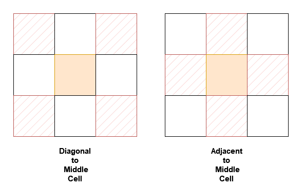
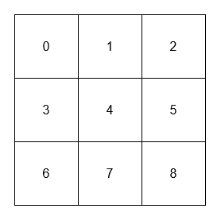
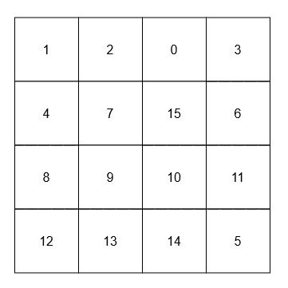

# Design

---

## Table of Contents

- [146. LRU Cache](#146-lru-cache)
- [155. Min Stack](#155-min-stack)
- [173. Binary Search Tree Iterator](#173-binary-search-tree-iterator)
- [225. Implement Stack using Queues](#225-implement-stack-using-queues)
- [232. Implement Queue using Stacks](#232-implement-queue-using-stacks)
- [303. Range Sum Query - Immutable](#303-range-sum-query---immutable)
- [703. Kth Largest Element in a Stream](#703-kth-largest-element-in-a-stream)
- [705. Design HashSet](#705-design-hashset)
- [706. Design HashMap](#706-design-hashmap)
- [933. Number of Recent Calls](#933-number-of-recent-calls)
- [1603. Design Parking System](#1603-design-parking-system)
- [1656. Design an Ordered Stream](#1656-design-an-ordered-stream)
- [3242. Design Neighbor Sum Service](#3242-design-neighbor-sum-service)

---

## 146. LRU Cache

- **LeetCode Link:** [LRU Cache](https://leetcode.com/problems/lru-cache/)
- **Difficulty:** Medium
- **Topic(s):** Design, Hash Table, Linked List
- **Company:** Twitch

### 🧠 Problem Statement

Design a data structure that follows the constraints of a [Least Recently Used (LRU) cache](https://en.wikipedia.org/wiki/Cache_replacement_policies#LRU).

Implement the `LRUCache` class:

- `LRUCache(int capacity)` Initialize the LRU cache with positive size `capacity`.
- `int get(int key)` Return the value of the `key` if the key exists, otherwise return `-1`.
- `void put(int key, int value)` Update the value of the `key` if the `key` exists. Otherwise, add the `key-value` pair to the cache. If the number of keys exceeds the `capacity` from this operation, evict the least recently used key.

The functions `get` and `put` must each run in `O(1)` average time complexity.

Example 1:

```txt
Input
["LRUCache", "put", "put", "get", "put", "get", "put", "get", "get", "get"]
[[2], [1, 1], [2, 2], [1], [3, 3], [2], [4, 4], [1], [3], [4]]

Output
[null, null, null, 1, null, -1, null, -1, 3, 4]

Explanation
LRUCache lRUCache = new LRUCache(2);
lRUCache.put(1, 1); // cache is {1=1}
lRUCache.put(2, 2); // cache is {1=1, 2=2}
lRUCache.get(1);    // return 1
lRUCache.put(3, 3); // LRU key was 2, evicts key 2, cache is {1=1, 3=3}
lRUCache.get(2);    // returns -1 (not found)
lRUCache.put(4, 4); // LRU key was 1, evicts key 1, cache is {4=4, 3=3}
lRUCache.get(1);    // return -1 (not found)
lRUCache.get(3);    // return 3
lRUCache.get(4);    // return 4
```

### 🧩 Approach

To implement an LRU Cache, we can use a combination of a hash map and a doubly linked list. The hash map will allow us to access the cache items in `O(1)` time, while the doubly linked list will help us maintain the order of usage of the cache items. The most recently used item will be at the end of the list, and the least recently used item will be at the beginning of the list. When we access an item, we will move it to the end of the list to mark it as most recently used. When we need to evict an item due to capacity constraints, we will remove the item at the beginning of the list, which is the least recently used item.

### 💡 Solution

```python
from typing import Optional, Dict

class Node:

    def __init__(self, key: int, value: int):
        """Initializes a Node with the given key and value.

        Args:
            key (int): The key associated with the node.
            value (int): The value associated with the node.

        Returns:
            None
        """
        self.key: int = key
        self.value: int = value
        self.prev: Optional[Node] = None
        self.next: Optional[Node] = None

class LRUCache:

    def __init__(self, capacity: int):
        """Initializes the LRUCache object with the given capacity.

        Args:
            capacity (int): The maximum number of items that the cache can hold.

        Returns:
            None
        """
        self._capacity: int = capacity
        self._hashmap: Dict[int, Node] = {}
        self._left: Node = Node(0, 0)
        self._right: Node = Node(0, 0)
        self._left.next = self._right
        self._right.prev = self._left

    def _insert(self, node: Node) -> None:
        """Inserts a node at the end of the doubly linked list (right before the right dummy node).

        Args:
            node (Node): The node to be inserted into the list.

        Returns:
            None
        """
        prev: Node = self._right.prev
        nxt: Node = self._right
        prev.next = node
        nxt.prev = node
        node.prev = prev
        node.next = nxt

    def _remove(self, node: Node) -> None:
        """Removes a node from the doubly linked list.

        Args:
            node (Node): The node to be removed from the list.

        Returns:
            None
        """
        prev: Node = node.prev
        nxt: Node = node.next
        prev.next = nxt
        nxt.prev = prev

    def get(self, key: int) -> int:
        """Returns the value of the key if the key exists, otherwise returns -1.

        Args:
            key (int): The key to be accessed in the cache.

        Returns:
            int: The value associated with the key if it exists, otherwise -1.
        """
        if key in self._hashmap:
            self._remove(self._hashmap[key])
            self._insert(self._hashmap[key])
            return self._hashmap[key].value
        return -1

    def put(self, key: int, value: int) -> None:
        """Updates the value of the key if the key exists. Otherwise, adds the key-value pair to the cache. If the number of keys exceeds the capacity from this operation, evicts the least recently used key.

        Args:
            key (int): The key to be added or updated in the cache.
            value (int): The value to be associated with the key.

        Returns:
            None
        """
        if key in self._hashmap:
            self._remove(self._hashmap[key])
        self._hashmap[key] = Node(key, value)
        self._insert(self._hashmap[key])

        if len(self._hashmap) > self._capacity:
            lru: Node = self._left.next
            self._remove(lru)
            del self._hashmap[lru.key]
```

### 🧮 Complexity Analysis

- Time Complexity:
  - `get`: `O(1)`
  - `put`: `O(1)`
- Space Complexity: `O(n)` where `n` is the capacity of the cache.

---

## 155. Min Stack

- **LeetCode Link:** [Min Stack](https://leetcode.com/problems/min-stack/)
- **Difficulty:** Easy
- **Topic(s):** Design, Stack
- **Company:** Amazon

### 🧠 Problem Statement

> Design a stack that supports push, pop, top, and retrieving the minimum element in constant time.
>
> Implement the `MinStack` class:
>
> - `MinStack()` initializes the stack object.
> - `void push(int val)` pushes the element `val` onto the stack.
> - `void pop()` removes the element on the top of the stack.
> - `int top()` gets the top element of the stack.
> - `int getMin()` retrieves the minimum element in the stack.
>
> You must implement a solution with `O(1)` time complexity for each function.
>
> Example 1:
>
> ```txt
> Input
> ["MinStack","push","push","push","getMin","pop","top","getMin"]
> [[],[-2],[0],[-3],[],[],[],[]]
>
> Output
> [null,null,null,null,-3,null,0,-2]
>
> Explanation
> MinStack minStack = new MinStack();
> minStack.push(-2);
> minStack.push(0);
> minStack.push(-3);
> minStack.getMin(); // return -3
> minStack.pop();
> minStack.top();    // return 0
> minStack.getMin(); // return -2
> ```

### 🧩 Approach

To implement a stack that supports retrieving the minimum element in constant time, we can use two stacks. The first stack will be used to store all the elements of the stack, while the second stack will be used to keep track of the minimum elements. Whenever we push a new element onto the main stack, we compare it with the current minimum (the top of the minimum stack). If the new element is smaller than or equal to the current minimum, we also push it onto the minimum stack. When we pop an element from the main stack, if that element is the same as the current minimum, we also pop it from the minimum stack. This way, the top of the minimum stack will always represent the minimum element in the main stack.

### 💡 Solution

```python
from typing import List

class MinStack:

    def __init__(self):
        self._stack: List[int] = []
        self._minStack: List[int] = []

    def push(self, val: int) -> None:
        """Pushes an element onto the stack and updates the minimum stack if necessary.

        Args:
            val (int): The value to be pushed onto the stack.

        Returns:
            None
        """
        self._stack.append(val)
        val: int = min(val, self._minStack[-1] if self._minStack else val)
        self._minStack.append(val)

    def pop(self) -> None:
        """Removes the element on the top of the stack and updates the minimum stack if necessary.

        Args:
            None

        Returns:
            None
        """
        self._stack.pop()
        self._minStack.pop()

    def top(self) -> int:
        """Returns the top element of the stack.

        Args:
            None

        Returns:
            int: The element at the top of the stack.
        """
        return self._stack[-1]

    def getMin(self) -> int:
        """Retrieves the minimum element in the stack.

        Args:
            None

        Returns:
            int: The minimum element in the stack.
        """
        return self._minStack[-1]
```

## 🧮 Complexity Analysis

- Time Complexity:
  - `push`: `O(1)`
  - `pop`: `O(1)`
  - `top`: `O(1)`
  - `getMin`: `O(1)`
- Space Complexity: `O(n)` where `n` is the number of elements in the stack.

---

## 173. Binary Search Tree Iterator

- **LeetCode Link:** [Binary Search Tree Iterator](https://leetcode.com/problems/binary-search-tree-iterator/)
- **Difficulty:** Medium
- **Topic(s):** Design, Tree, Stack
- **Company:** Meta

### 🧠 Problem Statement

> Implement the `BSTIterator` class that represents an iterator over the [in-order traversal](<https://en.wikipedia.org/wiki/Tree_traversal#In-order_(LNR)>) of a binary search tree (BST):
>
> - `BSTIterator(TreeNode root)` Initializes an object of the `BSTIterator` class. The `root` of the BST is given as part of the constructor. The pointer should be initialized to a non-existent number smaller than any element in the BST.
> - `boolean hasNext()` Returns `true` if there exists a number in the traversal to the right of the pointer, otherwise returns `false`.
> - `int next()` Moves the pointer to the right, then returns the number at the pointer.
>
> Notice that by initializing the pointer to a non-existent smallest number, the first call to `next()` will return the smallest element in the BST.
>
> You may assume that `next()` calls will always be valid. That is, there will be at least a next number in the in-order traversal when `next()` is called.
>
> Example 1:
>
> 
>
> ```txt
> Input
> ["BSTIterator", "next", "next", "hasNext", "next", "hasNext", "next", "hasNext", "next", "hasNext"]
> [[[7, 3, 15, null, null, 9, 20]], [], [], [], [], [], [], [], [], []]
>
> Output
> [null, 3, 7, true, 9, true, 15, true, 20, false]
>
> Explanation
> BSTIterator bSTIterator = new BSTIterator([7, 3, 15, null, null, 9, 20]);
> bSTIterator.next();    // return 3
> bSTIterator.next();    // return 7
> bSTIterator.hasNext(); // return True
> bSTIterator.next();    // return 9
> bSTIterator.hasNext(); // return True
> bSTIterator.next();    // return 15
> bSTIterator.hasNext(); // return True
> bSTIterator.next();    // return 20
> bSTIterator.hasNext(); // return False
> ```

### 🧩 Approach

To implement the `BSTIterator`, we can use a stack to simulate the in-order traversal of the binary search tree. The idea is to push all the left children of the current node onto the stack until we reach a leaf node. When we call `next()`, we pop the top node from the stack, which will be the next smallest element in the BST. After popping a node, we need to consider its right child and push all of its left children onto the stack as well. This way, we maintain the invariant that the top of the stack always contains the next smallest element in the BST.

### 💡 Solution

```python
from typing import Optional, List

class TreeNode:

    def __init__(self, val=0, left=None, right=None):
        """Initializes a TreeNode with the given value and optional left and right children.

        Args:
            val (int): The value of the node. Default is 0.
            left (Optional[TreeNode]): The left child of the node. Default is None.
            right (Optional[TreeNode]): The right child of the node. Default is None.

        Returns:
            None
        """
        self.val: int = val
        self.left: Optional[TreeNode] = left
        self.right: Optional[TreeNode] = right

class BSTIterator:

    def __init__(self, root: Optional[TreeNode]):
        """Initializes the BSTIterator object with the given root of the binary search tree.

        Args:
            root (Optional[TreeNode]): The root of the binary search tree.

        Returns:
            None
        """
        self._stack: List[TreeNode] = []
        while root:
            self._stack.append(root)
            root = root.left

    def next(self) -> int:
        """Moves the pointer to the right, then returns the number at the pointer.

        Args:
            None

        Returns:
            int: The next number in the in-order traversal of the BST.
        """
        res: TreeNode = self._stack.pop()
        cur: TreeNode = res.right
        while cur:
            self._stack.append(cur)
            cur = cur.left
        return res.val

    def hasNext(self) -> bool:
        """Returns whether there exists a number in the traversal to the right of the pointer.

        Args:
            None

        Returns:
            bool: True if there exists a next number in the in-order traversal, False otherwise.
        """
        return self._stack != []
```

### 🧮 Complexity Analysis

- Time Complexity:
  - `next`: `O(1)` amortized
  - `hasNext`: `O(1)`

- Space Complexity: `O(h)` where `h` is the height of the binary search tree.

---

## 225. Implement Stack using Queues

- **LeetCode Link:** [Implement Stack using Queues](https://leetcode.com/problems/implement-stack-using-queues/)
- **Difficulty:** Easy
- **Topic(s):** Design, Queue, Stack
- **Company:** Google

### 🧠 Problem Statement

> Implement a last-in-first-out (LIFO) stack using only two queues. The implemented stack should support all the functions of a normal stack (`push`, `top`, `pop`, and `empty`).
>
> Implement the `MyStack` class:
>
> - `void push(int x)` Pushes element x to the top of the stack.
> - `int pop()` Removes the element on the top of the stack and returns it.
> - `int top()` Returns the element on the top of the stack.
> - `boolean empty()` Returns `true` if the stack is empty, `false` otherwise.
>
> Notes:
>
> - You must use only standard operations of a queue, which means that only `push to back`, `peek/pop from front`, `size` and `is empty` operations are valid.
> - Depending on your language, the queue may not be supported natively. You may simulate a queue using a list or deque (double-ended queue) as long as you use only a queue's standard operations.
>
> Example 1:
>
> ```txt
> Input
> ["MyStack", "push", "push", "top", "pop", "empty"]
> [[], [1], [2], [], [], []]
>
> Output
> [null, null, null, 2, 2, false]
>
> Explanation
> MyStack myStack = new MyStack();
> myStack.push(1);
> myStack.push(2);
> myStack.top(); // return 2
> myStack.pop(); // return 2
> myStack.empty(); // return False
> ```

### 🧩 Approach

To implement a stack using queues, we can use a single queue to store the elements of the stack. The main idea is to ensure that the most recently added element (the top of the stack) is always at the front of the queue. This way, we can perform `pop` and `top` operations in `O(1)` time. To achieve this, when we pop a new element onto the stack, we can enqueue it to the back of the queue and then rotate the queue by dequeuing all elements before it and enqueuing them back to the end of the queue. This way, the new element will be at the front of the queue, representing the top of the stack.

### 💡 Solution

```python
from collections import deque

class MyStack:

    def __init__(self):
        """Initializes an empty stack."""
        self._q: deque[int] = deque()

    def push(self, x: int) -> None:
        """Pushes an element onto the top of the stack.

        Args:
            x (int): The value to be pushed onto the stack.

        Returns:
            None
        """
        self._q.append(x)

    def pop(self) -> int:
        """Removes and returns the top element of the stack.

        Args:
            None

        Returns:
            int: The element removed from the top of the stack.
        """
        for _ in range(len(self._q) - 1):
            self._q.append(self._q.popleft())
        return self._q.popleft()


    def top(self) -> int:
        """Returns the top element of the stack without removing it.

        Args:
            None

        Returns:
            int: The element at the top of the stack.
        """
        return self._q[-1]


    def empty(self) -> bool:
        """Checks whether the stack is empty.

        Args:
            None

        Returns:
            bool: True if the stack is empty, False otherwise.
        """
        return not self._q
```

### 🧮 Complexity Analysis

- Time Complexity:
  - `push`: `O(1)`
  - `pop`: `O(n)`
  - `top`: `O(1)`
  - `empty`: `O(1)`
- Space Complexity: `O(n)`

---

## 232. Implement Queue using Stacks

- **LeetCode Link:** [Implement Queue using Stacks](https://leetcode.com/problems/implement-queue-using-stacks/)
- **Difficulty:** Easy
- **Topic(s):** Design, Queue, Stack
- **Company:** Microsoft

### 🧠 Problem Statement

> Implement a first in first out (FIFO) queue using only two stacks. The implemented queue should support all the functions of a normal queue (`push`, `peek`, `pop`, and `empty`).
>
> Implement the `MyQueue` class:
>
> - `void push(int x)` Pushes element x to the back of the queue.
> - `int pop()` Removes the element from the front of the queue and returns it.
> - `int peek()` Returns the element at the front of the queue.
> - `boolean empty()` Returns `true` if the queue is empty, `false` otherwise.
>
> Notes:
>
> You must use only standard operations of a stack, which means only `push to top`, `peek/pop from top`, `size`, and `is empty` operations are valid.
> Depending on your language, the stack may not be supported natively. You may simulate a stack using a list or deque (double-ended queue) as long as you use only a stack's standard operations.
>
> Example 1:
>
> ```txt
> Input
> ["MyQueue", "push", "push", "peek", "pop", "empty"]
> [[], [1], [2], [], [], []]
>
> Output
> [null, null, null, 1, 1, false]
>
> Explanation
> MyQueue myQueue = new MyQueue();
> myQueue.push(1); // queue is: [1]
> myQueue.push(2); // queue is: [1, 2] (leftmost is front of the queue)
> myQueue.peek(); // return 1
> myQueue.pop(); // return 1, queue is [2]
> myQueue.empty(); // return false
> ```

### 🧩 Approach

To implement a queue using stacks, we can use two stacks to manage the elements of the queue. The main idea is to use one stack (`s1`) for enqueueing elements and another stack (`s2`) for dequeueing elements. When we need to dequeue an element, if `s2` is empty, we can pop all elements from `s1` and push them onto `s2`, which will reverse the order of the elements and allow us to access the front of the queue. This way, we can perform `push`, `pop`, and `peek` operations efficiently.

### 💡 Solution

```python
from typing import List

class MyQueue:

    def __init__(self):
        """Initializes an empty queue using two stacks."""
        self._s1: List[int] = []
        self._s2: List[int] = []

    def push(self, x: int) -> None:
        """Pushes an element to the back of the queue.

        Args:
            x (int): The value to be pushed onto the queue.

        Returns:
            None
        """
        self._s1.append(x)

    def pop(self) -> int:
        """Removes and returns the front element of the queue.

        Args:
            None

        Returns:
            int: The element removed from the front of the queue.
        """
        if not self._s2:
            while self._s1:
                self._s2.append(self._s1.pop())
        return self._s2.pop()

    def peek(self) -> int:
        """Returns the front element of the queue without removing it.

        Args:
            None

        Returns:
            int: The element at the front of the queue.
        """
        if not self._s2:
            while self._s1:
                self._s2.append(self._s1.pop())
        return self._s2[-1]

    def empty(self) -> bool:
        """Checks whether the queue is empty.

        Args:
            None

        Returns:
            bool: True if the queue is empty, False otherwise.
        """
        return max(len(self._s1), len(self._s2)) == 0
```

### 🧮 Complexity Analysis

- Time Complexity:
  - `push`: `O(1)`
  - `pop`: `O(1)` amortized
  - `peek`: `O(1)` amortized
  - `empty`: `O(1)`
- Space Complexity: `O(n)`

---

## 303. Range Sum Query - Immutable

- **LeetCode Link:** [Range Sum Query - Immutable](https://leetcode.com/problems/range-sum-query-immutable/)
- **Difficulty:** Easy
- **Topic(s):** Design, Array, Prefix Sum
- **Company:** Amazon

### 🧠 Problem Statement

> Given an integer array `nums`, handle multiple queries of the following type:
>
> Calculate the sum of the elements of `nums` between indices `left` and `right` inclusive where `left <= right`.
>
> Implement the `NumArray` class:
>
> - `NumArray(int[] nums)` Initializes the object with the integer array `nums`.
> - `int sumRange(int left, int right)` Returns the sum of the elements of `nums` between indices `left` and `right` inclusive (i.e. `nums[left] + nums[left + 1] + ... + nums[right]`).
>
> Example 1:
>
> ```txt
> Input
> ["NumArray", "sumRange", "sumRange", "sumRange"]
> [[[-2, 0, 3, -5, 2, -1]], [0, 2], [2, 5], [0, 5]]
>
> Output
> [null, 1, -1, -3]
>
> Explanation
> NumArray numArray = new NumArray([-2, 0, 3, -5, 2, -1]);
> numArray.sumRange(0, 2); // return (-2) + 0 + 3 = 1
> numArray.sumRange(2, 5); // return 3 + (-5) + 2 + (-1) = -1
> numArray.sumRange(0, 5); // return (-2) + 0 + 3 + (-5) + 2 + (-1) = -3
> ```

### 🧩 Approach

To efficiently calculate the sum of elements in a given range, we can use a prefix sum array. The prefix sum array allows us to compute the sum of any subarray in constant time after an initial preprocessing step. The idea is to create a prefix sum array where each element at index `i` contains the sum of all elements from the start of the original array up to index `i`. Then, to calculate the sum of elements between indices `left` and `right`, we can simply subtract the prefix sum at `left - 1` from the prefix sum at `right`.

### 💡 Solution

```python
from typing import List

class NumArray:

    def __init__(self, nums: List[int]):
        """Initializes the NumArray object with the given integer array.

        Args:
            nums (List[int]): The input integer array.

        Returns:
            None
        """
        self._prefix: List[int] = []
        cur: int = 0
        for n in nums:
            cur += n
            self._prefix.append(cur)

    def sumRange(self, left: int, right: int) -> int:
        """Returns the sum of the elements of nums between indices left and right inclusive.

        Args:
            left (int): The starting index of the range.
            right (int): The ending index of the range.

        Returns:
            int: The sum of the elements in the specified range.
        """
        rightSum: int = self._prefix[right]
        leftSum: int = self._prefix[left - 1] if left > 0 else 0
        return rightSum - leftSum
```

### 🧮 Complexity Analysis

- Time Complexity:
  - `__init__`: `O(n)` for preprocessing the prefix sum array.
  - `sumRange`: `O(1)` for each query after preprocessing.
- Space Complexity: `O(n)`

---

## 703. Kth Largest Element in a Stream

- **LeetCode Link:** [Kth Largest Element in a Stream](https://leetcode.com/problems/kth-largest-element-in-a-stream/)
- **Difficulty:** Easy
- **Topic(s):** Design, Heap, Priority Queue
- **Company:** Amazon

### 🧠 Problem Statement

> You are part of a university admissions office and need to keep track of the `kth` highest test score from applicants in real-time. This helps to determine cut-off marks for interviews and admissions dynamically as new applicants submit their scores.
>
> You are tasked to implement a class which, for a given integer `k`, maintains a stream of test scores and continuously returns the `k`th highest test score after a new score has been submitted. More specifically, we are looking for the `k`th highest score in the sorted list of all scores.
>
> Implement the `KthLargest` class:
>
> - `KthLargest(int k, int[] nums)` Initializes the object with the integer `k` and the stream of test scores `nums`.
> - `int add(int val)` Adds a new test score `val` to the stream and returns the element representing the `kth` largest element in the pool of test scores so far.
>
> Example 1:
>
> ```txt
> Input:
> ["KthLargest", "add", "add", "add", "add", "add"]
> [[3, [4, 5, 8, 2]], [3], [5], [10], [9], [4]]
>
> Output: [null, 4, 5, 5, 8, 8]
>
> Explanation:
>
> KthLargest kthLargest = new KthLargest(3, [4, 5, 8, 2]);
> kthLargest.add(3); // return 4
> kthLargest.add(5); // return 5
> kthLargest.add(10); // return 5
> kthLargest.add(9); // return 8
> kthLargest.add(4); // return 8
> ```
>
> Example 2:
>
> ```txt
> Input:
> ["KthLargest", "add", "add", "add", "add"]
> [[4, [7, 7, 7, 7, 8, 3]], [2], [10], [9], [9]]
>
> Output: [null, 7, 7, 7, 8]
>
> Explanation:
>
> KthLargest kthLargest = new KthLargest(4, [7, 7, 7, 7, 8, 3]);
> kthLargest.add(2); // return 7
> kthLargest.add(10); // return 7
> kthLargest.add(9); // return 7
> kthLargest.add(9); // return 8
> ```

### 🧩 Approach

To maintain the `k`th largest element in a stream of test scores, we can use a min-heap (priority queue) to store the top `k` largest elements. The min-heap allows us to efficiently keep track of the smallest element among the top `k` elements, which will be the `k`th largest element in the stream. When a new score is added, we can compare it with the smallest element in the heap. If the new score is larger than the smallest element, we can remove the smallest element and add the new score to the heap. This way, we ensure that the heap always contains the `k` largest elements from the stream.

### 💡 Solution

```python
from typing import List

import heapq

class KthLargest:

    def __init__(self, k: int, nums: List[int]):
        """Initializes the KthLargest object with the given integer k and the stream of test scores nums.

        Args:
            k (int): The integer k representing the rank of the largest element to maintain.
            nums (List[int]): The initial stream of test scores.

        Returns:
            None
        """
        self._minHeap: List[int] = nums
        self._k: int = k
        heapq.heapify(self._minHeap)
        while len(self._minHeap) > k:
            heapq.heappop(self._minHeap)

    def add(self, val: int) -> int:
        """Adds a new test score val to the stream and returns the element representing the kth largest element in the pool of test scores so far.

        Args:
            val (int): The new test score to be added to the stream.

        Returns:
            int: The kth largest element in the stream after adding the new score.
        """
        heapq.heappush(self._minHeap, val)
        if len(self._minHeap) > self._k:
            heapq.heappop(self._minHeap)
        return self._minHeap[0]
```

### 🧮 Complexity Analysis

- Time Complexity:
  - `__init__`: `O(n log k)` for building the heap and maintaining the top `k` elements.
  - `add`: `O(log k)` for adding a new score and maintaining the heap.
- Space Complexity: `O(k)` for storing the top `k` elements in the heap.

---

## 705. Design HashSet

- **LeetCode Link:** [Design HashSet](https://leetcode.com/problems/design-hashset/)
- **Difficulty:** Easy
- **Topic(s):** Design, Hash Table
- **Company:** Meta

### 🧠 Problem Statement

> Design a HashSet without using any built-in hash table libraries.
>
> Implement `MyHashSet` class:
>
> - `void add(key)` Inserts the value `key` into the HashSet.
> - `bool contains(key)` Returns whether the value `key` exists in the HashSet or not.
> - `void remove(key)` Removes the value `key` in the HashSet. If key does not exist in the HashSet, do nothing.
>
> Example 1:
>
> ```txt
> Input
> ["MyHashSet", "add", "add", "contains", "contains", "add", "contains", "remove", "contains"]
> [[], [1], [2], [1], [3], [2], [2], [2], [2]]
>
> Output
> [null, null, null, true, false, null, true, null, false]
>
> Explanation
> MyHashSet myHashSet = new MyHashSet();
> myHashSet.add(1); // set = [1]
> myHashSet.add(2); // set = [1, 2]
> myHashSet.contains(1); // return True
> myHashSet.contains(3); // return False, (not found)
> myHashSet.add(2); // set = [1, 2]
> myHashSet.contains(2); // return True
> myHashSet.remove(2); // set = [1]
> myHashSet.contains(2); // return False, (already removed)
> ```

### 🧩 Approach

To design a HashSet, we can use an array of linked lists (chaining) to handle collisions. We can define a `ListNode` class to represent each node in the linked list, which will store the key and a reference to the next node. The `MyHashSet` class will contain an array of `ListNode` objects, where each index corresponds to a hash value derived from the key. When adding a key, we will compute its hash value and insert it into the corresponding linked list. For checking if a key exists or for removing a key, we will traverse the linked list at the computed hash index to find the key.

### 💡 Solution

```python
from typing import Optional, List

class ListNode:

    def __init__(self, key: int):
        """Initializes a ListNode with the given key.

        Args:
            key (int): The value to be stored in the ListNode.

        Returns:
            None
        """
        self.key: int = key
        self.next: Optional[ListNode] = None

class MyHashSet:

    def __init__(self):
        """Initializes an empty HashSet."""
        self._set: List[ListNode] = [ListNode(0) for _ in range(10**4)]

    def add(self, key: int) -> None:
        """Inserts the value key into the HashSet.

        Args:
            key (int): The value to be added to the HashSet.

        Returns:
            None
        """
        cur: ListNode = self._set[key % len(self._set)]
        while cur.next:
            if cur.next.key == key:
                return None
            cur = cur.next
        cur.next = ListNode(key)

    def remove(self, key: int) -> None:
        """Removes the value key in the HashSet. If key does not exist in the HashSet, do nothing.

        Args:
            key (int): The value to be removed from the HashSet.

        Returns:
            None
        """
        cur: ListNode = self._set[key % len(self._set)]
        while cur.next:
            if cur.next.key == key:
                cur.next = cur.next.next
                return None
            cur = cur.next

    def contains(self, key: int) -> bool:
        """Returns whether the value key exists in the HashSet or not.

        Args:
            key (int): The value to check for existence in the HashSet.

        Returns:
            bool: True if the value exists in the HashSet, False otherwise.
        """
        cur: ListNode = self._set[key % len(self._set)]
        while cur.next:
            if cur.next.key == key:
                return True
            cur = cur.next
        return False
```

### 🧮 Complexity Analysis

- Time Complexity:
  - `add`: `O(1)` on average, but `O(n)` in the worst case due to collision handling with chaining.
  - `remove`: `O(1)` on average, but `O(n)` in the worst case due to collision handling with chaining.
  - `contains`: `O(1)` on average, but `O(n)` in the worst case due to collision handling with chaining.
- Space Complexity: `O(n)`

---

## 706. Design HashMap

- **LeetCode Link:** [Design HashMap](https://leetcode.com/problems/design-hashmap/)
- **Difficulty:** Easy
- **Topic(s):** Design, Hash Table
- **Company:** Google

### 🧠 Problem Statement

> Design a HashMap without using any built-in hash table libraries.
>
> Implement the `MyHashMap` class:
>
> - `MyHashMap()` initializes the object with an empty map.
> - `void put(int key, int value)` inserts a `(key, value)` pair into the HashMap. If the `key` already exists in the map, update the corresponding `value`.
> - `int get(int key)` returns the `value` to which the specified `key` is mapped, or `-1` if this map contains no mapping for the `key`.
> - `void remove(key)` removes the `key` and its corresponding `value` if the map contains the mapping for the `key`.
>
> Example 1:
>
> ```txt
> Input
> ["MyHashMap", "put", "put", "get", "get", "put", "get", "remove", "get"]
> [[], [1, 1], [2, 2], [1], [3], [2, 1], [2], [2], [2]]
>
> Output
> [null, null, null, 1, -1, null, 1, null, -1]
>
> Explanation
> MyHashMap myHashMap = new MyHashMap();
> myHashMap.put(1, 1); // The map is now [[1,1]]
> myHashMap.put(2, 2); // The map is now [[1,1], [2,2]]
> myHashMap.get(1); // return 1, The map is now [[1,1], [2,2]]
> myHashMap.get(3); // return -1 (i.e., not found), The map is now [[1,1], [2,2]]
> myHashMap.put(2, 1); // The map is now [[1,1], [2,1]] (i.e., update the existing value)
> myHashMap.get(2); // return 1, The map is now [[1,1], [2,1]]
> myHashMap.remove(2); // remove the mapping for 2, The map is now [[1,1]]
> myHashMap.get(2); // return -1 (i.e., not found), The map is now [[1,1]]
> ```

### 🧩 Approach

To design a HashMap, we can use an array of linked lists (chaining) to handle collisions, similar to the design of a HashSet. We can define a `ListNode` class to represent each node in the linked list, which will store the key, value, and a reference to the next node. The `MyHashMap` class will contain an array of `ListNode` objects, where each index corresponds to a hash value derived from the key. When adding a key-value pair, we will compute its hash value and insert it into the corresponding linked list. For checking if a key exists or for removing a key, we will traverse the linked list at the computed hash index to find the key and perform the necessary operations.

### 💡 Solution

```python
from typing import Optional, List

class ListNode:

    def __init__(self, key: int, value: int):
        self.key: int = key
        self.value: int = value
        self.next: Optional[ListNode] = None

class MyHashMap:

    def __init__(self):
        self._map: List[ListNode] = [ListNode(0, 0) for _ in range(10**4)]

    def put(self, key: int, value: int) -> None:
        cur: ListNode = self._map[key % len(self._map)]
        while cur.next:
            if cur.next.key == key:
                cur.next.value = value
                return None
            cur = cur.next
        cur.next = ListNode(key, value)

    def get(self, key: int) -> int:
        cur: ListNode = self._map[key % len(self._map)]
        while cur.next:
            if cur.next.key == key:
                return cur.next.value
            cur = cur.next
        return -1

    def remove(self, key: int) -> None:
        cur: ListNode = self._map[key % len(self._map)]
        while cur.next:
            if cur.next.key == key:
                cur.next = cur.next.next
                return None
            cur = cur.next
```

### 🧮 Complexity Analysis

- Time Complexity:
  - `put`: `O(1)` on average, but `O(n)` in the worst case due to collision handling with chaining.
  - `get`: `O(1)` on average, but `O(n)` in the worst case due to collision handling with chaining.
  - `remove`: `O(1)` on average, but `O(n)` in the worst case due to collision handling with chaining.
- Space Complexity: `O(n)` for storing the key-value pairs in the hash map.

---

## 933. Number of Recent Calls

- **LeetCode Link:** [Number of Recent Calls](https://leetcode.com/problems/number-of-recent-calls/)
- **Difficulty:** Easy
- **Topic(s):** Design, Queue
- **Company:** Amazon

### 🧠 Problem Statement

> You have a `RecentCounter` class which counts the number of recent requests within a certain time frame.
>
> Implement the `RecentCounter` class:
>
> - `RecentCounter()` Initializes the counter with zero recent requests.
> - `int ping(int t)` Adds a new request at time `t`, where `t` represents some time in milliseconds, and returns the number of requests that has happened in the past `3000` milliseconds (including the new request). Specifically, return the number of requests that have happened in the inclusive range `[t - 3000, t]`.
>
> It is guaranteed that every call to `ping` uses a strictly larger value of `t` than the previous call.
>
> Example 1:
>
> ```txt
> Input
> ["RecentCounter", "ping", "ping", "ping", "ping"]
> [[], [1], [100], [3001], [3002]]
>
> Output
> [null, 1, 2, 3, 3]
>
> Explanation
> RecentCounter recentCounter = new RecentCounter();
> recentCounter.ping(1); // requests = [1], range is [-2999,1], return 1
> recentCounter.ping(100); // requests = [1, 100], range is [-2900,100], return 2
> recentCounter.ping(3001); // requests = [1, 100, 3001], range is [1,3001], return 3
> recentCounter.ping(3002); // requests = [1, 100, 3001, 3002], range is [2,3002], return 3
> ```

### 🧩 Approach

To count the number of recent requests within a certain time frame, we can use a queue (specifically, a deque) to store the timestamps of the requests. When a new request is added using the `ping` method, we will add its timestamp to the back of the queue. Then, we will remove any timestamps from the front of the queue that are outside the range of `[t - 3000, t]`. Finally, we can return the size of the queue, which will represent the number of requests that have happened in the past 3000 milliseconds.

### 💡 Solution

```python
from collections import deque

class RecentCounter:

    def __init__(self):
        """Initializes the RecentCounter object with zero recent requests."""
        self._requests: deque[int] = deque()

    def ping(self, t: int) -> int:
        """Adds a new request at time t and returns the number of requests that has happened in the past 3000 milliseconds.

        Args:
            t (int): The time in milliseconds when the new request is added.

        Returns:
            int: The number of requests that have happened in the inclusive range [t - 3000, t].
        """
        self._requests.append(t)
        while self._requests and self._requests[0] < t - 3000:
            self._requests.popleft()
        return len(self._requests)
```

### 🧮 Complexity Analysis

- Time Complexity:
  - `ping`: `O(1)` on average, but `O(n)` in the worst case when all requests are outside the 3000 milliseconds range and need to be removed.
- Space Complexity: `O(n)` for storing the requests in the deque.

---

## 1603. Design Parking System

- **LeetCode Link:** [Design Parking System](https://leetcode.com/problems/design-parking-system/)
- **Difficulty:** Easy
- **Topic(s):** Design
- **Company:** Amazon

### 🧠 Problem Statement

> Design a parking system for a parking lot. The parking lot has three kinds of parking spaces: big, medium, and small, with a fixed number of slots for each size.
>
> Implement the `ParkingSystem` class:
>
> - `ParkingSystem(int big, int medium, int small)` Initializes object of the `ParkingSystem` class. The number of slots for each parking space are given as part of the constructor.
> - `bool addCar(int carType)` Checks whether there is a parking space of `carType` for the car that wants to get into the parking lot. `carType` can be of three kinds: big, medium, or small, which are represented by `1`, `2`, and `3` respectively. A car can only park in a parking space of its `carType`. If there is no space available, return `false`, else park the car in that size space and return `true`.
>
> Example 1:
>
> ```txt
> Input
> ["ParkingSystem", "addCar", "addCar", "addCar", "addCar"]
> [[1, 1, 0], [1], [2], [3], [1]]
>
> Output
> [null, true, true, false, false]
>
> Explanation
> ParkingSystem parkingSystem = new ParkingSystem(1, 1, 0);
> parkingSystem.addCar(1); // return true because there is 1 available slot for a big car
> parkingSystem.addCar(2); // return true because there is 1 available slot for a medium car
> parkingSystem.addCar(3); // return false because there is no available slot for a small car
> parkingSystem.addCar(1); // return false because there is no available slot for a big car. It is already occupied.
> ```

### 🧩 Approach

To design the parking system, we can use a simple list to keep track of the available parking spaces for each car type. The list will have three elements corresponding to the number of available slots for big, medium, and small cars. When a car tries to park, we can check if there is an available slot for that car type by checking the corresponding element in the list. If there is an available slot, we can decrement the count for that car type and return `true`. If there are no available slots, we return `false`.

### 💡 Solution

```python
from typing import List

class ParkingSystem:

    def __init__(self, big: int, medium: int, small: int):
        self._spaces: List[int] = [big, medium, small]

    def addCar(self, carType: int) -> bool:
        if self._spaces[carType - 1] > 0:
            self._spaces[carType - 1] -= 1
            return True
        return False
```

### 🧮 Complexity Analysis

- Time Complexity:
  - `addCar`: `O(1)` for checking and updating the available slots.
- Space Complexity: `O(1)` for storing the available slots for each car type.

---

## 1656. Design an Ordered Stream

- **LeetCode Link:** [Design an Ordered Stream](https://leetcode.com/problems/design-an-ordered-stream/)
- **Difficulty:** Easy
- **Topic(s):** Design
- **Company:** Google

### 🧠 Problem Statement

> There is a stream of `n` `(idKey, value)` pairs arriving in an arbitrary order, where `idKey` is an integer between `1` and `n` and `value` is a string. No two pairs have the same `id`.
>
> Design a stream that returns the values in increasing order of their IDs by returning a chunk (list) of values after each insertion. The concatenation of all the chunks should result in a list of the sorted values.
>
> Implement the `OrderedStream` class:
>
> - `OrderedStream(int n)` Constructs the stream to take `n` values.
> - `String[] insert(int idKey, String value)` Inserts the pair `(idKey, value)` into the stream, then returns the largest possible chunk of currently inserted values that appear next in the order.
>
> Example:
>
> 
>
> ```txt
> Input
> ["OrderedStream", "insert", "insert", "insert", "insert", "insert"]
> [[5], [3, "ccccc"], [1, "aaaaa"], [2, "bbbbb"], [5, "eeeee"], [4, "ddddd"]]
>
> Output
> [null, [], ["aaaaa"], ["bbbbb", "ccccc"], [], ["ddddd", "eeeee"]]
>
> Explanation
> // Note that the values ordered by ID is ["aaaaa", "bbbbb", "ccccc", "ddddd", "eeeee"].
> OrderedStream os = new OrderedStream(5);
> os.insert(3, "ccccc"); // Inserts (3, "ccccc"), returns [].
> os.insert(1, "aaaaa"); // Inserts (1, "aaaaa"), returns ["aaaaa"].
> os.insert(2, "bbbbb"); // Inserts (2, "bbbbb"), returns ["bbbbb", "ccccc"].
> os.insert(5, "eeeee"); // Inserts (5, "eeeee"), returns [].
> os.insert(4, "ddddd"); // Inserts (4, "ddddd"), returns ["ddddd", "eeeee"].
> // Concatentating all the chunks returned:
> // [] + ["aaaaa"] + ["bbbbb", "ccccc"] + [] + ["ddddd", "eeeee"] = ["aaaaa", "bbbbb", "ccccc", "ddddd", "eeeee"]
> // The resulting order is the same as the order above.
> ```

### 🧩 Approach

To design the ordered stream, we can use a list to store the values corresponding to their IDs. We will maintain a pointer that keeps track of the next ID that we need to return in order. When a new `(idKey, value)` pair is inserted, we will store the value at the index corresponding to `idKey - 1` in the list. After inserting the new value, we will check if the value at the current pointer index is available (not `None`). If it is available, we will keep moving the pointer forward until we find a `None` value or reach the end of the list. We will then return the chunk of values from the original pointer position to the new pointer position.

### 💡 Solution

```python
from typing import Optional, List

class OrderedStream:

    def __init__(self, n: int):
        """Constructs the stream to take n values.

        Args:
            n (int): The number of values the stream can take.

        Returns:
            None
        """
        self._ptr: int = 0
        self._data: List[Optional[str]] = [None] * n


    def insert(self, idKey: int, value: str) -> List[str]:
        """Inserts the pair (idKey, value) into the stream, then returns the largest possible chunk of currently inserted values that appear next in the order.

        Args:
            idKey (int): The ID key of the value to be inserted.
            value (str): The value to be inserted.

        Returns:
            List[str]: The largest possible chunk of currently inserted values that appear next in the order.
        """
        idx: int = idKey - 1
        self._data[idx] = value

        if idx != self._ptr:
            return []

        n = len(self._data)

        while self._ptr < n and self._data[self._ptr]:
            self._ptr += 1

        return self._data[idx:self._ptr]
```

### 🧮 Complexity Analysis

- Time Complexity:
  - `insert`: `O(1)`for inserting a value, but `O(n)` in the worst case when all values are inserted in order and we need to return a chunk of size `n`.
- Space Complexity: `O(n)` for storing the values in the stream.

---

## 3242. Design Neighbor Sum Service

- **LeetCode Link:** [Design Neighbor Sum Service](https://leetcode.com/problems/design-neighbor-sum-service/)
- **Difficulty:** Easy
- **Topic(s):** Design
- **Company:** Google

### 🧠 Problem Statement

> You are given a `n x n` 2D array `grid` containing distinct elements in the range `[0, n2 - 1]`.
>
> Implement the `NeighborSum` class:
>
> - `NeighborSum(int [][]grid)` initializes the object.
> - `int adjacentSum(int value)` returns the sum of elements which are adjacent neighbors of `value`, that is either to the top, left, right, or bottom of `value` in `grid`.
> - `int diagonalSum(int value)` returns the sum of elements which are diagonal neighbors of `value`, that is either to the top-left, top-right, bottom-left, or bottom-right of `value` in `grid`.
>
> 
>
> Example 1:
>
> 
>
> ```txt
> Input:
>
> ["NeighborSum", "adjacentSum", "adjacentSum", "diagonalSum", "diagonalSum"]
>
> [[[[0, 1, 2], [3, 4, 5], [6, 7, 8]]], [1], [4], [4], [8]]
>
> Output: [null, 6, 16, 16, 4]
>
> Explanation:
>
> - The adjacent neighbors of 1 are 0, 2, and 4.
> - The adjacent neighbors of 4 are 1, 3, 5, and 7.
> - The diagonal neighbors of 4 are 0, 2, 6, and 8.
> - The diagonal neighbor of 8 is 4.
> ```
>
> Example 2:
>
> 
>
> ```txt
> Input:
>
> ["NeighborSum", "adjacentSum", "diagonalSum"]
>
> [[[[1, 2, 0, 3], [4, 7, 15, 6], [8, 9, 10, 11], [12, 13, 14, 5]]], [15], [9]]
>
> Output: [null, 23, 45]
>
> Explanation:
>
> - The adjacent neighbors of 15 are 0, 10, 7, and 6.
> - The diagonal neighbors of 9 are 4, 12, 14, and 15.
> ```

### 🧩 Approach

Use a lookup table (hash map) to store the coordinates of each value in the grid for O(1) access. For both `adjacentSum` and `diagonalSum`, we can define the relative positions of the neighbors and iterate through them to calculate the sum, while ensuring that we stay within the bounds of the grid.

### 💡 Solution

```python
from typing import List, Tuple

class NeighborSum:

    def __init__(self, grid: List[List[int]]):
        """Initializes the NeighborSum object with the given 2D array grid.

        Args:
            grid (List[List[int]]): The 2D array containing distinct elements.

        Returns:
            None
        """
        self._grid: List[List[int]] = grid
        self._R: int = len(grid)
        self._C: int = len(grid[0])
        self._lookup: dict[int, Tuple[int, int]] = {}

        for x in range(self._R):
            for y in range(self._C):
                self._lookup[grid[x][y]] = (x, y)


    def adjacentSum(self, value: int) -> int:
        """Returns the sum of elements which are adjacent neighbors of value, that is either to the top, left, right, or bottom of value in grid.

        Args:
            value (int): The value for which to calculate the adjacent sum.

        Returns:
            int: The sum of adjacent neighbors of the given value.
        """
        x, y = self._lookup[value]

        total: int = 0
        for dx, dy in [(-1, 0), (1, 0), (0, -1), (0, 1)]:
            nx: int = x + dx
            ny: int = y + dy

            if 0 <= nx < self._R and 0 <= ny < self._C:
                total += self._grid[nx][ny]

        return total

    def diagonalSum(self, value: int) -> int:
        """Returns the sum of elements which are diagonal neighbors of value, that is either to the top-left, top-right, bottom-left, or bottom-right of value in grid.

        Args:
            value (int): The value for which to calculate the diagonal sum.

        Returns:
            int: The sum of diagonal neighbors of the given value.
        """
        x, y = self._lookup[value]

        total: int = 0
        for dx, dy in [(-1, -1), (1, 1), (1, -1), (-1, 1)]:
            nx: int = x + dx
            ny: int = y + dy

            if 0 <= nx < self._R and 0 <= ny < self._C:
                total += self._grid[nx][ny]

        return total
```

### 🧮 Complexity Analysis

- Time Complexity:
  - `adjacentSum`: `O(1)` since we only check 4 adjacent neighbors.
  - `diagonalSum`: `O(1)` since we only check 4 diagonal neighbors.
- Space Complexity: `O(n^2)` for storing the grid and lookup table.
